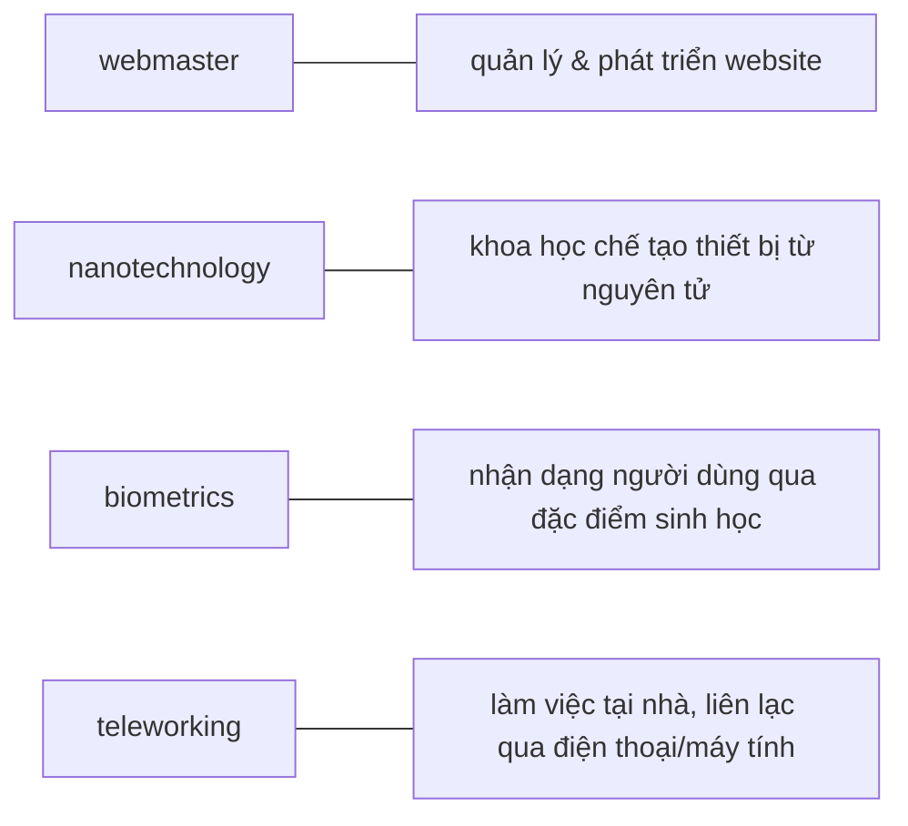

# HƯỚNG DẪN XỬ LÝ TÀI LIỆU ÔN THI TIẾNG ANH CHUYÊN NGÀNH ICT

## 1. MỤC TIÊU

Chuyển tài liệu thô (copy từ PDF/Word) thành file Markdown chuẩn, phục vụ ôn thi với các dạng bài:
- Câu 1: Trả lời câu hỏi (reading comprehension)
- Câu 2: Trắc nghiệm (từ vựng, ngữ pháp, chủ đề)
- Câu 3: Nối cặp từ / nối hình với từ
- Câu 4: Điền vào chỗ trống (có/không có box, có/không chỉnh ngữ pháp)
- Câu 5: Dịch Anh–Việt

> **Lưu ý: không thi listening.** Nếu bản gốc có bài nghe (transcript, audio script, "Listen to..."), bỏ qua không xử lý phần đó — không cần tạo transcript, không cần đưa vào bài tập hay đáp án.

---

## 2. CẤU TRÚC FILE ĐẦU RA

Mỗi Unit xuất thành **1 file .md riêng**, đặt tên: `unit_XX_ten_chu_de.md`

**Quy tắc đặt tên file:**
- `XX`: số thứ tự unit, luôn 2 chữ số (01, 02, ..., 12), không bỏ số 0 đầu.
- `ten_chu_de`: viết không dấu, chữ thường, các từ nối bằng `_` (gạch dưới đơn), không dùng gạch ngang `-`, không khoảng trắng, không ký tự đặc biệt.
- Không thêm số/ký tự thừa do trùng tên khi tải lên (ví dụ tránh dạng `_1_`); nếu file đã tồn tại, thống nhất ghi đè hoặc hỏi lại trước khi tạo bản trùng.
- Ví dụ đúng: `unit_12_jobs_in_ict.md`. Ví dụ sai: `Unit12-JobsInICT.md`, `unit_12_jobs_in_ict__1_.md`.

**Khi 1 unit quá dài** (nhiều bài đọc, nhiều job/technology, vượt quá khoảng 1 file đọc thoải mái trong 1 lần ôn — ước lượng > 6 bài đọc hoặc > 8 jobs/technologies):
- Vẫn ưu tiên dồn vào 1 file duy nhất theo cấu trúc 6 mục chuẩn, để giữ tính toàn vẹn khi ôn thi theo unit.
- Chỉ chia file con (`unit_XXa_...md`, `unit_XXb_...md`) nếu người dùng yêu cầu rõ, hoặc nội dung unit thực chất gồm 2 chủ đề tách biệt rõ ràng.

Cấu trúc bên trong mỗi file theo thứ tự:

```
# UNIT XX — [Tên chủ đề]

## 1. TỪ VỰNG CHÍNH (Vocabulary)
## 2. BÀI ĐỌC SONG NGỮ (Reading — EN | VI)
## 3. NGỮ PHÁP (Grammar)
## 4. BÀI TẬP (Exercises)
## 5. ĐÁP ÁN (Answer Key)
## 6. GLOSSARY TỔNG HỢP
```

---

## 3. QUY TẮC TỪNG PHẦN

---

### 3.1 PHẦN TỪ VỰNG

- Liệt kê tất cả từ/cụm từ chuyên ngành xuất hiện trong unit
- Định dạng bảng:

```markdown
| Từ/Cụm từ (EN) | Phiên âm | Nghĩa (VI) | Gợi nhớ |
|---|---|---|---|
| **webmaster** | /ˈwebmɑːstər/ | quản trị viên website | web + master = chủ website |
| **nanotube** | | ống siêu nhỏ từ carbon | nano = siêu nhỏ, tube = ống |
```

- Chỉ ghi phiên âm nếu biết chắc, để trống nếu không chắc (không bịa)
- Cột "Gợi nhớ": ghi liên tưởng ngắn giúp nhớ nghĩa, không cần có với mọi từ
- Ưu tiên từ nào hay xuất hiện trong câu hỏi trắc nghiệm / điền từ

---

### 3.2 PHẦN BÀI ĐỌC SONG NGỮ

Mỗi đoạn văn gồm 3 lớp theo thứ tự:

**Lớp 1 — Nguyên văn EN** (giữ nguyên, không sửa)

**Lớp 2 — Tóm tắt VI** (2-3 dòng, nắm ý chính nhanh):
```markdown
> 📌 **Tóm tắt:** Viễn thông là truyền tín hiệu qua khoảng cách xa.
> Ngày nay chủ yếu là truyền thông tin qua Internet. Xu hướng mới gồm
> teleworking và call centre.
```

**Lớp 3 — Dịch đầy đủ** (sát nghĩa, tự nhiên):
```markdown
> **[VI]** Viễn thông là việc truyền tín hiệu qua một khoảng cách nhất
> định nhằm mục đích liên lạc. Thông tin được truyền qua các thiết bị
> như điện thoại, radio, truyền hình, vệ tinh hoặc mạng máy tính.
```

**Quy tắc dịch "Dịch đầy đủ":**
- Dịch theo **đoạn** (paragraph-by-paragraph), không tách dịch từng câu rời rạc — giữ văn phong tự nhiên.
- Không cần dài hơn bản gốc; tránh dịch lan man hoặc thêm diễn giải không có trong nguyên văn.

**Xử lý ảnh/sơ đồ/biểu đồ trong bản gốc:**
- Nếu là sơ đồ kỹ thuật có thể tái tạo bằng chữ/mũi tên (luồng quy trình, cấu trúc mạng…) → tái tạo lại bằng Mermaid.
- Nếu là ảnh minh họa/screenshot không thể tái tạo → ghi chú `[Hình: mô tả ngắn nội dung ảnh]` ngay vị trí xuất hiện trong bản gốc, không bỏ qua không ghi chú gì.
- Nếu file ảnh không có caption/alt text và không thể xác định nội dung (ví dụ placeholder `img-0.jpeg` không kèm chú thích): **không đoán bừa nội dung ảnh**. Ghi chú `[Hình: không xác định được nội dung — xuất hiện sau phần "..."]`, nêu rõ phần nội dung đứng trước/sau ảnh để người học biết vị trí.

**Mẩu tin tuyển dụng (job advertisement) kèm danh sách kỹ năng tick-box:**
Khác với "thư ứng tuyển" (đã có khuôn riêng ở trên), mẩu tin tuyển dụng + checklist kỹ năng (dạng `☐ logical reasoning`, `☐ patience and tenacity`...) xử lý như sau:
- Giữ nguyên văn mẩu tin tuyển dụng ở Lớp 1 (nguyên văn EN), áp dụng đánh dấu in đậm/in nghiêng như bài đọc thông thường.
- Danh sách kỹ năng tick-box: chuyển thành checklist Markdown chuẩn `- [ ] tên kỹ năng`, không giữ ký hiệu `☐` gốc.
- Đây là nguồn tốt cho dạng bài "chọn kỹ năng phù hợp với job" — nên đưa câu hỏi liên quan (ví dụ "Which skills does this job require?") vào Mini Quiz nếu bản gốc chưa có câu hỏi khai thác trực tiếp.

**Một đoạn bài đọc dùng cho nhiều bài tập khác nhau:**
Nếu cùng một đoạn văn (ví dụ thư ứng tuyển) được dùng làm nguồn cho cả bài fill-in-the-blank và bài reading comprehension, ghi rõ ngay dưới đoạn văn các bài tập liên quan, ví dụ:
```markdown
> *Đoạn văn này dùng cho: Exercise B (điền for/since/ago/until) và Exercise A (trả lời câu hỏi đọc hiểu).*
```
Không tách lặp đoạn văn ra 2 lần ở 2 vị trí khác nhau trong file.

**Quy tắc đánh dấu trong đoạn văn EN:**
- Tối đa **3–5 chỗ** được in đậm mỗi đoạn — buộc phải chắt lọc
- **In đậm**: thuật ngữ kỹ thuật cốt lõi, định nghĩa chính thức
- *In nghiêng*: từ mới ít quan trọng hơn, tên riêng, ví dụ minh họa
- `Monospace`: viết tắt kỹ thuật (GPS, DAB, HTML, RFID, VoIP)
- ⚠️ **Hay thi**: đánh dấu vào định nghĩa, số liệu, chức năng cụ thể — những điểm đề hay hỏi kể cả khi không có đoạn văn gốc

Ví dụ:

```markdown
**Telecommunications** refers to the transmission of signals over a distance
for the purpose of communication. Information is transmitted by devices such
as the telephone, radio, television, satellite, or computer networks.
Because of telecommunications, people can now work at home — this is called
**teleworking**. ⚠️ In *call centres*, assistance is given to customers using
telephone, email or online chats.
```

---

### 3.3 BẢNG TỔNG HỢP "AI LÀM GÌ" (cho Unit có nhiều jobs/technologies)

Với các Unit liệt kê nhiều jobs hoặc technologies, thêm bảng tổng hợp ngang ngay sau phần từ vựng để người học nhìn thấy toàn cảnh một lần.

**Ngưỡng áp dụng**: thêm bảng này khi unit có **từ 4 jobs/technologies trở lên** được mô tả nhiệm vụ riêng biệt. Dưới 4, không cần bảng này (mục từ vựng + bài đọc đã đủ).

```markdown
| Job | Nhiệm vụ chính | Lương TB | Kỹ năng nổi bật |
|---|---|---|---|
| **Webmaster** | Quản lý & phát triển website | $51,533/năm | HTML, cross-browser |
| **Hardware Engineer** | Nghiên cứu, thiết kế phần cứng | $83,631/năm | Verilog |
| **Software Engineer** | Viết, debug, test phần mềm | $81,884/năm | Debugger, IDE |
| **Network Administrator** | Cài đặt, bảo trì hệ thống mạng | ~$58K/năm | Telecom, troubleshooting |
| **Computer Security Specialist** | Bảo mật hệ thống, phân tích rủi ro | $76,667/năm | Security Testing |
| **Help Desk Technician** | Hỗ trợ kỹ thuật người dùng | $15.94/giờ | Desktop Support Tier 2 |
```

⚠️ Bảng này là nguồn ôn chính cho dạng bài "điền tên job theo chức năng" hoặc "nối job với mô tả".

---

### 3.4 PHẦN NGỮ PHÁP

- Điền đầy đủ vào các bảng còn thiếu (ví dụ: bảng passive voice bị trống trong tài liệu gốc)
- Giữ phần giải thích tiếng Việt đã có, bổ sung nếu thiếu
- Thêm cột "Ví dụ từ bài":

```markdown
| Thì | Công thức | Ví dụ từ bài |
|---|---|---|
| Present simple passive | is/are + P2 | Microprocessors **are made** of silicon. |
| Present continuous passive | is/are + being + P2 | The computers **are being replaced** at the moment. |
| Past simple passive | was/were + P2 | `GPS` **was developed** in the 1970s. |
| Past continuous passive | was/were + being + P2 | My PC **was being fixed** this morning. |
| Present perfect passive | has/have + been + P2 | Most phones **have been equipped** with Bluetooth. |
| Past perfect passive | had + been + P2 | He **had been caught** copying programs. |
| Future simple passive | will + be + P2 | New legislation **will be introduced** next year. |
| Modal passive | modal + be + P2 | Networks **can be connected** via satellite. |
```

- Với Future tenses: giữ nguyên ghi chú VI, thêm bảng so sánh 4 dạng tương lai

**Khối ngữ pháp dạng "giải thích + ví dụ" (không phải bảng)** — ví dụ HELP box giải thích Present perfect simple/continuous kèm công thức, cách dùng, ví dụ và phần so sánh với thì khác:
- Giữ cấu trúc: **Công thức** → **Cách dùng** (liệt kê từng trường hợp) → **Ví dụ từ bài** cho mỗi trường hợp.
- Phần "Contrast with" (so sánh 2 thì dễ nhầm, ví dụ present perfect vs past simple): giữ riêng thành mục con, nêu rõ tiêu chí phân biệt (mốc thời gian cụ thể đã kết thúc → past simple; hành động còn liên quan đến hiện tại → present perfect), kèm ví dụ đối chiếu cạnh nhau.
```markdown
### Present perfect simple vs Past simple

| | Present perfect simple | Past simple |
|---|---|---|
| Dùng khi | Hành động/trạng thái còn liên quan đến hiện tại, không rõ hoặc không cần nói mốc thời gian cụ thể | Hành động đã xảy ra và kết thúc tại một thời điểm cụ thể trong quá khứ |
| Ví dụ từ bài | I have designed four programs in COBOL. | I graduated in May 2003. *(không nói "I have graduated in")* |
```

---

### 3.5 PHẦN BÀI TẬP

**Tách riêng hoàn toàn** phần đề và phần đáp án (đáp án để ở mục 5).

**Fill-in-the-blank:**
```markdown
Complete the sentences with *for, since, ago* or *until*.

1. I stayed in this job ___(1)___ March 2004.
2. ___(2)___ the last three years I have been working as a software engineer.
3. ___(3)___ January I have been writing programs in C.
4. Two years ___(4)___ I spent three months in Spain.
```

**Trắc nghiệm:** giữ nguyên format a/b/c.

**Chọn từ đúng trong ngoặc** (khác trắc nghiệm a/b/c, khác fill-in-blank — câu đã có sẵn 2 lựa chọn ngay trong ngoặc đơn để chọn 1):
```markdown
Choose the correct words in brackets to complete these sentences.

1. He ___ Maths. *('s never liked / 's never been liking)*
2. They ___ on the project all day. *('ve worked / 've been working)*
3. John ___ the computer for hours – he looks really tired. *('s used / 's been using)*
```
- Giữ nguyên 2 lựa chọn trong ngoặc ở cuối câu (không xóa, vì đây là đề gốc), chỉ thay khoảng trống `___` vào vị trí cần điền trong câu.
- Đáp án để ở mục 5, kèm giải thích vì sao chọn lựa chọn này mà không chọn lựa chọn kia (theo mục 3.6).

**Bài tập có đáp án lồng sẵn trong đề gốc** (ví dụ tài liệu gốc đã là bản chữa bài, đáp án viết thẳng vào chỗ trống): tách đáp án ra mục 5, đưa đề về dạng trống chuẩn để người học tự làm lại.
```markdown
<!-- Bản gốc: "She (be) has been a software engineer since 2004." -->
<!-- → Tách thành: -->
Put the verbs in brackets into the present perfect simple or past simple.

1. She ___ (be) a software engineer since 2004.
```
Đáp án tương ứng ghi ở mục 5: `1. has been — present perfect simple vì có "since 2004" (mốc thời gian bắt đầu, kéo dài đến hiện tại)`.

**Nối cặp — dùng Mermaid diagram** thay vì bảng 2 cột:

```markdown

```

> Lưu ý: Mermaid chỉ dùng cho bài nối từ với định nghĩa. Với bài nối hình với từ thì giữ dạng danh sách đánh số.

**Mini quiz cuối unit** — 5–7 câu tự luyện do agent tự ra dựa vào nội dung, không lấy lại nguyên câu bài tập gốc. Bao gồm đủ dạng: trắc nghiệm, điền từ, nối. Ví dụ:

```markdown
### 🧪 Mini Quiz

**Câu 1 (Trắc nghiệm):** Which job is responsible for analyzing security requirements for networks?
- a. Webmaster
- b. Network Administrator
- c. Computer Security Specialist ✓

**Câu 2 (Điền từ):** `GPS` stands for _____________. *(Global Positioning System)*

**Câu 3 (Nối):** Nối job với mức lương:
1. Help Desk Technician — A. $83,631/năm
2. Hardware Engineer — B. $15.94/giờ
3. Webmaster — C. $51,533/năm
*(Đáp án: 1-B, 2-A, 3-C)*
```

---

### 3.6 PHẦN ĐÁP ÁN

- Đặt cuối file, dưới heading `## 5. ĐÁP ÁN`
- **Áp dụng cho TẤT CẢ dạng bài**, không chỉ fill-in-the-blank: reading comprehension, trắc nghiệm, nối cặp, dịch — câu nào cũng phải có giải thích ngắn, không chỉ ghi đáp án trần.
- **Ưu tiên giải thích theo ngữ pháp/kiến thức** (vì sao đúng về luật, công thức, định nghĩa) hơn là chỉ giải thích theo ngữ cảnh (vì sao hợp nghĩa câu) — để áp dụng được sang câu hỏi tương tự trong đề khác.
- **Trắc nghiệm**: ngoài lý do đáp án đúng, phải giải thích ngắn vì sao các lựa chọn còn lại sai/bị loại.
- **Nối cặp**: giải thích ngắn lý do nối, không chỉ liệt kê "A nối B".
- **Trích lại ngắn câu hỏi/chỗ trống** ngay trong phần đáp án (đặc biệt với câu dài) để không phải cuộn lên xem lại đề.
- **Khi bài tập gốc không có đáp án có sẵn**: agent tự suy luận thì đánh dấu rõ `(suy luận)` bên cạnh đáp án, để người học biết cần tự verify lại.

```markdown
## 5. ĐÁP ÁN

### Exercise C (Fill in: for/since/ago/until)
1. "...stayed in this job ___(1)___ March 2004" → **until** — chỉ mốc thời gian kết thúc (đến tháng 3/2004 thì nghỉ)
2. "___(2)___ the last three years..." → **For** — chỉ khoảng thời gian (3 năm)
3. "___(3)___ January I have been..." → **since** — chỉ mốc bắt đầu (từ tháng 1)
4. "Two years ___(4)___..." → **ago** — dùng với quá khứ đơn, đặt sau khoảng thời gian

### Mini Quiz — Câu 1 (Trắc nghiệm)
**b. Verilog ✓** — Verilog được nêu rõ là kỹ năng liên quan đến lương cao của Hardware Engineer.
- a. Java programming ✗ — không được đề cập gắn với Hardware Engineer trong bài.
- c. HTML and CSS ✗ — đây là kỹ năng của Webmaster, không phải Hardware Engineer.

### Exercise C — Nối job với mô tả (suy luận)
Webmaster — "Quản lý, bảo trì và cập nhật kiến trúc website" (suy luận) — vì bảng tổng hợp ghi nhiệm vụ chính của Webmaster là "thiết kế/phát triển kiến trúc trang web".
```

---

### 3.7 GLOSSARY TỔNG HỢP

- Bảng tổng hợp tất cả thuật ngữ quan trọng của unit, sắp xếp theo A–Z
- Chỉ giữ từ chuyên ngành, bỏ từ phổ thông

```markdown
## 6. GLOSSARY TỔNG HỢP

| Thuật ngữ | Nghĩa | Gợi nhớ | Xuất hiện ở |
|---|---|---|---|
| **android** | robot hình người | *android* = người máy | Text 2, Exercise D |
| **biometrics** | nhận dạng sinh trắc học | *bio* = sinh học, *metrics* = đo lường | Text 3, Exercise D |
| `DAB` | Phát thanh âm thanh kỹ thuật số | Digital Audio Broadcasting | Text 2 |
| **nanotube** | ống siêu nhỏ từ carbon | *nano* = siêu nhỏ, *tube* = ống | Text 1 |
```

---

## 4. QUY TẮC ĐỊNH DẠNG CHUNG

| Yếu tố | Quy tắc |
|---|---|
| Thuật ngữ kỹ thuật cốt lõi, định nghĩa | **In đậm** — tối đa 3–5 chỗ/đoạn |
| Từ mới ít quan trọng, tên riêng, ví dụ | *In nghiêng* |
| Viết tắt kỹ thuật (GPS, DAB, RFID...) | `Monospace` |
| Điểm hay thi, bẫy đề | ⚠️ + text thường |
| Heading | H1 = tên Unit, H2 = mục lớn, H3 = sub-section/bài tập |
| Bullet | Dùng `-` thống nhất, không dùng `🞂` hay `•` |
| Số thứ tự | `1.` `2.` — không dùng chữ số La Mã |
| Bảng | Luôn có header row, căn trái |
| Khoảng cách | 1 dòng trống giữa các đoạn, 2 dòng trống giữa các mục H2 |
| Emoji | **Chỉ dùng đúng 2 emoji quy định: ⚠️ (hay thi/bẫy đề) và 📌 (tóm tắt).** Không tự thêm emoji khác (✅, 🔥, 💡, 🧪 trừ tiêu đề Mini Quiz đã quy định sẵn...) để các file đồng nhất giao diện. |

---

## 5. LƯU Ý ĐẶC BIỆT

- **Không bịa nội dung**: nếu bản gốc thiếu, chỉ điền những gì chắc chắn đúng; đánh dấu `[?]` chỗ không chắc
- **Không bỏ bài tập nào**: kể cả câu chưa có đáp án — giữ nguyên đề, tự điền nếu suy luận được
- **Giữ nguyên ví dụ gốc**: không thay ví dụ mới, không dịch lại ví dụ đã đúng
- **Bản dịch VI**: dịch đoạn văn chính và giải thích ngữ pháp; không dịch tên riêng, tên công ty, tên sản phẩm
- **Mermaid** chỉ dùng cho bài nối từ — không dùng cho bảng thông thường
- **Khi tài liệu gốc có lỗi** (sai ngữ pháp, sai số liệu, lỗi đề do scan/photo mờ, lỗi đánh máy/OCR): giữ nguyên nội dung gốc trong bài đọc/bài tập (không tự sửa âm thầm), nhưng chú thích ngay bên cạnh bằng `[Lưu ý: bản gốc có thể đã ghi nhầm — đúng ra là ...]` để người học biết và agent không bịa thay nội dung gốc.
  - Ví dụ thực tế: bản gốc viết *"I studies languages at school"* → chú thích `[Lưu ý: bản gốc ghi nhầm "studies", đúng ngữ pháp phải là "studied" vì đây là quá khứ đơn]`.
  - Ví dụ thực tế: bản gốc viết *"Windows, Mac and Linus"* → chú thích `[Lưu ý: bản gốc có thể đã ghi nhầm "Linus" — tên hệ điều hành đúng là "Linux"]`. Đây là lỗi đánh máy/OCR phổ biến (chữ "x" bị nhận nhầm thành "s"), không phải lỗi kiến thức.
- **Cross-check trước khi hoàn thiện file**: từ vựng xuất hiện trong bài đọc (mục 2) phải khớp với bảng từ vựng (mục 1) và glossary (mục 6) — không để từ xuất hiện ở mục này mà thiếu ở mục khác.
- **Từ vựng trùng giữa các unit**: nếu một từ đã xuất hiện ở unit trước với nghĩa/cách dùng khác, ghi chú ngắn trong cột "Gợi nhớ" hoặc "Xuất hiện ở", ví dụ `(đã xuất hiện ở Unit 09 với nghĩa khác)`; mỗi file unit vẫn độc lập, không bắt buộc tham chiếu ngược.
- **Version control khi sửa lại 1 unit đã làm trước đó**: nếu chỉnh sửa một file unit đã hoàn thiện, thêm dòng changelog ở cuối file (trước dòng kết) ghi ngày sửa và nội dung sửa, ví dụ:
  ```markdown
  > *Cập nhật 2026-06-16: bổ sung đáp án Exercise D, sửa lại bảng lương Network Administrator.*
  ```

---

## 6. CHECKLIST TỰ RÀ TRƯỚC KHI XUẤT FILE

Trước khi hoàn thành, agent tự kiểm tra:

- [ ] Đủ 6 mục theo cấu trúc (mục 2), đúng thứ tự heading
- [ ] Mọi đáp án (mục 5) đều có giải thích ngắn, kể cả trắc nghiệm và nối cặp (không chỉ đánh dấu ✓)
- [ ] Trắc nghiệm có giải thích vì sao các lựa chọn sai bị loại
- [ ] Bài "chọn từ trong ngoặc" giữ nguyên 2 lựa chọn gốc, đáp án giải thích rõ vì sao chọn cái này không chọn cái kia
- [ ] Bài có đáp án lồng sẵn trong đề gốc đã được tách: đề về dạng trống, đáp án chuyển sang mục 5
- [ ] Đáp án tự suy luận (không có trong bản gốc) đã đánh dấu `(suy luận)`
- [ ] Từ vựng nhất quán giữa mục 1, mục 2 (bài đọc) và mục 6 (glossary)
- [ ] Không bịa nội dung; chỗ không chắc đã đánh dấu `[?]`
- [ ] Không bỏ sót bài tập nào từ bản gốc
- [ ] Chỉ dùng đúng 2 emoji quy định (⚠️, 📌), không tự thêm emoji khác
- [ ] Tên file đúng format `unit_XX_ten_chu_de.md` (không dấu, gạch dưới, 2 chữ số)
- [ ] Ảnh/sơ đồ trong bản gốc đã được tái tạo bằng Mermaid hoặc ghi chú `[Hình: ...]`; nếu không xác định được nội dung ảnh, đã ghi rõ là không xác định được (không đoán bừa)
- [ ] Job advertisement (nếu có) đã tách rõ khỏi thư ứng tuyển, checklist kỹ năng đã chuyển sang `- [ ]` chuẩn
- [ ] Đoạn văn dùng cho nhiều bài tập đã được ghi chú liên kết, không bị tách lặp 2 lần
- [ ] Nếu là bản sửa lại file cũ: đã thêm dòng changelog

---

*Hết hướng dẫn — version 4.0*
