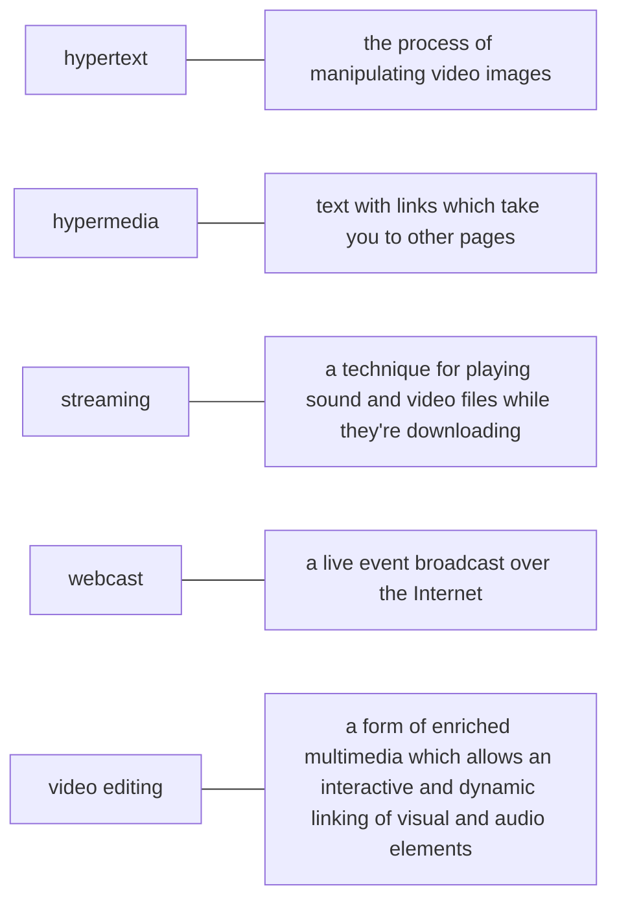

# UNIT 10 — Multimedia

## 1. TỪ VỰNG CHÍNH (Vocabulary)

| Từ/Cụm từ (EN) | Phiên âm | Nghĩa (VI) | Gợi nhớ |
|---|---|---|---|
| **multimedia** | /ˈmʌltiˌmiːdiə/ | đa phương tiện | multi (nhiều) + media (phương tiện) |
| **hypertext** | /ˈhaɪpətekst/ | siêu văn bản | hyper (vượt bậc) + text (văn bản) = văn bản chứa liên kết |
| **hypermedia** | /ˌhaɪpəˈmiːdiə/ | siêu đa phương tiện | hyper + media = liên kết kết hợp cả ảnh, âm thanh, video |
| **interactivity** | /ˌɪntərækˈtɪvəti/ | tính tương tác | inter (giữa) + activity (hoạt động) = sự tương tác qua lại |
| **sound card** | /ˈsaʊnd kɑːd/ | card âm thanh | sound (âm thanh) + card (bo mạch) |
| **stereo synthesizer** | /ˈsteriəʊ ˈsɪnθəsaɪzə/ | bộ tổng hợp âm thanh nổi | stereo (âm thanh nổi) + synthesizer (bộ tổng hợp) |
| **MIDI** | | giao diện kỹ thuật số dành cho nhạc cụ | Musical Instrument Digital Interface |
| **DAW** | | trạm làm việc âm thanh kỹ thuật số | Digital Audio Workstation |
| **MP3** | | định dạng nén âm thanh MP3 | MPEG audio player 3 |
| **CD ripper** | | phần mềm trích xuất nhạc từ đĩa CD | rip = trích xuất/xé từ đĩa |
| **streaming audio** | /ˈstriːmɪŋ ˈɔːdiəʊ/ | truyền phát âm thanh trực tiếp | stream = dòng chảy (dữ liệu truyền liên tục) |
| **webcast** | /ˈwebkɑːst/ | phát sóng trực tiếp trên web | web + cast (phát sóng) = phát trực tiếp qua mạng |
| **plug-in** | /ˈplʌɡ ɪn/ | phần mềm cắm thêm, bổ trợ | plug = cắm, in = vào |
| **video computing** | /ˈvɪdiəʊ kəmˈpjuːtɪŋ/ | tin học video | xử lý video bằng máy tính |
| **video editing** | /ˈvɪdiəʊ ˈedɪtɪŋ/ | chỉnh sửa video | edit = chỉnh sửa |
| **information kiosk** | /ˌɪnfəˈmeɪʃn ˈkiːɒsk/ | trạm thông tin công cộng | kiosk = quầy thông tin |
| **optical disc** | /ˈɒptɪkl dɪsk/ | đĩa quang | đĩa CD, DVD đọc bằng tia laser |
| **surround sound** | /səˈraùi nd saʊnd/ | âm thanh vòm | surround = bao quanh |
| **soundtrack** | /ˈsaʊndtræk/ | nhạc nền | track = bản nhạc |

---

### BẢNG TỔNG HỢP — CÔNG NGHỆ ĐA PHƯƠNG TIỆN

⚠️ Bảng này là nguồn ôn chính cho dạng bài "điền từ theo chức năng" hoặc "nối công nghệ với vai trò".

| Thiết bị / Công nghệ | Vai trò / Chức năng chính | Ứng dụng thực tế |
|---|---|---|
| **Sound card** | Thu âm thanh dưới dạng kỹ thuật số và phát lại, tích hợp bộ tổng hợp âm thanh nổi. | Tạo âm thanh trên máy tính |
| **MIDI** | Cho phép nhạc cụ điện tử (đàn keyboard, v.v.) giao tiếp và truyền tín hiệu với máy tính. | Soạn nhạc, kết nối nhạc cụ điện tử |
| **DAW (Digital Audio Workstation)** | Trộn và ghi âm nhiều track âm thanh kỹ thuật số khác nhau. | Ghi âm chuyên nghiệp, sản xuất âm nhạc |
| **CD ripper** | Trích xuất các bản nhạc từ đĩa CD và lưu dưới dạng tệp MP3 trên ổ đĩa. | Chuyển đổi định dạng nhạc từ đĩa cứng/CD |
| **Video editing software** | Cắt ghép phân đoạn, sắp xếp clip, thêm hiệu ứng chuyển cảnh và âm thanh. | Làm phim, sản xuất video (ví dụ: iMovie) |

---

## 2. BÀI ĐỌC SONG NGỮ (Reading — EN | VI)

### The Potential of Multimedia

**English (Original)**
Multimedia applications are used in all sorts of fields. For example, museums, banks and estate agents often have **information kiosks** that use multimedia; companies produce *training programs* on **optical discs**; businesspeople use *Microsoft PowerPoint* to create slideshows; and teachers use multimedia to make video projects or to teach subjects like art and music. They have all found that moving images and sound can involve viewers emotionally as well as inform them, helping make their message more memorable.

> **[VI]** Các ứng dụng đa phương tiện được sử dụng trong mọi lĩnh vực. Ví dụ, các bảo tàng, ngân hàng và đại lý bất động sản thường có các trạm thông tin công cộng sử dụng đa phương tiện; các công ty sản xuất các chương trình đào tạo trên đĩa quang; giới kinh doanh sử dụng phần mềm *Microsoft PowerPoint* để tạo các bài trình chiếu; và giáo viên sử dụng đa phương tiện để làm các dự án video hoặc dạy các môn học như mỹ thuật và âm nhạc. Tất cả họ đều nhận thấy rằng hình ảnh động và âm thanh có thể thu hút người xem về mặt cảm xúc cũng như cung cấp thông tin cho họ, giúp thông điệp của họ dễ nhớ hơn.
>
> 📌 *Tóm tắt:* Ứng dụng đa phương tiện (multimedia) được dùng rộng rãi trong các lĩnh vực như bảo tàng, ngân hàng, giáo dục nhờ khả năng truyền tải thông tin bằng hình ảnh và âm thanh sống động.

The power of multimedia software resides in **hypertext**, hypermedia and **interactivity** (meaning the user is involved in the programme). ⚠️ If you click on a **hypertext link**, you can jump to another screen with more information about a particular subject. Hypermedia is similar, but also uses graphics, audio and video as hypertext elements.

> **[VI]** Sức mạnh của phần mềm đa phương tiện nằm ở siêu văn bản, siêu đa phương tiện và tính tương tác (có nghĩa là người dùng tham gia vào chương trình). ⚠️ Nếu bạn nhấp vào một liên kết siêu văn bản, bạn có thể nhảy sang một màn hình khác chứa nhiều thông tin hơn về một chủ đề cụ thể. Siêu đa phương tiện cũng tương tự, nhưng nó còn sử dụng cả đồ họa, âm thanh và video dưới dạng các yếu tố siêu văn bản.
>
> 📌 *Tóm tắt:* Sức mạnh của phần mềm đa phương tiện nằm ở siêu văn bản (hypertext), siêu đa phương tiện (hypermedia) và tính tương tác (interactivity).

### Sound, Music, MIDI

**English (Original)**
As long as your computer has a **sound card**, you can use it to capture sounds in digital format and play them back. Sound cards offer two important capabilities: a built-in stereo synthesizer and a system called `MIDI`, or **Musical Instrument Digital Interface**, which allows electronic musical instruments to communicate with computers. A **Digital Audio Workstation** (`DAW`) lets you mix and record several tracks of digital audio.

> **[VI]** Miễn là máy tính của bạn có card âm thanh, bạn có thể sử dụng nó để thu âm thanh ở định dạng kỹ thuật số và phát lại chúng. Card âm thanh cung cấp hai khả năng quan trọng: một bộ tổng hợp âm thanh nổi tích hợp sẵn và một hệ thống gọi là `MIDI`, hay Giao diện kỹ thuật số dành cho nhạc cụ, cho phép các nhạc cụ điện tử giao tiếp với máy tính. Trạm làm việc âm thanh kỹ thuật số (`DAW`) cho phép bạn trộn và ghi âm một vài track âm thanh kỹ thuật số.
>
> 📌 *Tóm tắt:* Chỉ cần có card âm thanh (sound card), máy tính có thể thu và phát âm thanh. Giao diện kỹ thuật số `MIDI` giúp nhạc cụ điện tử kết nối với máy tính, và phần mềm `DAW` hỗ trợ trộn nhạc.

You can also listen to music on your `PC`, or transfer it to a portable `MP3` player. `MP3` is short for `MPEG` audio player 3, a standard format that **compresses audio files**. ⚠️ If you want to create your own `MP3` files from `CD`s, you must have a **CD ripper**, a program that extracts music tracks and saves them on disk as `MP3`s.

> **[VI]** Bạn cũng có thể nghe nhạc trên máy tính cá nhân của mình, hoặc chuyển nó sang một máy nghe nhạc `MP3` cầm tay. `MP3` là viết tắt của trình phát âm thanh `MPEG` 3, một định dạng chuẩn dùng để nén các tệp âm thanh. ⚠️ Nếu bạn muốn tự tạo các tệp `MP3` của riêng mình từ đĩa `CD`, bạn phải có một công cụ trích xuất đĩa `CD` (CD ripper), một chương trình trích xuất các bản nhạc và lưu chúng trên đĩa dưới dạng tệp `MP3`.
>
> 📌 *Tóm tắt:* Định dạng `MP3` nén dữ liệu âm thanh và được tạo ra nhờ phần mềm trích xuất `CD ripper`.

Audio is becoming a key element of the Web. Many radio stations broadcast live over the Internet using **streaming audio** technology, which lets you listen to audio in a continuous stream while it is being transmitted. The broadcast of an event over the Web, for example a concert, is called a **webcast**. Be aware that you won't be able to play audio and video on the Web unless you have a *plug-in* like *RealPlayer* or *QuickTime*.

> **[VI]** Âm thanh đang trở thành một yếu tố cốt lõi của mạng Web. Nhiều đài phát thanh phát sóng trực tiếp qua Internet bằng công nghệ truyền phát âm thanh trực tuyến (streaming audio), cho phép bạn nghe âm thanh theo một dòng liên tục trong khi nó đang được truyền đi. Việc phát sóng một sự kiện trên Web, chẳng hạn như một buổi hòa nhạc, được gọi là truyền phát trực tiếp trên web (webcast). Hãy lưu ý rằng bạn sẽ không thể phát âm thanh và video trên Web trừ khi bạn có một phần mềm hỗ trợ cắm thêm (plug-in) như *RealPlayer* hoặc *QuickTime*.
>
> 📌 *Tóm tắt:* Công nghệ truyền phát âm thanh trực tuyến (streaming audio) và truyền phát sự kiện (webcast) yêu cầu các phần mềm hỗ trợ cắm thêm (plug-in) như *RealPlayer* hoặc *QuickTime*.

### Creating and Editing Movies

**English (Original)**
Video is another important part of multimedia. **Video computing** refers to recording, manipulating and storing video in digital format. ⚠️ If you wanted to make a movie on your computer, first you would need to capture images with a **digital video camera** and then transfer them to your computer. Next, you would need a **video editing** program like *iMovie* to cut your favourite segments, re-sequence the clips and add transitions and other effects. Finally, you could save your movie on a `DVD` or post it on websites like *YouTube* and *Google Video*.

> **[VI]** Video là một phần quan trọng khác của đa phương tiện. Tin học video đề cập đến việc ghi hình, xử lý và lưu trữ video ở định dạng kỹ thuật số. ⚠️ Nếu bạn muốn làm một bộ phim trên máy tính của mình, trước tiên bạn cần thu giữ các hình ảnh bằng một máy quay video kỹ thuật số rồi truyền chúng vào máy tính. Tiếp theo, bạn sẽ cần một chương trình chỉnh sửa video như *iMovie* để cắt các phân cảnh yêu thích của mình, sắp xếp lại chuỗi clip và thêm các hiệu ứng chuyển cảnh cũng như các hiệu ứng khác. Cuối cùng, bạn có thể lưu bộ phim của mình trên đĩa `DVD` hoặc đăng nó lên các trang web như *YouTube* và *Google Video*.
>
> 📌 *Tóm tắt:* Tin học video (video computing) bao gồm ghi hình, xử lý và lưu trữ video kỹ thuật số. Quá trình làm phim gồm quay phim bằng camera kỹ thuật số, chỉnh sửa cắt ghép và thêm hiệu ứng bằng phần mềm như *iMovie*, rồi lưu trữ hoặc đăng tải lên Web (*YouTube*).

### Multimedia Products

**English (Original)**
Multimedia is used to produce **dictionaries and encyclopedias**. They often come on `DVD`s, but some are also available on the Web. A good example is the *Grolier Online Encyclopedia*, which contains thousands of articles, animations, sounds, dynamic maps and hyperlinks. Similarly, the *Encyclopedia Britannica* is now available online, and a concise version is available for *iPod*s, `PDA`s and mobile phones. **Educational courses** on history, science and foreign languages are also available on `DVD`. Finally, if you like entertainment, you'll love the latest **multimedia video games** with surround sound, music soundtracks, and even film extracts.

> **[VI]** Đa phương tiện được sử dụng để sản xuất các từ điển và bách khoa toàn thư. Chúng thường được phát hành trên đĩa `DVD`, nhưng một số cũng có sẵn trên Web. Một ví dụ điển hình là *Bách khoa toàn thư trực tuyến Grolier*, chứa hàng ngàn bài viết, hình ảnh động, âm thanh, bản đồ động và các siêu liên kết. Tương tự, *Bách khoa toàn thư Britannica* hiện đã có trực tuyến, và một phiên bản rút gọn có sẵn cho máy *iPod*, thiết bị hỗ trợ kỹ thuật số cá nhân `PDA` và điện thoại di động. Các khóa học giáo dục về lịch sử, khoa học và ngoại ngữ cũng có sẵn trên đĩa `DVD`. Cuối cùng, nếu bạn thích giải trí, bạn sẽ yêu thích các trò chơi video đa phương tiện mới nhất với âm thanh vòm, nhạc nền và thậm chí cả các đoạn trích từ phim.
>
> 📌 *Tóm tắt:* Đa phương tiện được ứng dụng để sản xuất từ điển, bách khoa toàn thư trực tuyến hoặc trên đĩa `DVD`. Ngoài ra, nó còn hỗ trợ xây dựng các khóa học giáo dục trực quan và thiết kế các trò chơi điện tử đa phương tiện với âm thanh vòm sống động.

## KEY CONCEPTS

| Concept | Short Explanation | Giải thích tiếng Việt |
|---|---|---|
| **multimedia** | the integration of text, sound, graphics, video, and animation. | Đa phương tiện: tích hợp chữ, âm thanh, đồ họa, video và hoạt ảnh. |
| **sound card** | a device converting digital audio data into analog sound signals. | Card âm thanh: thiết bị chuyển đổi tín hiệu số thành âm thanh phát ra loa. |
| **MIDI** | Musical Instrument Digital Interface, protocol for connecting instruments. | MIDI: giao thức chuẩn kết nối nhạc cụ điện tử với máy tính. |
| **codec** | software algorithms to compress and decompress digital media files. | Codec: thuật toán phần mềm dùng nén và giải nén file đa phương tiện. |

---

## POSSIBLE EXAM QUESTIONS

Q: What is multimedia?
A: The combination of text, sound, graphics, video, and animation in one program.
*(Dịch: Đa phương tiện là gì? - Kết hợp chữ, âm thanh, đồ họa, video và hoạt ảnh trong một ứng dụng.)*

Q: Explain the role of a sound card.
A: It converts digital data to analog sounds for speakers, and vice versa.
*(Dịch: Giải thích vai trò card âm thanh. - Chuyển đổi dữ liệu số thành âm thanh loa phát và ngược lại khi ghi âm.)*

Q: How does MIDI differ from MP3 audio files?
A: MIDI stores instructions to play music (no audio data), while MP3 stores digitized waves.
*(Dịch: MIDI khác gì MP3? - MIDI lưu lệnh chơi nhạc (không có tiếng), MP3 lưu sóng âm số hóa (dung lượng lớn hơn).)*

Q: Why are codecs important in digital video?
A: They compress massive video files to make them practical to stream and store.
*(Dịch: Tại sao codec quan trọng trong video số? - Chúng nén file video khổng lồ để dễ dàng lưu trữ và truyền phát.)*

---

## ONE-LINE ANSWERS

- Multimedia combines text, sound, graphics, and video elements. (Đa phương tiện kết hợp chữ, âm thanh, đồ họa và video.)
- Sound cards convert digital sound files to speaker signals. (Card âm thanh chuyển file nhạc số thành tín hiệu phát loa.)
- MIDI files contain musical notes and instructions, not audio. (File MIDI chứa nốt nhạc và lệnh chơi nhạc, không có tiếng.)
- Codecs compress video files to reduce bandwidth requirements. (Codec nén video để giảm yêu cầu băng thông truyền tải.)

---

## TEACHER TRAPS (DỄ NHẦM LẪN)

### ⚠️ MIDI vs MP3
MIDI lưu ký hiệu nốt nhạc (dung lượng siêu nhỏ, cần nhạc cụ phát). MP3 lưu dữ liệu âm thanh thực tế (chạy được ngay).

### ⚠️ Codec vs Media Player
Codec là thuật toán nén/giải nén ẩn bên trong. Media Player là giao diện phần mềm có nút Play/Pause.

---

## WEBSITE / SOFTWARE / APPLICATION IDENTIFICATION

| Name | Type | Main Function (EN) | Chức năng chính (VI) |
|---|---|---|---|
| **Media Player** | Playback Software | Play compressed audio and video files | Phát các tệp âm thanh và video đã nén |
| **MIDI Sequencer** | Music Software | Record and edit MIDI musical performances | Ghi âm và chỉnh sửa các bản nhạc MIDI |

---

## 3. NGỮ PHÁP (Grammar)

### 3.1 Câu điều kiện loại 1 (First Conditional)
- **Công thức**:
  `If + S + V (hiện tại đơn), S + will/can/must/should + V (nguyên thể)`
- **Cách dùng**:
  Diễn tả các điều kiện có thực, có thể xảy ra ở hiện tại hoặc tương lai.
- **Liên từ thay thế**:
  - `unless` (= `if not` / trừ khi): `You won't be able to play video unless you have a plug-in` (= `if you don't have a plug-in`)
  - `as long as` (= `provided that` / miễn là): `As long as your computer has a sound card, you can use it...` (= `If your computer has a sound card...`)
- **Ví dụ từ bài**:
  - *If you want to create your own MP3 files from CDs, you must have a CD ripper.*
  - *If you bring your digital video camera, we can make a movie on my PC.*

### 3.2 Câu điều kiện loại 2 (Second Conditional)
- **Công thức**:
  `If + S + V (quá khứ đơn), S + would/could/might/should + V (nguyên thể)`
- **Cách dùng**:
  Diễn tả tình huống giả định, không có thật hoặc trái với thực tế ở hiện tại hoặc tương lai.
- **Lưu ý đặc biệt**:
  Khi động từ `to be` ở mệnh đề `if`, ta chia là `were` cho tất cả các ngôi (ngay cả `I`, `he`, `she`, `it`).
- **Ví dụ từ bài**:
  - *If you wanted to make a movie on your computer, first you would need to capture images...*
  - *If I were you, I'd get a new MP3 player.*
  - *If the marketing manager had PowerPoint, she could make more effective presentations.*

### So sánh Điều kiện Loại 1 và Loại 2

| Đặc điểm | Điều kiện Loại 1 (First Conditional) | Điều kiện Loại 2 (Second Conditional) |
|---|---|---|
| **Khả năng xảy ra** | Có thực, có thể xảy ra ở hiện tại/tương lai | Trái thực tế ở hiện tại, chỉ là giả định/mơ ước |
| **Mệnh đề điều kiện (If)** | Hiện tại đơn (`V_s/es`, `don't/doesn't + V`) | Quá khứ đơn (`V2/ed`, `didn't + V`, to-be = `were`) |
| **Mệnh đề chính** | `will/can/must/should + V_infinitive` | `would/could/might/should + V_infinitive` |
| **Ví dụ đối chiếu** | If I have money, I will buy software. *(Tôi có thể sẽ có tiền)* | If I had money, I would buy software. *(Thực tế tôi đang không có tiền)* |

---

## 4. BÀI TẬP & ĐÁP ÁN (Exercises & Answer Key)

### Exercise A — Verb Forms in Conditionals

Complete these sentences with the correct form of the verbs in brackets:

1. If you ___ (bring) your digital video camera, we can make a movie on my PC.
2. You won't be able to play those video files if you ___ (not have) the correct plug-in.
3. If the marketing manager ___ (have) PowerPoint, she could make more effective presentations.
4. If I could afford it, I ___ (buy) a new game console.
5. If I had the money, I ___ (invest) in some new multimedia software.

<b>Xem đáp án chi tiết</b>

1. **bring** — Câu điều kiện loại 1 (mệnh đề chính dùng động từ khuyết thiếu "can make"), mệnh đề if chia thì hiện tại đơn.
2. **don't have** — Câu điều kiện loại 1 phủ định ở hiện tại đơn (mệnh đề chính là "won't be able to").
3. **had** — Câu điều kiện loại 2 (mệnh đề chính dùng "could make"), mệnh đề if giả định trái thực tế ở hiện tại nên chia động từ ở quá khứ đơn (`have` thành `had`).
4. **would buy** — Câu điều kiện loại 2 (mệnh đề if chia quá khứ đơn "could afford"), mệnh đề chính chia dạng `would + V_infinitive`.
5. **would invest** — Câu điều kiện loại 2 (mệnh đề if dùng quá khứ đơn "had"), mệnh đề chính dùng `would + V_infinitive`.

### Exercise B — Technical Mistakes Correction

Correct the technical mistake in each of these sentences. The incorrect parts are in square brackets.

1. Multimedia training software is distributed on [magnetic disks].
2. You need to have [MIDI] on your computer to hear speech and music.
3. [A stereo synthesizer] allows your computer to communicate with electronic musical instruments.
4. A CD ripper converts CDs to [live streams].
5. The Encyclopedia Britannica is only available [on DVD].

<b>Xem đáp án chi tiết</b>

1. `magnetic disks` -> **optical discs** (đĩa quang) — vì đĩa quang (như đĩa CD, DVD) là phương tiện phân phối tiêu chuẩn cho các phần mềm huấn luyện đa phương tiện thay vì đĩa từ.
2. `MIDI` -> **sound card** (card âm thanh) — vì card âm thanh là thiết bị phần cứng bắt buộc giúp xử lý và chuyển đổi âm thanh để máy tính có thể phát được nhạc/giọng nói.
3. `A stereo synthesizer` -> **MIDI** (hoặc **Musical Instrument Digital Interface**) — vì MIDI mới là hệ thống tiêu chuẩn giao tiếp giữa nhạc cụ điện tử và máy tính.
4. `live streams` -> **MP3s** (hoặc **MP3 files**) — vì CD ripper thực hiện việc trích xuất và nén bản nhạc CD sang dạng tệp nén MP3 lưu cục bộ, không phải phát trực tuyến.
5. `on DVD` -> **online / on the Web** (hoặc **for iPods, PDAs and mobile phones**) — vì Bách khoa toàn thư Britannica hiện đã có bản trực tuyến miễn phí hoặc trả phí và phiên bản cho thiết bị cầm tay di động.

### Exercise C — Word Matching

Match the words (A-E) with the definitions (1-5) using the Mermaid diagram below:

<b>Xem đáp án chi tiết</b>

- **hypertext** --- **text with links which take you to other pages** (suy luận) — văn bản có chứa liên kết giúp người dùng chuyển đổi giữa các trang thông tin.
- **hypermedia** --- **a form of enriched multimedia which allows an interactive and dynamic linking of visual and audio elements** (suy luận) — siêu đa phương tiện kết hợp cả yếu tố đồ họa, âm thanh, video làm liên kết.
- **streaming** --- **a technique for playing sound and video files while they're downloading** (suy luận) — kỹ thuật cho phép phát âm thanh/hình ảnh khi tệp tin đang được tải về từ máy chủ.
- **webcast** --- **a live event broadcast over the Internet** (suy luận) — sự kiện trực tiếp được truyền phát qua mạng Web.
- **video editing** --- **the process of manipulating video images** (suy luận) — quy trình xử lý, cắt ghép và biên tập hình ảnh video.

### Exercise D — Second Conditional Practice (Discussion)

Answer these discussion questions using the second conditional:

1. What would you do if you had a digital video camera?
   - *If I had a digital video camera, I...*
2. What would you do if you had a home recording studio?
   - *If I had a home recording studio, I...*
3. What would you do if you couldn't afford an iPod but you wanted an MP3 player?
   - *If I couldn't afford an iPod but I wanted an MP3 player, I...*
4. What would you do if you won the lottery?
   - *If I won the lottery, I...*
5. What would you do if someone stole your laptop?
   - *If someone stole my laptop, I...*

---

<b>Xem đáp án chi tiết</b>

1. **If I had a digital video camera, I would film travel vlogs and upload them to YouTube.** (suy luận)
2. **If I had a home recording studio, I could produce and mix high-quality music tracks.** (suy luận)
3. **If I couldn't afford an iPod but I wanted an MP3 player, I would download a music player application on my phone.** (suy luận)
4. **If I won the lottery, I would buy the most powerful computer setup for video editing.** (suy luận)
5. **If someone stole my laptop, I would contact the local police and track the device online.** (suy luận)

### 🧪 Mini Quiz

**Câu 1 (Trắc nghiệm):** Which hardware component allows electronic musical instruments to communicate with a computer?
- a. Digital Audio Workstation (DAW)
- b. Musical Instrument Digital Interface (MIDI)
- c. CD ripper

<b>Xem đáp án chi tiết</b>

**Câu 1 (Trắc nghiệm):**
*   **b. Musical Instrument Digital Interface (MIDI) ✓** — Đây là tiêu chuẩn kết nối nhạc cụ với máy tính được định nghĩa ở bài đọc.
*   - a. Digital Audio Workstation (DAW) ✗ — Đây là trạm làm việc âm thanh (phần mềm/hệ thống thu trộn nhạc).
*   - c. CD ripper ✗ — Phần mềm trích xuất đĩa nhạc CD.

**Câu 2 (Điền từ):** A software program that extracts music tracks from audio CDs and saves them as MP3s is called a ____________.

<b>Xem đáp án chi tiết</b>

**Câu 2 (Điền từ):**
*   **CD ripper** — Trình trích xuất đĩa CD nhạc thành tệp tin MP3.

**Câu 3 (Trắc nghiệm):** Choose the correct verb form: "If I _________ the money, I would buy that professional video editing program."
- a. have
- b. had
- c. will have

<b>Xem đáp án chi tiết</b>

**Câu 3 (Trắc nghiệm):**
*   **b. had ✓** — Cấu trúc câu điều kiện loại 2 (mệnh đề chính dùng "would buy"), do đó động từ trong mệnh đề điều kiện chia ở quá khứ đơn ("had").
*   - a. have ✗ — Thì hiện tại đơn (chỉ dùng cho loại 1).
*   - c. will have ✗ — Không dùng "will" trong mệnh đề "if".

**Câu 4 (Điền từ):** Fill in the blank with the correct verb form: "We won't be able to listen to the webcast unless we _________ (have) the correct plug-in."

<b>Xem đáp án chi tiết</b>

**Câu 4 (Điền từ):**
*   **have** — Câu điều kiện loại 1 phủ định ở mệnh đề chính ("won't be able to"), mệnh đề "unless" đóng vai trò là "if not", động từ đi kèm chia ở hiện tại đơn khẳng định ("have").

**Câu 5 (Điền từ):** What does `MP3` stand for? _____________.

<b>Xem đáp án chi tiết</b>

**Câu 5 (Điền từ):**
*   **MPEG audio player 3** — Viết tắt đầy đủ của định dạng âm thanh MP3.

**Câu 6 (Nối):** Nối thuật ngữ với nghĩa tương thích:
1. Webcast — A. Công nghệ nghe/xem nội dung trực tiếp khi đang truyền tải qua mạng
2. Streaming — B. Buổi phát sóng trực tiếp một sự kiện âm nhạc/hội thảo qua mạng Web
3. Interactivity — C. Khả năng người dùng chủ động tương tác với phần mềm
*(Đáp án: 1-B, 2-A, 3-C)*

---

<b>Xem đáp án chi tiết</b>

**Câu 6 (Nối):**
*   **1-B** (Webcast — Buổi phát sóng trực tiếp một sự kiện qua mạng Web)
*   **2-A** (Streaming — Công nghệ nghe/xem nội dung trực tiếp khi đang truyền tải qua mạng)
*   **3-C** (Interactivity — Khả năng người dùng chủ động tương tác với phần mềm)

---

## 5. GLOSSARY TỔNG HỢP

| Thuật ngữ | Nghĩa | Gợi nhớ | Xuất hiện ở |
|---|---|---|---|
| **CD ripper** | phần mềm trích xuất CD | rip = trích xuất, tách nhạc từ CD | Reading 2, Ex B |
| **DAW** | trạm làm việc âm thanh kỹ thuật số | Digital Audio Workstation | Reading 2, Glossary |
| **hypermedia** | siêu đa phương tiện | hyper = siêu, media = đa phương tiện | Reading 1, Ex C |
| **hypertext** | siêu văn bản | hyper = siêu, text = văn bản | Reading 1, Ex C |
| **interactivity** | tính tương tác | interactive = tương tác | Reading 1 |
| **MIDI** | giao diện số nhạc cụ | Musical Instrument Digital Interface | Reading 2, Ex B |
| **MP3** | định dạng âm thanh nén | MPEG audio player 3 | Reading 2, Ex B |
| **multimedia** | đa phương tiện | multi = nhiều, media = phương tiện | Reading 1, Ex B |
| **optical disc** | đĩa quang | optic = quang học, đĩa CD/DVD | Reading 1, Ex B |
| **plug-in** | phần mềm cắm thêm | plug = cắm, in = vào | Reading 2 |
| **sound card** | card âm thanh | card xử lý tín hiệu âm thanh | Reading 2, Ex B |
| **streaming** | truyền phát trực tuyến | stream = dòng chảy | Reading 2, Ex C |
| **surround sound** | âm thanh vòm | surround = bao quanh | Reading 4 |
| **video computing** | tin học video | computing = tin học | Reading 3 |
| **video editing** | chỉnh sửa video | edit = chỉnh sửa | Reading 3, Ex C |
| **webcast** | phát sóng trên web | web + cast = phát qua web | Reading 2, Ex C |
