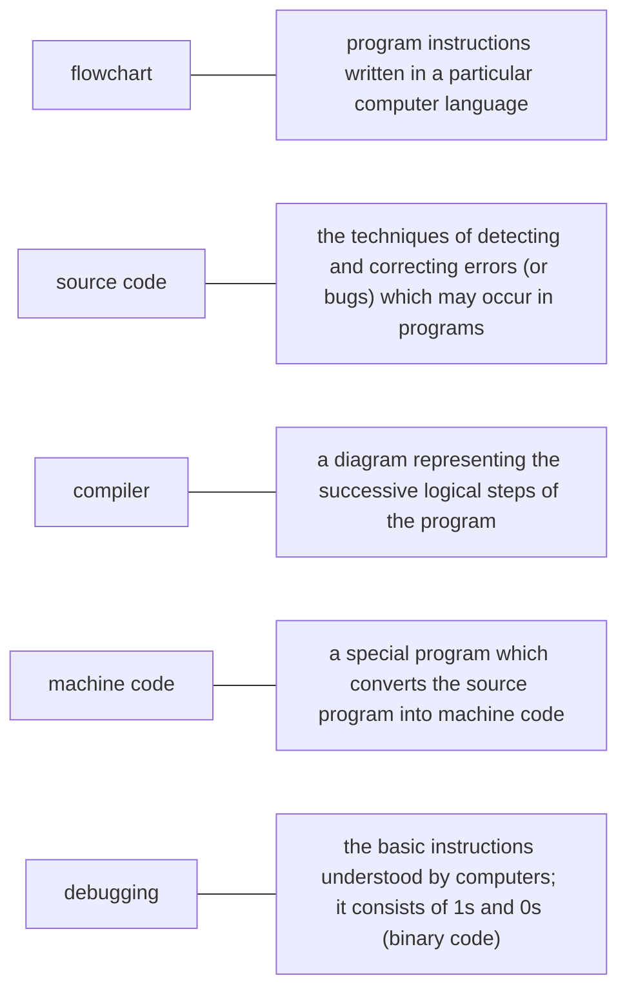

# UNIT 11 — Program Design and Computer Languages

## 1. TỪ VỰNG CHÍNH (Vocabulary)

| Từ/Cụm từ (EN) | Phiên âm | Nghĩa (VI) | Gợi nhớ |
|---|---|---|---|
| **flowchart** | /ˈfləʊtʃɑːt/ | sơ đồ khối, lưu đồ | flow (luồng) + chart (sơ đồ) |
| **source code** | /ˈsɔːs kəʊd/ | mã nguồn | source (nguồn) + code (mã) |
| **compiler** | /kəmˈpaɪlər/ | trình biên dịch | compile (biên dịch) |
| **interpreter** | /ɪnˈtɜːprətər/ | trình thông dịch | interpret (thông dịch) |
| **machine code** | /məˈʃiːn kəʊd/ | mã máy | mã nhị phân 0 và 1 vi xử lý hiểu trực tiếp |
| **assembler** | /əˈsemblər/ | trình hợp dịch | dịch assembly sang mã máy |
| **debugging** | /ˌdiːˈbʌɡɪŋ/ | việc gỡ lỗi | de- (loại bỏ) + bug (lỗi máy tính) |
| **low-level language** | /ˌləʊˈlev.əl ˈlæŋ.ɡwɪdʒ/ | ngôn ngữ bậc thấp | gần phần cứng máy tính hơn |
| **high-level language** | /ˌhaɪˈlev.əl ˈlæŋ.ɡwɪdʒ/ | ngôn ngữ bậc cao | gần ngôn ngữ tự nhiên của con người hơn |
| **object-oriented programming** | /ˌɒbdʒɪkt ˌɔːrientɪd ˈprəʊɡræmɪŋ/ | lập trình hướng đối tượng | viết tắt là OOP |
| **markup language** | /ˈmɑːkʌp ˈlæŋɡwɪdʒ/ | ngôn ngữ đánh dấu | dùng các thẻ để định dạng văn bản |
| **markup tag** | /ˈmɑːkʌp tæɡ/ | thẻ đánh dấu | tag = thẻ |
| **voice recognition** | /vɔɪs ˌrekəɡˈnɪʃn/ | nhận dạng giọng nói | voice (giọng nói) + recognition (nhận diện) |
| **text-to-speech** | /tekst tuː spiːtʃ/ | chuyển văn bản thành giọng nói | text (văn bản) + speech (giọng nói) |
| **applet** | /ˈæplət/ | ứng dụng con (web) | chương trình nhỏ nhúng trên trang web |

---

### BẢNG TỔNG HỢP — CÁC NGÔN NGỮ LẬP TRÌNH & ĐÁNH DẤU

⚠️ Bảng này là nguồn ôn chính cho dạng bài "điền từ theo chức năng" hoặc "nối công nghệ với vai trò".

| Ngôn ngữ | Loại | Năm ra đời | Ứng dụng / Đặc điểm chính |
|---|---|---|---|
| **FORTRAN** | Bậc cao | 1954 | Khoa học và kỹ thuật (Scientific & engineering) |
| **COBOL** | Bậc cao | 1959 | Ứng dụng kinh doanh thương mại (Business applications) |
| **BASIC** | Bậc cao | Thập niên 1960 | Dễ học, dùng phổ biến trên các máy vi tính đời đầu |
| **Visual BASIC** | Bậc cao | 1990 | Thiết kế giao diện đồ họa (GUI) nhanh chóng trên Windows |
| **PASCAL** | Bậc cao | 1971 | Giảng dạy nguyên lý và nền tảng lập trình tại đại học |
| **C** | Bậc cao | Thập niên 1980 | Viết phần mềm hệ thống, đồ họa và các ứng dụng thương mại |
| **C++** | Bậc cao | Thập niên 1980 | Phiên bản mở rộng của C hỗ trợ lập trình hướng đối tượng (OOP) |
| **Java** | Bậc cao | 1995 | Thiết kế chạy trên Web qua các chương trình nhỏ (applets) |
| **HTML** | Đánh dấu | | Định dạng cấu trúc hiển thị thông tin trực quan trên trang web |
| **XML** | Đánh dấu | | Cho phép tự định nghĩa các thẻ tùy biến để cấu trúc dữ liệu |
| **VoiceXML** | Đánh dấu | 2000 | Truy cập nội dung web bằng giọng nói thông qua điện thoại |

---

## 2. BÀI ĐỌC SONG NGỮ (Reading — EN | VI)

### The Need for Symbolic Languages

**English (Original)**
Unfortunately for us, computers can't understand spoken English or any other natural language. The only language they can understand directly is **machine code**, which consists of 1s and 0s (binary code).

Machine code is too difficult to write. For this reason, we use symbolic languages to communicate instructions to the computer. For example, *assembly languages* use abbreviations such as *ADD*, *SUB*, *MPY* to represent instructions. The program is then translated into machine code by a piece of software called an **assembler**. Machine code and assembly languages are called **low-level languages** because they are closer to the hardware. They are quite complex and restricted to particular machines. To make the programs easier to write, and to overcome the problem of intercommunication between different types of computer, software developers designed **high-level languages**, which are closer to the English language.

> 📌 **Tóm tắt:** Máy tính chỉ hiểu trực tiếp mã máy (machine code) gồm các số 0 và 1. Vì mã máy quá khó viết, các nhà phát triển sử dụng ngôn ngữ ký hiệu (ngôn ngữ bậc thấp và bậc cao) rồi chuyển đổi sang mã máy nhờ phần mềm dịch (như assembler).

> **[VI]** Thật không may cho chúng ta, máy tính không thể hiểu tiếng Anh nói hay bất kỳ ngôn ngữ tự nhiên nào khác. Ngôn ngữ duy nhất chúng có thể hiểu trực tiếp là **mã máy**, bao gồm các chữ số 1 và 0 (mã nhị phân).
> Mã máy quá khó để viết. Vì lý do này, chúng ta sử dụng các ngôn ngữ ký hiệu để truyền đạt các chỉ thị cho máy tính. Ví dụ, *ngôn ngữ hợp dịch* (assembly languages) sử dụng các chữ viết tắt như *ADD*, *SUB*, *MPY* để đại diện cho các chỉ thị. Sau đó, chương trình được dịch sang mã máy bằng một phần mềm gọi là **trình hợp dịch** (assembler). Mã máy và ngôn ngữ hợp dịch được gọi là **ngôn ngữ bậc thấp** vì chúng gần với phần cứng hơn. Chúng khá phức tạp và bị giới hạn ở các dòng máy cụ thể. Để làm cho các chương trình dễ viết hơn, và để khắc phục vấn đề giao tiếp giữa các loại máy tính khác nhau, các nhà phát triển phần mềm đã thiết kế các **ngôn ngữ bậc cao**, gần gũi với ngôn ngữ tiếng Anh hơn.

---

### Examples of High-level Languages

**English (Original)**
Here are some examples of high-level languages:
- *FORTRAN* was developed by `IBM` in 1954 and is still used for scientific and engineering applications.
- *COBOL* (Common Business Oriented Language) was developed in 1959 and is mainly used for business applications.
- *BASIC* was developed in the 1960s and was widely used in microcomputer programming because it was easy to learn. *Visual BASIC* is a modern version of the old *BASIC* language, used to build graphical elements such as buttons and windows in Windows programs.
- *PASCAL* was created in 1971. It is used in universities to teach the fundamentals of programming.

> 📌 **Tóm tắt:** Các ngôn ngữ bậc cao phổ biến trong lịch sử bao gồm *FORTRAN* (khoa học/kỹ thuật), *COBOL* (kinh doanh), *BASIC*/*Visual BASIC* (giao diện Windows, dễ học), và *PASCAL* (giảng dạy lập trình cơ bản).

> **[VI]** Dưới đây là một số ví dụ về ngôn ngữ bậc cao:
> - *FORTRAN* được phát triển bởi `IBM` vào năm 1954 và vẫn được sử dụng cho các ứng dụng khoa học và kỹ thuật.
> - *COBOL* (Ngôn ngữ hướng kinh doanh chung) được phát triển vào năm 1959 và chủ yếu được sử dụng cho các ứng dụng kinh doanh.
> - *BASIC* được phát triển vào những năm 1960 và được sử dụng rộng rãi trong lập trình máy vi tính vì nó dễ học. *Visual BASIC* là một phiên bản hiện đại của ngôn ngữ *BASIC* cũ, được sử dụng để xây dựng các yếu tố đồ họa như nút bấm và cửa sổ trong các chương trình Windows.
> - *PASCAL* được tạo ra vào năm 1971. Nó được sử dụng trong các trường đại học để giảng dạy các nguyên lý cơ bản của lập trình.

---

### C, C++, and Java

**English (Original)**
*C* was developed in the 1980s at *AT&T*. It is used to write system software, graphics and commercial applications. *C++* is a version of *C* which incorporates **object-oriented programming** (`OOP`): the programmer concentrates on particular things (a piece of text, a graphic or a table, etc.) and gives each object functions which can be altered without changing the entire program. For example, to add a new graphics format, the programmer needs to rework just the graphics object. This makes programs easier to modify.

*Java* was designed by *Sun* in 1995 to run on the Web. *Java* applets provide animation and interactive features on web pages. Programs written in high-level languages must be translated into machine code by a **compiler** or an **interpreter**. ⚠️ A **compiler** translates the source code into object code - that is, it converts the entire program into machine code in one go. On the other hand, an **interpreter** translates the source code line by line as the program is running.

> 📌 **Tóm tắt:** Ngôn ngữ *C* chuyên viết phần mềm hệ thống và đồ họa. *C++* tích hợp lập trình hướng đối tượng (`OOP`) giúp dễ dàng chỉnh sửa chương trình. *Java* chuyên chạy trên Web. Các chương trình bậc cao được dịch sang mã máy bằng trình biên dịch (compiler - dịch toàn bộ một lúc) hoặc trình thông dịch (interpreter - dịch từng dòng khi chạy).

> **[VI]** *C* được phát triển vào những năm 1980 tại *AT&T*. Nó được sử dụng để viết phần mềm hệ thống, đồ họa và các ứng dụng thương mại. *C++* là một phiên bản của *C* kết hợp **lập trình hướng đối tượng** (`OOP`): lập trình viên tập trung vào các đối tượng cụ thể (một đoạn văn bản, một hình ảnh đồ họa hay một bảng biểu, v.v.) và cung cấp cho mỗi đối tượng các chức năng có thể thay đổi mà không cần sửa đổi toàn bộ chương trình. Ví dụ, để thêm một định dạng đồ họa mới, lập trình viên chỉ cần làm lại đối tượng đồ họa đó. Điều này làm cho các chương trình dễ sửa đổi hơn.
> *Java* được thiết kế bởi *Sun* vào năm 1995 để chạy trên Web. Các ứng dụng con (*Java* applets) cung cấp các tính năng hoạt ảnh và tương tác trên các trang web. Các chương trình được viết bằng ngôn ngữ bậc cao phải được dịch sang mã máy bằng một trình biên dịch hoặc một trình thông dịch. ⚠️ Một **trình biên dịch** (compiler) dịch mã nguồn thành mã đối tượng - tức là nó chuyển đổi toàn bộ chương trình sang mã máy trong một lượt. Mặt khác, một **trình thông dịch** (interpreter) dịch mã nguồn từng dòng một khi chương trình đang chạy.

---

### Markup Languages

**English (Original)**
It is important not to confuse programming languages with markup languages, used to create web documents. Markup languages use instructions, known as **markup tags**, to format and link text files. Some examples include:
- *HTML*, which allows us to describe how information will be displayed on web pages.
- *XML*, which stands for Extensible Markup Language. ⚠️ While *HTML* uses pre-defined tags, *XML* enables us to define our own tags; it is not limited by a fixed set of tags.
- *VoiceXML*, which makes Web content accessible via voice and phone. *VoiceXML* is used to create voice applications that run on the phone, whereas *HTML* is used to create visual applications (for example, web pages).

> 📌 **Tóm tắt:** Cần phân biệt ngôn ngữ lập trình với ngôn ngữ đánh dấu (markup languages) vốn sử dụng thẻ (tags) để định dạng và liên kết văn bản. Các ngôn ngữ đánh dấu gồm *HTML* (hiển thị trang web), *XML* (thẻ tự định nghĩa) và *VoiceXML* (truy cập web bằng giọng nói qua điện thoại).

> **[VI]** Điều quan trọng là không nhầm lẫn ngôn ngữ lập trình với ngôn ngữ đánh dấu, vốn được sử dụng để tạo tài liệu web. Ngôn ngữ đánh dấu sử dụng các chỉ thị, được gọi là **thẻ đánh dấu** (markup tags), để định dạng và liên kết các tệp văn bản. Một số ví dụ bao gồm:
> - *HTML*, cho phép chúng ta mô tả cách thông tin sẽ hiển thị trên các trang web.
> - *XML*, viết tắt của Ngôn ngữ đánh dấu mở rộng. ⚠️ Trong khi *HTML* sử dụng các thẻ được định nghĩa sẵn, *XML* cho phép chúng ta tự định nghĩa các thẻ của riêng mình; nó không bị giới hạn bởi một tập hợp thẻ cố định.
> - *VoiceXML*, giúp làm cho nội dung Web có thể truy cập được thông qua giọng nói và điện thoại. *VoiceXML* được sử dụng để tạo các ứng dụng giọng nói chạy trên điện thoại, trong khi *HTML* được sử dụng để tạo các ứng dụng hiển thị trực quan (ví dụ: các trang web).

---

### Profiles: Visual BASIC vs VoiceXML

**English (Original)**
*Visual BASIC* was developed by *Microsoft* in 1990. The name `BASIC` stands for *Beginner's All-purpose Symbolic Instruction Code*. The adjective "Visual" refers to the technique used to create a **graphical user interface** (`GUI`). Instead of writing a lot of instructions to describe interface elements, you just add pre-defined objects such as buttons, icons and dialog boxes. It enables programmers to create a variety of Windows applications.

*VoiceXML* (Extensible Markup Language) was created in 2000 to make web content accessible via the telephone. For input, it uses **voice recognition**. For output, it uses pre-recorded audio content and **text-to-speech**. Applications of *VoiceXML* include voice portals (where you can hear information about sports, news, traffic, etc.), voice-enabled intranets, voice e-commerce, and home appliances controlled by voice.

> 📌 **Tóm tắt:** *Visual BASIC* (1990) của *Microsoft* giúp lập trình nhanh giao diện đồ họa (`GUI`) trên Windows nhờ kéo thả đối tượng có sẵn. *VoiceXML* (2000) giúp truy cập web qua điện thoại bằng nhận diện giọng nói (input) và công nghệ văn bản thành giọng nói (output).

> **[VI]** *Visual BASIC* được phát triển bởi *Microsoft* vào năm 1990. Tên `BASIC` là viết tắt của *Beginner's All-purpose Symbolic Instruction Code* (Mã chỉ thị ký hiệu dành cho người bắt đầu). Tính từ "Visual" (trực quan) đề cập đến kỹ thuật được sử dụng để tạo ra giao diện người dùng đồ họa (`GUI`). Thay vì viết nhiều dòng lệnh để mô tả các thành phần giao diện, bạn chỉ cần thêm các đối tượng được định nghĩa sẵn như nút bấm, biểu tượng và hộp thoại. Nó cho phép lập trình viên tạo ra nhiều ứng dụng Windows khác nhau.
> *VoiceXML* (Ngôn ngữ đánh dấu giọng nói mở rộng) được tạo ra vào năm 2000 để làm cho nội dung web có thể truy cập được qua điện thoại. Đối với đầu vào, nó sử dụng **nhận dạng giọng nói**. Đối với đầu ra, nó sử dụng nội dung âm thanh được ghi âm sẵn và **chuyển văn bản thành giọng nói**. Các ứng dụng của *VoiceXML* bao gồm cổng thông tin giọng nói (nơi bạn có thể nghe thông tin về thể thao, tin tức, giao thông, v.v.), mạng nội bộ hỗ trợ giọng nói, thương mại điện tử qua giọng nói và các thiết bị gia dụng được điều khiển bằng giọng nói.

---

## 3. NGỮ PHÁP (Grammar)

### 3.1 Động từ nguyên thể có 'to' (To-infinitive)
- **Để thể hiện mục đích (Purpose)**:
  - *We use symbolic languages **to communicate** instructions.*
  - *I went on the course **to learn** how to be a better programmer.*
- **Sau một số tính từ (Adjectives)**:
  - *BASIC was easy **to learn**.*
  - *Machine code is too difficult **to write**.*
  - *It is advisable **to test** the programs.*
- **Sau một số động từ (Verbs)**:
  - *A lot of companies are now trying **to develop** voice applications.*
  - *He refuses **to do** the project with me.*
  - *Các động từ đi kèm phổ biến: afford, plan, agree, expect, promise, appear, hope, refuse, arrange, learn, try, decide, manage...*
- **Sau tân ngữ của một số động từ nhất định (Verb + Object + to-V)**:
  - *HTML allows us **to describe** how information will be displayed.*
  - *The engineers warned the employees not **to touch** the cables.*
  - *Các động từ đi kèm phổ biến: advise, encourage, allow, expect, tell, ask, invite, want, enable, order, warn...*

### 3.2 Động từ nguyên thể không 'to' (Bare-infinitive)
- **Sau các động từ khuyết thiếu (Modal Verbs)**:
  - *Computers cannot **understand** human languages directly.*
  - *High-level languages must **be** translated.*
  - *Các động từ khuyết thiếu: can, could, may, might, will, would, must, should...*
- **Sau đối tượng của động từ `make` và `let`**:
  - *Programs make computers **perform** specific tasks.*
  - *Spyware can make your PC **perform** more slowly.*
  - *Java applets let you **watch** animated characters.*

### Bảng tổng hợp cách dùng Động từ nguyên thể (Infinitive)

| Dạng động từ | Trường hợp sử dụng | Ví dụ chuyên ngành |
|---|---|---|
| **To-Infinitive** | Chỉ mục đích (in order to) | We use Java **to add** interactive features to web pages. |
| | Sau tính từ (easy, difficult, too/enough...) | Machine code is too difficult **to write**. |
| | Sau động từ: *try, refuse, plan, hope, decide...* | He refuses **to do** the project with me. |
| | Sau động từ + Tân ngữ: *allow, enable, encourage, warn...* | HTML allows us **to describe** web page layouts. |
| **Bare-Infinitive** | Sau động từ khuyết thiếu (*can, must, should, may...*) | Computers cannot **understand** human languages directly. |
| | Sau tân ngữ của *make* hoặc *let* | Malware can make your system **crash**. |

---

## 4. BÀI TẬP (Exercises)

### Exercise A — Word Definitions Matching
Match the words (A-E) with their definitions (1-5) using the Mermaid diagram below:

### Exercise B — Sequencing: Program Development Steps
Put these program development steps into the correct logical order:

- Compile the program (to turn it into machine code)
- Understand the problem and plan a solution
- Test and debug the program
- Make a flowchart of the program
- Prepare documentation
- Write instructions in a programming language

### Exercise C — Reading Comprehension
Read the text again and answer these questions:

1. Do computers understand human languages? Why? / Why not?
2. What is the function of an assembler?
3. Why did software developers design high-level languages?
4. Which language is used to teach programming techniques?
5. What is the difference between a compiler and an interpreter?
6. Why are HTML and VoiceXML called markup languages?

### Exercise D — Computer Language Completion
Complete these sentences using a computer language from the unit (*FORTRAN, COBOL, Visual BASIC, Java, HTML, XML, VoiceXML*):

1. ___ allows us to create our own tags to describe our data better. We aren't constrained by a pre-defined set of tags the way we are with HTML.
2. IBM developed ___ in the 1950s. It was the first high-level language in data processing.
3. ___ applets are small programs that run automatically on web pages and let you watch animated characters, play games, etc.
4. ___ is the HTML of the voice web. Instead of using a web browser and a keyboard, you interact with a voice browser by listening to pre-recorded audio output and sending audio input through a telephone.
5. This language is widely used in the business community. For example, the statement ADD VAT to NET-PRICE could be used in a ___ program.

### Exercise E — Word Classes and Sentence Completion
Fill in the blanks with the correct form of the words in the boxes. Also identify the word class (*n, v, adj*) for each word.

*Box 1: program (___), programmers (___), programming (___), programmable (___)*
1. **Programming** is the process of writing a program using a computer language.
2. A computer ___ is a set of instructions that tells the computer how to do a specific task.
3. Most computer ___ make a plan of the program before they write it.
4. A ___ keyboard allows the user to configure the layout and meaning of the keys.

*Box 2: compile (___), compiler (___), compilation (___)*
5. Programs written in a high-level language require ___ – that is, translation into machine code, the language understood by the processor.
6. A source program is converted into machine code by software called a ___.
7. Programmers usually ___ their programs to generate an object program and diagnose possible errors.

*Box 3: bug (___), debug (___), debugger (___), debugging (___)*
8. Any error or malfunction of a computer program is known as a ___.
9. A ___ is a program used to test and ___ other programs.
10. The process of going through the code to identify the cause of errors and fixing them is called ___.

### Exercise F — Adjective & Infinitive Sentence Making
Make sentences using these prompts (incorporating `It is + adjective + to-V`):

1. not easy / write instructions in COBOL
   - *It's not easy to write instructions in COBOL.*
2. expensive / set up a data-processing area
3. advisable / test the programs under different conditions
4. unusual / write a program that works correctly the first time it's tested
5. important / use a good debugger to fix errors
6. easy / learn Visual BASIC

### Exercise G — Multiple Choice (Infinitive vs -ing)
Choose the correct options (a-c) to complete these sentences:

1. We use high-level languages because machine code is too difficult ______, understand and debug.
   - a. read
   - b. reading
   - c. to read
2. I went on the course ______ how to be a better programmer.
   - a. learn
   - b. to learn
   - c. for to learn
3. I'm not interested in ______ that computer language.
   - a. learn
   - b. learning
   - c. to learn
4. He refuses ______ the project with me.
   - a. do
   - b. doing
   - c. to do
5. The engineers warned the employees not ______ the cables.
   - a. touch
   - b. touching
   - c. to touch
6. They may not ______ to the conference.
   - a. come
   - b. coming
   - c. to come
7. Spyware can make your PC ______ more slowly.
   - a. perform
   - b. performing
   - c. to perform
8. This program is too slow ______ the simulation.
   - a. do
   - b. to do
   - c. for doing

### Exercise H — Visual BASIC and VoiceXML Comparison Table
Complete the table based on the reading profiles of Visual BASIC and VoiceXML:

| Feature | Visual BASIC | VoiceXML |
|---|---|---|
| What does it stand for? | | |
| When was it developed? | | |
| What are its main features? | | |
| What is it used for? | | |

---

### 🧪 Mini Quiz

**Câu 1 (Trắc nghiệm):** Which translator program converts source code into machine code line by line as the program is running?
- a. Compiler
- b. Interpreter ✓
- c. Assembler

**Câu 2 (Điền từ):** The programming languages C and PASCAL are classified as ____________ languages because they are closer to English than machine code. *(high-level)*

**Câu 3 (Trắc nghiệm):** Complete the sentence: "Java applets let users ________ interactive features on web pages."
- a. to enjoy
- b. enjoying
- c. enjoy ✓

**Câu 4 (Điền từ):** Fill in the blank with the correct form of the verb in brackets: "Visual BASIC is easy ________ (learn)." *(to learn)*

**Câu 5 (Điền từ):** What does `OOP` stand for in programming? _____________. *(Object-Oriented Programming)*

**Câu 6 (Nối):** Nối ngôn ngữ với đặc tính/chức năng chính của nó:
1. XML — A. Nhận dạng giọng nói (voice recognition) để tương tác web qua điện thoại
2. VoiceXML — B. Sử dụng các thẻ cố định được định nghĩa sẵn để định dạng hiển thị web
3. HTML — C. Cho phép lập trình viên tự định nghĩa các thẻ mô tả cấu trúc dữ liệu
*(Đáp án: 1-C, 2-A, 3-B)*

---

## 5. ĐÁP ÁN (Answer Key)

### Exercise A — Word Definitions Matching
- **flowchart** --- **3. a diagram representing the successive logical steps of the program** — Sơ đồ biểu diễn các bước logic tuần tự của chương trình.
- **source code** --- **1. program instructions written in a particular computer language** — Các câu lệnh mã nguồn được viết bằng một ngôn ngữ nhất định.
- **compiler** --- **4. a special program which converts the source program into machine code** — Phần mềm chuyển toàn bộ mã nguồn sang mã máy một lượt.
- **machine code** --- **5. the basic instructions understood by computers; it consists of 1s and 0s (binary code)** — Ngôn ngữ nhị phân gồm 0 và 1 mà bộ vi xử lý có thể hiểu trực tiếp.
- **debugging** --- **2. the techniques of detecting and correcting errors (or bugs) which may occur in programs** — Kỹ thuật phát hiện và sửa chữa các lỗi trong mã nguồn.

### Exercise B — Sequencing: Program Development Steps
Thứ tự logic đúng của các bước phát triển chương trình:
1. **Understand the problem and plan a solution** (Hiểu rõ vấn đề và lập phương án giải quyết)
2. **Make a flowchart of the program** (Thiết lập lưu đồ/sơ đồ khối biểu diễn thuật toán)
3. **Write instructions in a programming language** (Viết mã nguồn bằng ngôn ngữ lập trình cụ thể)
4. **Compile the program (to turn it into machine code)** (Biên dịch chương trình sang mã máy)
5. **Test and debug the program** (Kiểm thử phần mềm và gỡ sạch các lỗi phát sinh)
6. **Prepare documentation** (Chuẩn bị tài liệu mô tả sản phẩm và hướng dẫn vận hành)

### Exercise C — Reading Comprehension
1. **No, because computers can only understand machine code directly**, which consists of 1s and 0s (binary code). (Không, vì máy tính chỉ hiểu trực tiếp mã máy gồm hệ nhị phân 0 và 1).
2. **An assembler translates assembly language programs into machine code.** (Hợp dịch có chức năng dịch chương trình viết bằng ngôn ngữ assembly sang mã máy).
3. **To make programs easier to write and to solve the problem of intercommunication between different computers.** (Giúp lập trình dễ dàng hơn và giải quyết việc liên lạc giữa các kiến trúc máy tính khác nhau).
4. **PASCAL** is used in universities to teach the fundamentals of programming. (PASCAL được sử dụng ở các trường đại học để dạy cơ bản về lập trình).
5. **A compiler translates the entire source code into machine code in one go, while an interpreter translates it line by line as the program runs.** (Trình biên dịch dịch toàn bộ mã nguồn trong một lượt, còn trình thông dịch dịch từng dòng khi chương trình đang chạy).
6. **Because they use instructions called markup tags to format and link text files.** (Vì chúng sử dụng các thẻ để định dạng và liên kết tệp văn bản).

### Exercise D — Computer Language Completion
1. **XML** — Vì XML cho phép tự thiết kế thẻ định nghĩa dữ liệu (Extensible Markup Language).
2. **FORTRAN** — Ngôn ngữ bậc cao đầu tiên phục vụ khoa học và kỹ thuật do IBM thiết kế năm 1954.
3. **Java** — Java applets là các ứng dụng web tương tác.
4. **VoiceXML** — Ngôn ngữ đánh dấu tương tác qua giọng nói và điện thoại.
5. **COBOL** — Sử dụng lệnh gần gũi với tiếng Anh như "ADD VAT..." cho các ứng dụng kinh tế từ năm 1959.

### Exercise E — Word Classes and Sentence Completion
*Box 1*
- **program** (*n/v*)
- **programmers** (*n*)
- **programming** (*n*)
- **programmable** (*adj*)
1. **Programming** — Danh từ chỉ quá trình lập trình làm chủ ngữ.
2. **program** — Danh từ chỉ chương trình máy tính sau mạo từ "a".
3. **programmers** — Danh từ số nhiều chỉ lập trình viên đóng vai trò chủ ngữ của động từ "make".
4. **programmable** — Tính từ đứng trước danh từ "keyboard" bổ nghĩa cho nó (bàn phím có thể lập trình).

*Box 2*
- **compile** (*v*)
- **compiler** (*n*)
- **compilation** (*n*)
5. **compilation** — Danh từ chỉ sự biên dịch sau động từ "require".
6. **compiler** — Danh từ chỉ bộ biên dịch sau cụm từ "called a".
7. **compile** — Động từ chính đi sau trạng từ "usually".

*Box 3*
- **bug** (*n/v*)
- **debug** (*v*)
- **debugger** (*n*)
- **debugging** (*n*)
8. **bug** — Danh từ chỉ lỗi phần mềm.
9. **debugger** / **debug** — Trình gỡ lỗi (debugger) dùng để gỡ lỗi (debug) phần mềm khác.
10. **debugging** — Danh từ chỉ quá trình tìm kiếm và xử lý lỗi phần mềm.

### Exercise F — Adjective & Infinitive Sentence Making (suy luận)
1. **It's not easy to write instructions in COBOL.**
2. **It's expensive to set up a data-processing area.** (suy luận)
3. **It's advisable to test the programs under different conditions.** (suy luận)
4. **It's unusual to write a program that works correctly the first time it's tested.** (suy luận)
5. **It's important to use a good debugger to fix errors.** (suy luận)
6. **It's easy to learn Visual BASIC.** (suy luận)

### Exercise G — Multiple Choice (Infinitive vs -ing)
1. **c. to read** — Cấu trúc: `too + adj + to-V` (quá khó để đọc).
2. **b. to learn** — Dùng động từ nguyên thể có "to" chỉ mục đích của hành động "went on".
3. **b. learning** — Dùng V-ing sau giới từ "interested in".
4. **c. to do** — Động từ "refuse + to-V" (từ chối làm gì).
5. **c. to touch** — Cấu trúc "warn someone not to do something" (cảnh báo ai không làm gì).
6. **a. come** — Dùng động từ nguyên thể không "to" sau động từ khuyết thiếu "may not".
7. **a. perform** — Cấu trúc "make + object + bare-infinitive" (khiến cái gì hoạt động).
8. **b. to do** — Cấu trúc `too + adj + to-V` (quá chậm để chạy mô phỏng).

### Exercise H — Visual BASIC and VoiceXML Comparison Table (suy luận)
- **Visual BASIC**:
  - *Stand for*: Beginner’s All-purpose Symbolic Instruction Code (với hậu tố Visual đại diện cho thiết kế trực quan).
  - *Developed in*: 1990 by Microsoft.
  - *Main features*: Visual drag-and-drop technique to build Graphical User Interfaces (GUI) using pre-defined elements like buttons, dialog boxes.
  - *Used for*: Creating a variety of Windows-based applications.
- **VoiceXML**:
  - *Stand for*: Voice Extensible Markup Language. (suy luận)
  - *Developed in*: 2000.
  - *Main features*: Uses voice recognition for input, and pre-recorded audio / text-to-speech for output.
  - *Used for*: Accessing web content via telephone (applications: voice portals, voice e-commerce, intranets, voice-controlled home appliances).

### Mini Quiz
**Câu 1 (Trắc nghiệm):**
*   **b. Interpreter ✓** — Trình thông dịch dịch từng dòng một và thực thi đồng thời.
*   - a. Compiler ✗ — Trình biên dịch dịch toàn bộ một lượt trước khi thực thi.
*   - c. Assembler ✗ — Dịch ngôn ngữ hợp dịch sang mã máy.

**Câu 2 (Điền từ):**
*   **high-level** — C và PASCAL là ngôn ngữ lập trình bậc cao.

**Câu 3 (Trắc nghiệm):**
*   **c. enjoy ✓** — Sử dụng cấu trúc động từ nguyên mẫu không "to" sau tân ngữ của động từ "let" (*let + object + bare-infinitive*).
*   - a. to enjoy ✗ — Có to-infinitive.
*   - b. enjoying ✗ — Sử dụng V-ing.

**Câu 4 (Điền từ):**
*   **to learn** — Đi sau tính từ "easy" (easy to learn).

**Câu 5 (Điền từ):**
*   **Object-Oriented Programming** — Lập trình hướng đối tượng.

**Câu 6 (Nối):**
*   **1-C** (XML — Cho phép tự định nghĩa thẻ)
*   **2-A** (VoiceXML — Tương tác giọng nói qua điện thoại)
*   **3-B** (HTML — Thẻ cố định định dạng hiển thị trực quan)

---

## 6. GLOSSARY TỔNG HỢP

| Thuật ngữ | Nghĩa | Gợi nhớ | Xuất hiện ở |
|---|---|---|---|
| **assembler** | trình hợp dịch | dịch assembly sang mã máy | Reading 1, Ex E |
| **assembly language** | ngôn ngữ hợp dịch | sử dụng từ viết tắt để giao tiếp | Reading 1 |
| **bug** | lỗi máy tính | lỗi cú pháp hoặc logic trong chương trình | Ex E |
| **compiler** | trình biên dịch | dịch toàn bộ mã nguồn cùng lúc | Reading 3, Ex A, Ex E |
| **debugger** | phần mềm gỡ lỗi | công cụ phát hiện và dò lỗi | Ex E |
| **debugging** | quá trình gỡ lỗi | de- = gỡ, bug = lỗi | Reading 3, Ex A, Ex E |
| **flowchart** | sơ đồ khối, lưu đồ | flow = luồng, chart = sơ đồ | Ex A, Ex B |
| **high-level language** | ngôn ngữ bậc cao | gần tiếng Anh của con người | Reading 1 |
| **interpreter** | trình thông dịch | dịch và chạy từng dòng một | Reading 3 |
| **low-level language** | ngôn ngữ bậc thấp | gần phần cứng máy tính | Reading 1 |
| **machine code** | mã máy | nhị phân 0 và 1 vi xử lý hiểu trực tiếp | Reading 1, Ex A |
| **markup language** | ngôn ngữ đánh dấu | dùng các thẻ để định dạng trang web | Reading 4 |
| **markup tag** | thẻ đánh dấu | tags = các thẻ | Reading 4 |
| **object-oriented programming** | lập trình hướng đối tượng | viết tắt là OOP | Reading 3 |
| **source code** | mã nguồn | mã chương trình thô viết bằng ngôn ngữ | Reading 3, Ex A |
| **text-to-speech** | văn bản thành giọng nói | đọc to văn bản thành giọng | Reading 5 |
| **voice recognition** | nhận diện giọng nói | recognition = sự nhận dạng | Reading 5 |
