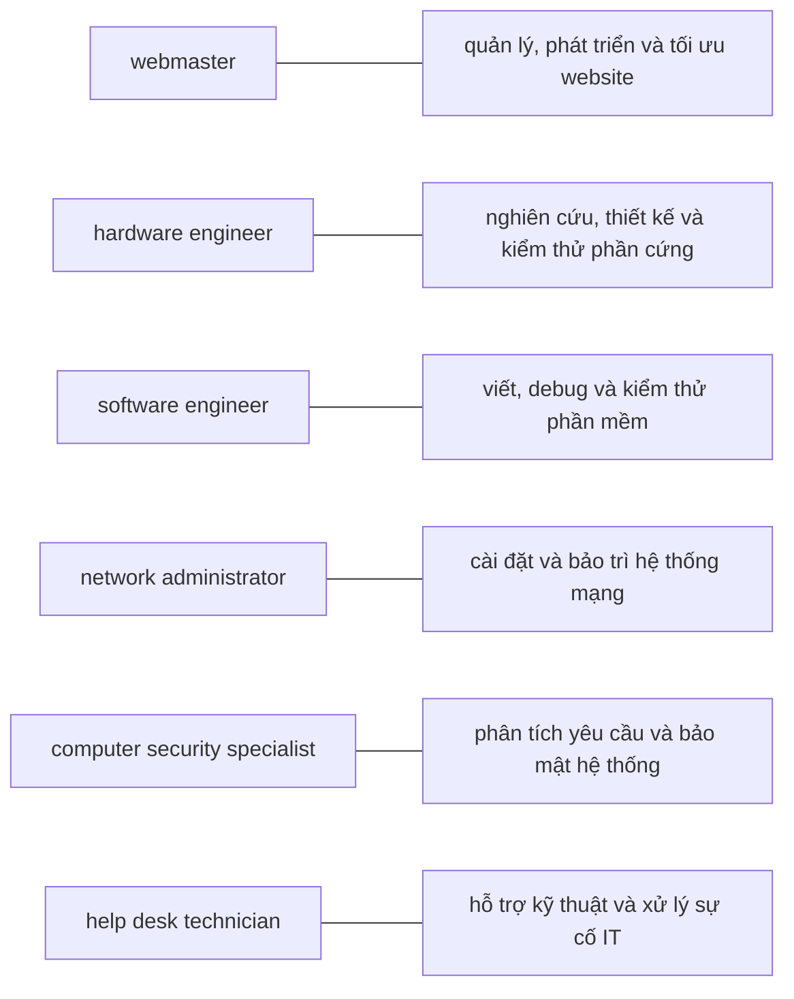

# UNIT 12 — Jobs in ICT

## 1. TỪ VỰNG CHÍNH (Vocabulary)

| Thuật ngữ | Nghĩa | Gợi nhớ | Xuất hiện ở |
|---|---|---|---|
| **access control** | kiểm soát truy cập | access = truy cập | Security Specialist tasks |
| **accuracy** | sự chính xác | accurate = chính xác | Personal qualities |
| **blog administrator** | quản trị viên blog | | Từ vựng Unit |
| `COBOL` | ngôn ngữ lập trình thương mại | Common Business-Oriented Language | Letter of Application |
| **corrective action** | hành động khắc phục | corrective = sửa chữa | Hardware Engineer tasks |
| **creativity** | sự sáng tạo | creative = sáng tạo | Personal qualities |
| **cross-browser** | tương thích đa trình duyệt | cross = xuyên qua | Webmaster tasks |
| **cross-platform** | tương thích đa nền tảng | platform = nền tảng | Webmaster tasks |
| **curriculum vitae** | hồ sơ xin việc (CV) | tiếng Latin | Letter of Application |
| **debug** | gỡ lỗi phần mềm | de- = loại bỏ, bug = lỗi | Software Engineer tasks |
| **DTP operator** | người vận hành xuất bản điện tử | Desktop Publishing | Từ vựng Unit |
| **efficiency** | sự hiệu quả | efficient = hiệu quả | Personal qualities |
| **enthusiasm** | sự nhiệt tình | | Personal skills |
| **hardware engineer** | kỹ sư phần cứng | hardware = phần cứng | Jobs list |
| **help desk technician** | kỹ thuật viên hỗ trợ | help desk = bàn hỗ trợ | Jobs list |
| **imagination** | sự tưởng tượng | imagine = tưởng tượng | Personal qualities |
| **logical reasoning** | lập luận logic | logical = hợp lý | Personal qualities |
| **network administrator** | quản trị viên mạng | network = mạng | Jobs list |
| **punctuality** | sự đúng giờ | punctual = đúng giờ | Personal skills |
| `QA` | kiểm định chất lượng | Quality Assurance | Webmaster tasks |
| **reliability** | sự đáng tin cậy | reliable = đáng tin | Personal skills |
| **security policy** | chính sách bảo mật | | Security Specialist tasks |
| **site architecture** | kiến trúc trang web | architecture = cấu trúc | Webmaster tasks |
| **software engineer** | kỹ sư phần mềm | software = phần mềm | Jobs list |
| **tenacity** | sự kiên trì, bền bỉ | | Personal qualities |
| **troubleshoot** | xử lý sự cố | trouble = sự cố | Network Admin, Help Desk tasks |
| **webmaster** | quản trị viên website | web + master = chủ website | Jobs list |
| **work placement** | thực tập có hưởng lương | placement = sắp xếp chỗ làm | Letter of Application |

---

### BẢNG TỔNG HỢP — AI LÀM GÌ

⚠️ Bảng này là nguồn ôn chính cho dạng bài "điền tên job theo chức năng" hoặc "nối job với mô tả".

| Job | Nhiệm vụ chính | Lương TB | Kỹ năng nổi bật |
|---|---|---|---|
| **Webmaster** | Quản lý, phát triển & tối ưu website | $51,533/năm | HTML, cross-browser, cross-platform |
| **Hardware Engineer** | Nghiên cứu, thiết kế, test phần cứng | $83,631/năm | Verilog |
| **Software Engineer** | Viết, debug, test phần mềm cho khách hàng | $81,884/năm | Debugger, IDE |
| **Network Administrator** | Cài đặt, bảo trì hệ thống mạng & telecom | ~$58K/năm | Telecom, troubleshooting |
| **Computer Security Specialist** | Phân tích & bảo mật hệ thống mạng | $76,667/năm | Security Testing, Risk Management |
| **Help Desk Technician** | Hỗ trợ kỹ thuật phần cứng, phần mềm, mạng | $15.94/giờ | Desktop Support Tier 2 |

---

## 2. BÀI ĐỌC SONG NGỮ (Reading — EN | VI)

### Webmaster — Tasks & Salary

**English (Original)**
Advise internal groups on all issues relating to the **web site**. Own site releases, `QA` signoff, and documentation. Ensure site is optimized and is **cross-platform** and **cross-browser** compatible. Design, develop, and execute *site architecture* and navigation including redesigns and upgrades. Collaborate with creative staff on design and layout issues to facilitate web publishing.

> **[VI]** Tư vấn cho các nhóm nội bộ về mọi vấn đề liên quan đến website. Chịu trách nhiệm phát hành trang, ký duyệt `QA` và lập tài liệu. Đảm bảo trang được tối ưu hóa và tương thích đa nền tảng, đa trình duyệt. Thiết kế, phát triển và triển khai kiến trúc cùng điều hướng trang web, bao gồm thiết kế lại và nâng cấp. Phối hợp với nhóm sáng tạo về thiết kế và bố cục để hỗ trợ xuất bản web.
>
> 📌 *Tóm tắt:* Webmaster tư vấn, quản lý và phát triển website, đảm bảo tương thích đa nền tảng.

⚠️ The average salary for a Webmaster is $51,533 per year. Most people with this job move on to other positions after 20 years in this career.

> **[VI]** ⚠️ Lương trung bình của một Webmaster là $51,533 mỗi năm. Hầu hết những người làm công việc này sẽ chuyển sang các vị trí khác sau 20 năm làm việc trong ngành này.
>
> 📌 *Tóm tắt:* Lương trung bình $51,533/năm.

### Hardware Engineer — Tasks & Salary

**English (Original)**
Define and coordinate **corrective action** changes. Write documentation and test specifications. Research, design, develop, and test computer or computer-related equipment. Provide technical support to team members.

> **[VI]** Xác định và phối hợp thực hiện các thay đổi khắc phục. Viết tài liệu và thông số kỹ thuật kiểm thử. Nghiên cứu, thiết kế, phát triển và kiểm thử máy tính hoặc thiết bị liên quan. Hỗ trợ kỹ thuật cho các thành viên trong nhóm.
>
> 📌 *Tóm tắt:* Hardware Engineer nghiên cứu, thiết kế và kiểm thử thiết bị máy tính. Lương trung bình cao nhất trong nhóm: $83,631/năm.

⚠️ A Hardware Engineer earns an average salary of $83,631 per year. A skill in *Verilog* is associated with high pay for this job.

> **[VI]** ⚠️ Một Kỹ sư phần cứng có mức lương trung bình là $83,631 mỗi năm. Kỹ năng sử dụng Verilog đi kèm với mức lương cao cho công việc này.
>
> 📌 *Tóm tắt:* Biết Verilog sẽ được trả lương cao hơn.

### Software Engineer — Tasks & Salary

**English (Original)**
Test and document software for client applications. Write, modify, and **debug** software for client applications. Write code to create single-threaded or user interface event driven applications, either stand-alone and those which access servers or services. Use source **debuggers** and visual development environments.

> **[VI]** Kiểm thử và lập tài liệu phần mềm cho ứng dụng khách hàng. Viết, chỉnh sửa và debug phần mềm. Viết code tạo ứng dụng đơn luồng hoặc hướng sự kiện giao diện người dùng, dạng độc lập hoặc kết nối máy chủ. Sử dụng trình gỡ lỗi nguồn và môi trường phát triển trực quan.
>
> 📌 *Tóm tắt:* Software Engineer viết, chỉnh sửa và debug phần mềm cho khách hàng.

⚠️ The average pay for a Software Engineer is $81,884 per year.

> **[VI]** ⚠️ Mức lương trung bình của một Kỹ sư phần mềm là $81,884 mỗi năm.
>
> 📌 *Tóm tắt:* Lương trung bình $81,884/năm.

### Network Administrator — Tasks & Salary

**English (Original)**
Perform delivery, physical setup, installation, **troubleshooting** and repair of all hardware and software. Train users on software applications, systems, and telecom systems. Maintain telecom system, including telecom, handsets, and company PDAs. Maintain IT inventories updating schedules as needed.

> **[VI]** Thực hiện giao hàng, lắp đặt, cài đặt, xử lý sự cố và sửa chữa toàn bộ phần cứng và phần mềm. Đào tạo người dùng về ứng dụng phần mềm, hệ thống và hệ thống viễn thông. Bảo trì hệ thống viễn thông bao gồm điện thoại và PDA của công ty. Cập nhật danh mục IT theo lịch trình.
>
> 📌 *Tóm tắt:* Network Administrator cài đặt, bảo trì hệ thống mạng và telecom, đào tạo người dùng.

⚠️ Network Administrators earn about $58K annually. Final cash compensation varies from around $38K to approximately $79K, with potential bonuses up to $7K and profit sharing up to $8K.

> **[VI]** ⚠️ Quản trị viên mạng kiếm được khoảng $58K hàng năm. Tổng thu nhập thực tế dao động từ khoảng $38K đến xấp xỉ $79K, với tiền thưởng tiềm năng lên tới $7K và chia sẻ lợi nhuận lên tới $8K.
>
> 📌 *Tóm tắt:* Lương ~$58K/năm, có thưởng và chia lợi nhuận.

### Computer Security Specialist — Tasks & Salary

**English (Original)**
**Analyze** and define security requirements for local and wide area networks. Update secure configurations by reviewing vendor sites, bulletins, and notifications for security information. Recertify application, platform, and server security periodically. Provide technical advice on **access control**, security models, disaster recovery, business continuity planning, and security awareness training. Plan, implement, monitor, and troubleshoot internal IT **security policies**.

> **[VI]** Phân tích và xác định yêu cầu bảo mật cho mạng cục bộ và diện rộng. Cập nhật cấu hình bảo mật bằng cách xem xét định kỳ các thông báo từ nhà cung cấp. Tái chứng nhận bảo mật ứng dụng, nền tảng và máy chủ định kỳ. Tư vấn kỹ thuật về kiểm soát truy cập, mô hình bảo mật, phục hồi sau thảm họa và đào tạo nhận thức bảo mật. Lập kế hoạch, triển khai, giám sát và khắc phục sự cố các chính sách bảo mật CNTT nội bộ.
>
> 📌 *Tóm tắt:* Chuyên gia bảo mật phân tích yêu cầu, cập nhật cấu hình và tư vấn về kiểm soát truy cập, phục hồi thảm họa.

⚠️ A Computer Security Specialist earns an average salary of $76,667 per year. Key skills: Computer Security, Security Testing and Auditing, Security Risk Management.

> **[VI]** ⚠️ Một Chuyên gia bảo mật máy tính kiếm được trung bình $76,667 mỗi năm. Các kỹ năng chính: Bảo mật máy tính, Kiểm tra và Đánh giá bảo mật, Quản lý rủi ro bảo mật.
>
> 📌 *Tóm tắt:* Lương $76,667/năm.

### Help Desk Technician — Tasks & Salary

**English (Original)**
Install and update desktops, laptops, PDAs, peripherals, networks, and related software. **Troubleshoot** all information technology issues, including software, hardware, and networking.

> **[VI]** Cài đặt và cập nhật máy tính bàn, laptop, PDA, thiết bị ngoại vi, mạng và phần mềm liên quan. Xử lý sự cố tất cả các vấn đề công nghệ thông tin bao gồm phần mềm, phần cứng và mạng.
>
> 📌 *Tóm tắt:* Help Desk Technician cài đặt thiết bị và xử lý sự cố IT.

⚠️ A Help Desk Technician earns an average wage of $15.94 per hour. A skill in Help Desk / Desktop Support (Tier 2) is associated with high pay.

> **[VI]** ⚠️ Một Kỹ thuật viên hỗ trợ kỹ thuật (Help Desk Technician) kiếm được mức lương trung bình là $15.94 mỗi giờ. Kỹ năng Hỗ trợ máy tính để bàn/Help Desk (Cấp độ 2) đi kèm với mức lương cao.
>
> 📌 *Tóm tắt:* Lương thấp nhất nhóm: $15.94/giờ.

### Job Advertisement: Senior Programmer — DIGITUM-UK

**English (Original)**
**SENIOR PROGRAMMER** required by *DIGITUM-UK*, a leading supplier of business systems to the insurance industry.

> **[VI]** **LẬP TRÌNH VIÊN CAO CẤP** yêu cầu bởi *DIGITUM-UK*, nhà cung cấp hệ thống kinh doanh hàng đầu cho ngành bảo hiểm.
>
> 📌 *Tóm tắt:* DIGITUM-UK tuyển Senior Programmer làm đầy đủ vòng đời phần mềm.

You will be able to work on the full range of software development activities – analysis, design, coding, testing, debugging and implementation. At least **two years' experience** of `COBOL` or `C++` is necessary.

> **[VI]** Bạn sẽ có thể làm việc trên đầy đủ các hoạt động phát triển phần mềm – phân tích, thiết kế, viết mã, kiểm thử, gỡ lỗi và triển khai. Yêu cầu có ít nhất **hai năm kinh nghiệm** về `COBOL` hoặc `C++`.
>
> 📌 *Tóm tắt:* Yêu cầu ít nhất 2 năm kinh nghiệm `COBOL`/`C++` và ưu tiên biết ngoại ngữ châu Âu.

As we are active in Europe, fluency in French, Italian or another European language is desirable.

> **[VI]** Vì chúng tôi hoạt động ở Châu Âu, việc thông thạo tiếng Pháp, tiếng Ý hoặc một ngôn ngữ Châu Âu khác là điều đáng mong đợi.
>
> 📌 *Tóm tắt:* 

Don't miss this opportunity to learn new skills and develop your career.

> **[VI]** Đừng bỏ lỡ cơ hội này để học hỏi các kỹ năng mới và phát triển sự nghiệp của bạn.
>
> 📌 *Tóm tắt:* 

Send your CV to *Chris Scott*, Personnel Manager, *DIGITUM-UK*, 75 Parkshill Street, London SW14 3DE.

> **[VI]** Gửi CV của bạn tới *Chris Scott*, Trưởng phòng Nhân sự, *DIGITUM-UK*, 75 Đường Parkshill, London SW14 3DE.
>
> 📌 *Tóm tắt:* 

You can visit our website at *www.digitum-uk.com*.

> **[VI]** Bạn có thể truy cập trang web của chúng tôi tại *www.digitum-uk.com*.
>
> 📌 *Tóm tắt:* 

- [ ] **logical reasoning**
- [ ] **patience and tenacity**
- [ ] **being good with figures**
- [ ] **imagination**
- [ ] **self-discipline**
- [ ] **accuracy**
- [ ] **leadership skills**
- [ ] **efficiency**
- [ ] **creativity**
- [ ] **drawing skills**

### Job Advertisement: DTP Operator

**English (Original)**
**DTP operator** required for a leading financial magazine.

> **[VI]** **NHÂN VIÊN XUẤT BẢN ĐIỆN TỬ (DTP)** yêu cầu cho một tạp chí tài chính hàng đầu.
>
> 📌 *Tóm tắt:* Tạp chí tài chính tuyển DTP Operator biết `QuarkXPress` với ít nhất 3 năm kinh nghiệm thiết kế dàn trang.

We are looking for a bright, competent `QuarkXPress` operator with at least **three years' experience** in design and layout. Skills in `Photoshop`, `Freehand` or `Illustrator` an advantage.

> **[VI]** Chúng tôi đang tìm kiếm một người vận hành `QuarkXPress` nhanh nhẹn, có năng lực với ít nhất **ba năm kinh nghiệm** trong thiết kế và dàn trang. Kỹ năng về `Photoshop`, `Freehand` hoặc `Illustrator` là một lợi thế.
>
> 📌 *Tóm tắt:* Ưu tiên biết `Photoshop`, `Freehand`, `Illustrator`.

Ability to work in a team and to tight deadlines is vital.

> **[VI]** Khả năng làm việc nhóm và làm việc dưới các hạn chót nghiêm ngặt là cực kỳ quan trọng.
>
> 📌 *Tóm tắt:* 

Please apply in writing, with CV and samples of your work, to *Tom Parker*, Production Manager, *Financial Monthly*, Stockton Street, London EC1A 4WW. Or apply online.

> **[VI]** Vui lòng nộp hồ sơ bằng văn bản, kèm theo CV và các tác phẩm mẫu của bạn, tới *Tom Parker*, Giám đốc Sản xuất, *Financial Monthly*, Đường Stockton, London EC1A 4WW. Hoặc nộp đơn trực tuyến.
>
> 📌 *Tóm tắt:* 

- [ ] **logical reasoning**
- [ ] **patience and tenacity**
- [ ] **being good with figures**
- [ ] **imagination**
- [ ] **self-discipline**
- [ ] **accuracy**
- [ ] **leadership skills**
- [ ] **efficiency**
- [ ] **creativity**
- [ ] **drawing skills**

### Professional Summary: Charles Graham

**English (Original)**
I graduated in 2004 with *A levels* in English, Art and Maths, and went on to do a course in graphic design and page layout at *Highland Art School*. Since 2006 I've been a graphic designer for *PromoPrint*, a company specializing in publishing catalogues and promotional material, and have used `Adobe InDesign` and other `DTP` software.

> **[VI]** Tôi tốt nghiệp năm 2004 với bằng trung học phổ thông nâng cao (*A levels*) các môn Tiếng Anh, Mỹ thuật và Toán, và tiếp tục học một khóa về thiết kế đồ họa và dàn trang tại *Trường Mỹ thuật Highland*. Từ năm 2006, tôi là nhà thiết kế đồ họa cho *PromoPrint*, một công ty chuyên xuất bản danh mục sản phẩm và tài liệu quảng cáo, và đã sử dụng phần mềm `Adobe InDesign` cùng các phần mềm xuất bản điện tử (`DTP`) khác.
>
> 📌 *Tóm tắt:* Charles Graham (22 tuổi) học thiết kế đồ họa, có kinh nghiệm thiết kế cho PromoPrint dùng phần mềm DTP (`Adobe InDesign`).

### Letter of Application — Sarah Brown

**English (Original)**
I am writing to apply for the position of **Senior Programmer**, which was advertised on 28th March in *The Times*.

> **[VI]** Tôi viết thư này để ứng tuyển vị trí Lập trình viên Cao cấp, được đăng ngày 28 tháng 3 trên tờ *The Times*.
>
> 📌 *Tóm tắt:* Sarah Brown xin việc Senior Programmer.

I graduated in May 2002 and did a work placement with *British Gas* as part of my degree. Before taking my present job I worked for a year with *NCR*. I stayed in this job until March 2004.

> **[VI]** Tôi tốt nghiệp tháng 5 năm 2002 và thực tập tại *British Gas* trong khuôn khổ chương trình học. Trước công việc hiện tại, tôi đã làm việc một năm tại *NCR* cho đến tháng 3 năm 2004.
>
> 📌 *Tóm tắt:* Tốt nghiệp 2002, từng thực tập tại British Gas, làm việc tại NCR đến 3/2004, hiện là software engineer tại Intelligent Software được 3 năm.

For the last three years I have been working as a software engineer for *Intelligent Software*. I have designed four programs in `COBOL` for commercial use, and since January I have been writing programs in `C` for use in large retail chains [Lưu ý: bản gốc viết nhầm 's_ince' thành có dấu gạch dưới].

> **[VI]** Trong ba năm qua, tôi làm kỹ sư phần mềm tại *Intelligent Software*, thiết kế bốn chương trình `COBOL` cho mục đích thương mại và từ tháng 1 đã viết chương trình bằng `C` cho chuỗi bán lẻ lớn.
>
> 📌 *Tóm tắt:* Biết COBOL và C, có kiến thức tiếng Tây Ban Nha và Ý.

Two years ago I spent three months in Spain testing our programs and also made several visits to Italy, so I have a basic knowledge of Spanish and Italian. I now feel ready for more responsibility and more challenging work.

> **[VI]** Hai năm trước, tôi dành ba tháng tại Tây Ban Nha để kiểm thử chương trình và nhiều lần đến Italy, nên tôi có kiến thức cơ bản về tiếng Tây Ban Nha và Ý.
>
> 📌 *Tóm tắt:*

## KEY CONCEPTS

| Concept | Short Explanation | Giải thích tiếng Việt |
|---|---|---|
| **webmaster** | maintains and develops website architecture and cross-browser compatibility. | Webmaster: quản trị, thiết kế và tối ưu tương thích trình duyệt trang web. |
| **hardware engineer** | designs, researches, and tests physical computer components. | Kỹ sư phần cứng: thiết kế, nghiên cứu và thử nghiệm linh kiện phần cứng. |
| **software engineer** | writes, modifies, and debugs application software. | Kỹ sư phần mềm: viết, sửa đổi và gỡ lỗi phần mềm ứng dụng. |
| **network administrator** | installs, manages, and troubleshoots network systems. | Quản trị mạng: cài đặt, quản trị và sửa lỗi hệ thống mạng. |

---

## POSSIBLE EXAM QUESTIONS

Q: What does a Webmaster do?
A: Designs, maintains, and optimizes websites for cross-platform compatibility.
*(Dịch: Webmaster làm gì? - Thiết kế, bảo trì và tối ưu website tương thích đa nền tảng.)*

Q: What language is high-paying for hardware engineers?
A: Verilog programming language.
*(Dịch: Ngôn ngữ nào giúp kỹ sư phần cứng lương cao? - Ngôn ngữ mô tả phần cứng Verilog.)*

Q: What is the job of a Network Administrator?
A: Installing and maintaining network equipment and troubleshooting connections.
*(Dịch: Công việc của quản trị mạng là gì? - Cài đặt, bảo trì thiết bị mạng và xử lý sự cố kết nối.)*

Q: What does a computer security specialist focus on?
A: Protecting networks from hackers and creating security policies.
*(Dịch: Chuyên gia bảo mật tập trung vào việc gì? - Bảo vệ mạng khỏi tin tặc và lập chính sách bảo mật.)*

---

## ONE-LINE ANSWERS

- Hardware engineers design and test computer components. (Kỹ sư phần cứng thiết kế và thử nghiệm các linh kiện máy tính.)
- Software engineers write and debug program applications. (Kỹ sư phần mềm viết và gỡ lỗi các ứng dụng chương trình.)
- Webmasters manage, update, and optimize corporate websites. (Webmaster quản trị, cập nhật và tối ưu website công ty.)
- Network administrators maintain networks and troubleshoot bugs. (Quản trị mạng duy trì mạng và khắc phục sự cố kết nối.)

---

## TEACHER TRAPS (DỄ NHẦM LẪN)

### ⚠️ Network Admin vs Security Specialist
Network Admin lo mạng chạy thông suốt, cắm dây, chia mạng. Security Specialist lo chống hack, mã hóa dữ liệu, đặt tường lửa.

### ⚠️ Hardware vs Software Engineer
Hardware Engineer thiết kế vi mạch, viết thông số kỹ thuật thiết bị. Software Engineer viết code chương trình, dùng tool debug code.

---

## WEBSITE / SOFTWARE / APPLICATION IDENTIFICATION

| Name | Type | Main Function (EN) | Chức năng chính (VI) |
|---|---|---|---|
| **Verilog** | Hardware Language | Describe and simulate digital hardware designs | Mô tả và mô phỏng thiết kế phần cứng số |
| **Debugger** | Development Tool | Test and debug program software code | Thử nghiệm và gỡ lỗi mã nguồn phần mềm |

---

## 3. NGỮ PHÁP (Grammar)

### Giới từ chỉ thời gian: For, Since, Ago, Until

| Từ | Cách dùng | Thì đi kèm | Ví dụ |
|---|---|---|---|
| **for** | Khoảng thời gian (duration) | Present perfect, Past simple | I've lived here **for** five years. |
| **since** | Mốc thời gian bắt đầu (starting point) | Present perfect | I've been unemployed **since** May 2005. |
| **ago** | Thời điểm trong quá khứ — đặt **sau** khoảng thời gian | Past simple | I got married five years **ago**. |
| **until** | Đến một thời điểm nhất định (up to a point) | Nhiều thì | I stayed at high school **until** I was 18. |

### Thì hiện tại hoàn thành đơn và Tiếp diễn (Present Perfect Simple & Continuous)

| Thì (Tense) | Công thức | Cách dùng | Ví dụ từ bài |
|---|---|---|---|
| **Present Perfect Simple** | has/have + P2 | - Trạng thái bắt đầu trong quá khứ và kéo dài đến hiện tại.   - Hành động quá khứ nhấn mạnh số lượng (how many).   - Trải nghiệm cá nhân (ever/never). | - Since 2006, I've been a computer operator.   - I have designed four programs in COBOL.   - Have you ever worked with databases? |
| **Present Perfect Continuous** | has/have been + V-ing | - Hành động bắt đầu trong quá khứ và vẫn đang tiếp tục xảy ra.   - Hành động quá khứ nhấn mạnh khoảng thời gian kéo dài (how long). | - Since January I've been writing programs in C.   - For the last three years I've been working as a software engineer. |

### So sánh với thì Quá khứ đơn (Contrast with Past Simple)

| Thì | Cách dùng | Ví dụ thực tế |
|---|---|---|
| **Present Perfect** | Hành động còn liên quan đến hiện tại, không rõ thời điểm cụ thể. | I have designed four programs. *(thiết kế xong 4 chương trình, nay vẫn dùng/có ích)* |
| **Past Simple** | Hành động đã kết thúc tại một thời điểm cụ thể trong quá khứ. | I graduated in May 2003. *(tốt nghiệp là việc đã xong trong quá khứ)*   I stayed in this job until March 2004. |

## 4. BÀI TẬP & ĐÁP ÁN (Exercises & Answer Key)

### Exercise A — Reading Comprehension (Sarah Brown's letter)

Answer these questions:
1. Which job is Sarah Brown applying for?
2. Where did she see the advertisement?
3. How long has she been working as a software engineer?
4. What type of programs has she written?
5. When did she spend three months in Spain?

<b>Xem đáp án chi tiết</b>

1. "Which job is Sarah Brown applying for?" → **Senior Programmer** — Câu 1 của lá thư ghi: "...apply for the position of Senior Programmer..."
2. "Where did she see the advertisement?" → **The Times** (newspaper) — Câu 1 của lá thư ghi: "...advertised on 28th March in *The Times*."
3. "How long has she been working as a software engineer?" → **For three years** — Đoạn 3 ghi: "For the last three years I have been working as a software engineer..."
4. "What type of programs has she written?" → **Four programs in COBOL for commercial use, and programs in C for retail chains** — Đoạn 3 ghi: "...designed four programs in COBOL... and since January I have been writing programs in C..."
5. "When did she spend three months in Spain?" → **Two years ago** — Đoạn 4 ghi: "Two years ago I spent three months in Spain..."

### Exercise B — Fill in the blank (for / since / ago / until)

Complete the letter extract with *for, since, ago* or *until*:
> I stayed in this job ___(1)___ March 2004. ___(2)___ the last three years I have been working as a software engineer for Intelligent Software. ___(3)___ January I have been writing programs in C for use in large retail chains. Two years ___(4)___ I spent three months in Spain.

<b>Xem đáp án chi tiết</b>

1. "...stayed in this job ___(1)___ March 2004" → **until** — chỉ mốc thời gian kết thúc của một quá trình (ở NCR đến mốc 3/2004 mới nghỉ).
2. "___(2)___ the last three years..." → **For** — dùng trước khoảng thời gian (3 năm qua) để chỉ độ dài thời gian của hành động. Viết hoa vì đứng đầu câu.
3. "___(3)___ January I have been..." → **since** — dùng trước một mốc thời gian (tháng Giêng) để chỉ thời điểm bắt đầu của hành động kéo dài đến hiện tại.
4. "Two years ___(4)___..." → **ago** — dùng trong câu quá khứ đơn, luôn đứng sau một khoảng thời gian (cách đây 2 năm).

### Exercise C — Complete the definitions with jobs from the box

Complete these definitions with jobs from the box:
*software engineer, computer security specialist, blog administrator, help desk technician, DTP operator, hardware engineer, network administrator, webmaster*

1. A(n) ________ designs and develops IT devices.
2. A(n) ________ writes computer programs.
3. A(n) ________ edits and deletes posts made by contributors to a blog.
4. A(n) ________ uses page layout software to prepare electronic files for publication.
5. A(n) ________ manages the hardware and software that comprise a network.
6. A(n) ________ designs and maintains websites.
7. A(n) ________ works with companies to build secure computer systems.
8. A(n) ________ helps end-users with their computer problems in person, by email or over the phone.

<b>Xem đáp án chi tiết</b>

1. **hardware engineer** — dựa trên định nghĩa "designs and develops IT devices" (thiết kế và phát triển thiết bị).
2. **software engineer** — dựa trên định nghĩa "writes computer programs" (viết chương trình).
3. **blog administrator** — dựa trên định nghĩa "edits and deletes posts..." (quản lý bài viết trên blog).
4. **DTP operator** — dựa trên định nghĩa "uses page layout software..." (dàn trang chuẩn bị xuất bản).
5. **network administrator** — dựa trên định nghĩa "manages the hardware and software that comprise a network" (quản trị mạng).
6. **webmaster** — dựa trên định nghĩa "designs and maintains websites" (thiết kế/bảo trì web).
7. **computer security specialist** — dựa trên định nghĩa "works with companies to build secure computer systems" (chuyên gia bảo mật).
8. **help desk technician** — dựa trên định nghĩa "helps end-users with their computer problems" (kỹ thuật viên hỗ trợ).

### Exercise D — Nối thuật ngữ với nghĩa tiếng Việt

<b>Xem đáp án chi tiết</b>

*   **webmaster** --- **"quản lý, phát triển và tối ưu website"** (suy luận) — dựa theo định nghĩa nhiệm vụ của Webmaster trong bài đọc (design, develop, and execute site architecture).
*   **hardware engineer** --- **"nghiên cứu, thiết kế và kiểm thử phần cứng"** (suy luận) — dựa theo định nghĩa của Hardware Engineer (research, design, develop, and test computer equipment).
*   **software engineer** --- **"viết, debug và kiểm thử phần mềm"** (suy luận) — dựa theo định nghĩa của Software Engineer (write, modify, and debug software).
*   **network administrator** --- **"cài đặt và bảo trì hệ thống mạng"** (suy luận) — dựa theo định nghĩa của Network Administrator (setup, installation, troubleshooting and repair).
*   **computer security specialist** --- **"phân tích yêu cầu và bảo mật hệ thống"** (suy luận) — dựa theo định nghĩa của Security Specialist (analyze and define security requirements).
*   **help desk technician** --- **"hỗ trợ kỹ thuật và xử lý sự cố IT"** (suy luận) — dựa theo định nghĩa của Help Desk Technician (troubleshoot all IT issues).

### Exercise E — Job Suitability & Skills Matching

Read the job advertisements for *Senior Programmer* and *DTP Operator*, and *Charles Graham's* CV summary, then answer the questions:
1. Which skills from the checklist (1-10) are more relevant for a *Senior Programmer*?
2. Which skills from the checklist (1-10) are more relevant for a *DTP Operator*?
3. Which of the two jobs is *Charles Graham* suitable for? Why?

<b>Xem đáp án chi tiết</b>

1. **Senior Programmer:** **1, 2, 5, 6, 7, 8** (logical reasoning, patience and tenacity, self-discipline, accuracy, leadership skills, efficiency) (suy luận) — Công việc lập trình viên cao cấp đòi hỏi suy luận logic tốt, kiên nhẫn gỡ lỗi, tính tự kỷ luật để quản lý tiến độ, độ chính xác cao khi viết code và kỹ năng lãnh đạo đội ngũ.
2. **DTP Operator:** **4, 6, 8, 9, 10** (imagination, accuracy, efficiency, creativity, drawing skills) (suy luận) — Nhân viên dàn trang điện tử đòi hỏi óc tưởng tượng thẩm mỹ, độ chính xác cao trong căn chỉnh bố cục, sự sáng tạo và kỹ năng vẽ cơ bản để thiết kế.
3. **Charles Graham** phù hợp với vị trí **DTP Operator** (suy luận) — Vì anh có học vấn chuyên ngành thiết kế đồ họa và dàn trang tại Highland Art School, cộng với kinh nghiệm thiết kế thực tế dùng phần mềm DTP (`Adobe InDesign`) tại PromoPrint. Anh không có kinh nghiệm về lập trình `COBOL`/`C++` hay khả năng ngoại ngữ Châu Âu khác như vị trí Senior Programmer yêu cầu.

### Exercise F — Writing: Letter of Application

Look at the job advertisement for a Webmaster at *eJupiter*. Use *Maria Quintana's* CV to write a letter of application following the paragraph structure:

#### 1. Vacancies at eJupiter.co.uk
**Webmaster**
We are seeking a Webmaster for eJupiter.co.uk, a company dedicated to e-commerce.
The successful candidate will manage our website. You will be responsible for making sure the web server runs properly, monitoring the traffic through the site, and designing and updating our web pages.
Experience of using HTML and Java is essential. Experience of Adobe PDF and Photoshop is an advantage. The successful candidate will also have knowledge of web editors – MS FrontPage or equivalent.
Send your CV and a covering letter to James Taylor, eJupiter Computers, 37 Oak Street, London SW10 6XY.

#### 2. Curriculum Vitae (Maria Quintana)
- **Personal information:**
  - Name: Maria Quintana
  - Address: Avda Séneca, 5, Madrid 28040
  - Telephone: 00 34 91 5435201
  - Email: mquintana0782@telefonica.net
  - Date of birth: 28/07/82
- **Education and Training:**
  - 2006 Online diploma in web-based technology for business, www.elearnbusiness.com
  - 2005 Course in web design at the Cybernetics College, London: HTML, Java and Macromedia Dreamweaver
  - 2004 Course in computer hardware and networking at the Cybernetics College, London
  - 1999–2004 Degree in Computer Science and Engineering, University of Madrid
- **Work experience:**
  - January 2006 – present: Part-time Webmaster at www.keo.es; responsible for updating the site and using Adobe Flash to create animations
  - May 2005 – December 2006: IT consultant at Media Market, specializing in e-commerce and IT strategies
- **IT skills:**
  - Knowledge of multiple computer platforms (Windows, Mac and Linux); strong database skills (including the popular open source MySQL database); complete understanding of graphics formats and Cascading Style Sheets
- **Personal skills:**
  - Social and organizational skills; Good communication skills
- **Languages:**
  - Spanish mother tongue; English (Cambridge CAE); Arabic (fluent)
- **Hobbies and Interests:**
  - Web surfing, listening to music and travelling
- **References:**
  - Miguel Santana, Manager, keo.es
  - Sam Jakes, Lecturer, Cybernetics College

Follow the paragraph structure:
- **Paragraph 1:** Reason for writing — *I am writing to apply for the position of...*
- **Paragraph 2:** Education and training — *I graduated in (date)... I completed a course in...*
- **Paragraph 3:** Work experience — *For the past X years I have been... Since X I have been...*
- **Paragraph 4:** Personal skills — *I spent X months in (country)... I can...*
- **Paragraph 5:** Reasons for applying — *I now feel ready to... and would welcome the opportunity to...*
- **Paragraph 6:** Closing — *I enclose... I look forward to... I will be available for an interview...*

---

<b>Xem đáp án chi tiết</b>

*(Tham khảo lá thư xin việc hoàn chỉnh viết từ CV của Maria Quintana)*
*   **Paragraph 1:** *I am writing to apply for the position of* Webmaster, which was advertised on monster.com on April 21st.
*   **Paragraph 2:** *I graduated in* 2004 with a degree in Computer Science and Engineering from the University of Madrid. After I left university, I did a course in computer hardware and networking at the Cybernetics College, London. In 2005, *I completed a course in* web design, where I learnt to use HTML, Java and Macromedia Dreamweaver. I also have a diploma in web-based technology for business.
*   **Paragraph 3:** *For the last three years, I have worked* part-time at keo.es, where I have been responsible for updating the website regularly. I have also used Adobe Flash to create media animation. *Before taking my present job*, I worked as an IT consultant at Media Market, a company specializing in e-commerce and IT strategies.
*   **Paragraph 4:** I studied languages at school and have the Cambridge CAE certificate in English. When I was a teenager I spent several years in Morocco so I also have a fluent level of Arabic. *I have knowledge of* most computer platforms (Windows, Mac and Linux) and good communication skills.
*   **Paragraph 5:** *Now I feel ready to* take the next step in my career *and would welcome the opportunity to* work for a company like eJupiter.
*   **Paragraph 6:** *I enclose* my curriculum vitae and *I look forward to hearing from you*. *I will be available for an interview* at any time from Monday. Yours sincerely, Maria Quintana.

### 🧪 Mini Quiz

**Câu 1 (Trắc nghiệm):** Which job earns the highest average salary?
- a. Software Engineer
- b. Hardware Engineer
- c. Computer Security Specialist

<b>Xem đáp án chi tiết</b>

**Câu 1 (Trắc nghiệm):**
*   **b. Hardware Engineer ✓** — vì mức lương của Hardware Engineer là $83,631/năm, cao nhất trong tất cả các vị trí được liệt kê.
*   - a. Software Engineer ✗ — lương trung bình là $81,884/năm, thấp hơn Hardware Engineer.
*   - c. Computer Security Specialist ✗ — lương trung bình là $76,667/năm, thấp hơn Hardware Engineer.

**Câu 2 (Trắc nghiệm):** Which job is specifically associated with the skill "Verilog"?
- a. Software Engineer
- b. Network Administrator
- c. Hardware Engineer

<b>Xem đáp án chi tiết</b>

**Câu 2 (Trắc nghiệm):**
*   **c. Hardware Engineer ✓** — đoạn Hardware Engineer ghi: "A skill in Verilog is associated with high pay for this job."
*   - a. Software Engineer ✗ — kỹ năng này không được đề cập đối với kỹ sư phần mềm.
*   - b. Network Administrator ✗ — kỹ năng này không liên quan đến công việc quản trị mạng trong bài đọc.

**Câu 3 (Điền từ):** A Help Desk Technician earns an average wage of $_______ per hour.

<b>Xem đáp án chi tiết</b>

**Câu 3 (Điền từ):**
*   **15.94** (suy luận) — câu gốc trong bài đọc ghi: "A Help Desk Technician earns an average wage of $15.94 per hour."

**Câu 4 (Điền từ):** Complete with *for/since/ago/until*: "I have been working here _______ three years."

<b>Xem đáp án chi tiết</b>

**Câu 4 (Điền từ):**
*   **for** (suy luận) — "three years" là khoảng thời gian kéo dài, đi kèm thì hiện tại hoàn thành tiếp diễn (have been working).

**Câu 5 (Điền từ):** Complete with *for/since/ago/until*: "She started this job two years _______."

<b>Xem đáp án chi tiết</b>

**Câu 5 (Điền từ):**
*   **ago** (suy luận) — "two years ago" đặt sau khoảng thời gian và dùng trong thì quá khứ đơn (started).

**Câu 6 (Trắc nghiệm):** Which personal quality means "always arriving on time"?
- a. Enthusiasm
- b. Reliability
- c. Punctuality

<b>Xem đáp án chi tiết</b>

**Câu 6 (Trắc nghiệm):**
*   **c. Punctuality ✓** — Punctuality có nghĩa là sự đúng giờ (always arriving on time).
*   - a. Enthusiasm ✗ — có nghĩa là sự nhiệt tình, hăng hái.
*   - b. Reliability ✗ — có nghĩa là sự đáng tin cậy.

**Câu 7 (Nối):** Match the job with its key responsibility:
1. Webmaster — A. Analyze security requirements for networks
2. Computer Security Specialist — B. Ensure cross-platform and cross-browser compatibility
3. Help Desk Technician — C. Troubleshoot all IT issues including hardware and software

---

<b>Xem đáp án chi tiết</b>

**Câu 7 (Nối):**
*   **1-B** (Webmaster — B. Ensure cross-platform and cross-browser compatibility) — dựa trên nhiệm vụ của Webmaster được mô tả trong bài đọc.
*   **2-A** (Computer Security Specialist — A. Analyze security requirements for networks) — dựa trên nhiệm vụ của Security Specialist.
*   **3-C** (Help Desk Technician — C. Troubleshoot all IT issues including hardware and software) — dựa trên nhiệm vụ gỡ lỗi kỹ thuật của Help Desk.

---

