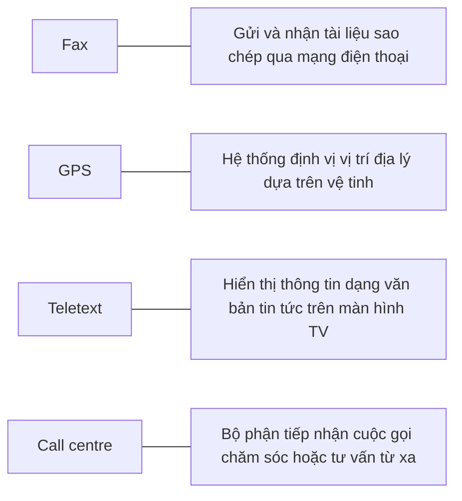

# UNIT 13 — Communication Systems

## 1. TỪ VỰNG CHÍNH (Vocabulary)

| Thuật ngữ | Nghĩa | Gợi nhớ | Xuất hiện ở |
|---|---|---|---|
| **ATA** | Bộ chuyển đổi điện thoại tương tự | Analog Telephone Adapter | VoIP section |
| **brand** | thương hiệu | | Mobile phones |
| **built-in camera** | camera tích hợp sẵn | built-in = tích hợp | Mobile phones |
| **call centre** | trung tâm cuộc gọi | call + centre | Reading 1 |
| **changeable faceplate** | vỏ máy thay đổi được | faceplate = mặt vỏ | Mobile phones |
| **cyborg** | sinh vật cơ khí hóa | part robot, part human | Reading 3 |
| **DAB** | phát thanh âm thanh số | Digital Audio Broadcasting | Reading 2 |
| **digital radio** | phát thanh kỹ thuật số | digital + radio | Vocab, Reading 2 |
| **digital TV** | truyền hình kỹ thuật số | digital + TV | Vocab, Reading 2 |
| **DMB** | phát sóng đa phương tiện kỹ thuật số | Digital Multimedia Broadcasting | Reading 2 |
| **DVB-H** | truyền hình số thiết bị cầm tay | Digital Video Broadcast-Handheld | Reading 2 |
| **fax** | máy fax / gửi fax | fax | Reading 1 |
| **GPS** | định vị toàn cầu | Global Positioning System | Reading 3 |
| **keypad** | bàn phím số điện thoại | keypad = bàn phím | Mobile phones |
| **LCD screen** | màn hình tinh thể lỏng | Liquid Crystal Display | Mobile phones |
| **MMS** | tin nhắn đa phương tiện | Multimedia Messaging Service | Mobile phones |
| **pay multimedia** | đa phương tiện trả phí | pay + multimedia | Reading 2 |
| **ringtone** | nhạc chuông | ring + tone | Mobile phones |
| **set-top box** | đầu giải mã truyền hình số | set-top + box | Reading 2 |
| **SIM card** | thẻ SIM | Subscriber Identity Module | Mobile phones |
| **spit** | cuộc gọi rác trên VoIP | Spam over Internet Telephony | VoIP section |
| **telecommunications** | viễn thông | tele + communication | Reading 1 |
| **telemarketing** | tiếp thị qua điện thoại | tele + marketing | Reading 1 |
| **teletext** | thông tin văn bản trên TV | tele + text | Reading 1 |
| **teleworking** | làm việc từ xa | tele + working | Reading 1 |
| **VoIP** | điện thoại qua Internet | Voice over IP | VoIP section |
| **wearable computer** | máy tính đeo trên người | wearable + computer | Reading 3 |
| **widescreen** | màn hình rộng (16:9) | wide + screen | Reading 2 |
| **wireless connectivity** | kết nối không dây | wire + less | Reading 3 |

---

### BẢNG TỔNG HỢP — CÔNG NGHỆ TRUYỀN THÔNG

⚠️ Bảng này là nguồn ôn chính cho dạng bài "điền tên công nghệ theo chức năng" hoặc "nối công nghệ với mô tả".

| Công nghệ | Nhiệm vụ/Chức năng chính | Đặc điểm nổi bật |
|---|---|---|
| **digital TV** | Truyền tín hiệu hình ảnh bằng tín hiệu số | Hỗ trợ widescreen 16:9, pay multimedia và chất lượng cao |
| **DMB / DVB-H** | Truyền tín hiệu đa phương tiện tới thiết bị di động | DMB = Digital Multimedia Broadcasting, DVB-H = Handheld |
| **DAB** | Định dạng truyền tải chương trình âm thanh kỹ thuật số | Thay thế FM trong tương lai gần |
| **GPS** | Định vị địa lý và hỗ trợ dẫn đường trên ô tô/PDA | Tích hợp chip GPS vào các dòng điện thoại di động |
| **wearable computer** | Máy tính đeo trực tiếp trên cơ thể hoặc tích hợp vào quần áo | Người dùng được gọi là "cyborgs" (thể sinh học cơ khí) |
| **VoIP** | Truyền tải giọng nói qua giao thức Internet | Sử dụng ATA để chuyển đổi điện thoại tương tự |

---

## 2. BÀI ĐỌC SONG NGỮ (Reading — EN | VI)

### What are telecommunications?

**English (Original)**
**Telecommunications** refers to the transmission of signals over a distance for the purpose of communication. Information is transmitted by devices such as the telephone, radio, television, satellite, or computer networks. Examples could be two people speaking on their `mobile phone`, a sales department sending a `fax` to a client, or even someone reading the `teletext` pages on TV. But in the modern world, telecommunications mainly means transferring information across the **Internet**, via modem, phone lines or wireless networks.

> **[VI]** Viễn thông đề cập đến việc truyền tín hiệu qua một khoảng cách nhằm mục đích giao tiếp. Thông tin được truyền bởi các thiết bị như điện thoại, đài phát thanh, truyền hình, vệ tinh hoặc mạng máy tính. Ví dụ có thể là hai người đang nói chuyện điện thoại di động, phòng bán hàng gửi bản fax cho khách hàng, hoặc thậm chí là ai đó đang đọc các trang thông tin văn bản (teletext) trên TV. Nhưng trong thế giới hiện đại, viễn thông chủ yếu có nghĩa là truyền thông tin qua Internet, thông qua modem, đường dây điện thoại hoặc mạng không dây.
>
> 📌 *Tóm tắt:* Viễn thông là truyền tín hiệu đi xa qua điện thoại, mạng máy tính hay Internet.

Because of telecommunications, people can now work at home and communicate with their office by computer and telephone. This is called **teleworking**. It has been predicted that about one third of all work could eventually be performed outside the workplace. In **call centres**, assistance or support is given to customers using the telephone, email or online chats. They are also used for **telemarketing**, the process of selling goods and services over the phone.

> **[VI]** Nhờ viễn thông, giờ đây mọi người có thể làm việc tại nhà và giao tiếp với văn phòng của họ bằng máy tính và điện thoại. Điều này được gọi là làm việc từ xa (teleworking). Người ta dự báo rằng khoảng một phần ba công việc cuối cùng có thể được thực hiện bên ngoài nơi làm việc. Tại các trung tâm cuộc gọi (call centres), sự trợ giúp hoặc hỗ trợ được cung cấp cho khách hàng qua điện thoại, email hoặc trò chuyện trực tuyến. Chúng cũng được sử dụng cho tiếp thị qua điện thoại (telemarketing), quy trình bán hàng hóa và dịch vụ qua điện thoại.
>
> 📌 *Tóm tắt:* Viễn thông tạo ra các xu hướng làm việc tại nhà (teleworking), trung tâm hỗ trợ (call centres) và bán hàng qua điện thoại (telemarketing).

### Digital TV and radio

**English (Original)**
In recent years, TV and radio broadcasting has been revolutionized by developments in satellite and digital transmission. **Digital TV** is a way of transmitting pictures by means of digital signals, in contrast to the analogue signals used by traditional TV. Digital TV offers interactive services and **pay multimedia** - that is, it can transmit movies and shows to TV sets or PCs on a pay-per-view basis. It is also **widescreen**, meaning programmes are broadcast in a native 16:9 format instead of the old 4:3 format. Digital TV provides a better quality of picture and sound and allows broadcasters to deliver more channels.

> **[VI]** Trong những năm gần đây, phát thanh và truyền hình đã được cách mạng hóa bởi các bước phát triển của truyền hình vệ tinh và kỹ thuật số. Truyền hình kỹ thuật số (Digital TV) là một phương thức truyền hình ảnh bằng các tín hiệu số, trái ngược với các tín hiệu tương tự (analogue) được sử dụng bởi TV truyền thống. Truyền hình kỹ thuật số cung cấp các dịch vụ tương tác và đa phương tiện trả tiền - nghĩa là nó có thể truyền phim ảnh và các chương trình đến tivi hoặc máy tính trên cơ sở trả tiền cho mỗi lần xem. Nó cũng có màn hình rộng, nghĩa là các chương trình được phát sóng ở định dạng gốc 16:9 thay vì định dạng 4:3 cũ. Truyền hình kỹ thuật số cung cấp chất lượng hình ảnh và âm thanh tốt hơn và cho phép các đài phát sóng cung cấp nhiều kênh hơn.
>
> 📌 *Tóm tắt:* Truyền hình và phát thanh số có sự nâng cấp vượt bậc so với hệ thống tương tự (analogue): hỗ trợ dịch vụ tương tác, đa phương tiện trả phí, màn hình rộng 16:9, hình ảnh/âm thanh sắc nét hơn.

Digital Terrestrial TV is received via a **set-top box**, a device that decodes the signal received through the aerial. New technologies are being devised to allow you to watch TV on your mobile. For example, `DMB` (**Digital Multimedia Broadcasting**) and `DVB-H` (**Digital Video Broadcast-Handheld**) can send multimedia (radio, TV and data) to mobile devices.

> **[VI]** Truyền hình kỹ thuật số mặt đất được tiếp nhận qua một đầu giải mã (set-top box), một thiết bị giải mã tín hiệu nhận được từ ăng-ten. Các công nghệ mới đang được thiết kế để cho phép bạn xem TV trên điện thoại di động của mình. Ví dụ, DMB (Phát sóng đa phương tiện kỹ thuật số) và DVB-H (Phát sóng video kỹ thuật số cho thiết bị cầm tay) có thể gửi đa phương tiện (đài phát thanh, TV và dữ liệu) đến các thiết bị di động.
>
> 📌 *Tóm tắt:* Các chuẩn `DMB`, `DVB-H`, `DAB` giúp truyền nội dung số tới thiết bị di động.

Audio programs (music, news, sports, etc.) are also transmitted in a digital radio format called `DAB` (**Digital Audio Broadcasting**).

> **[VI]** Các chương trình âm thanh (âm nhạc, tin tức, thể thao, v.v.) cũng được truyền ở định dạng đài phát thanh kỹ thuật số gọi là DAB (Phát thanh âm thanh kỹ thuật số).
>
> 📌 *Tóm tắt:*

### Mobile communications

**English (Original)**
Thanks to wireless connectivity, mobile phones and `BlackBerrys` now let you check your email, browse the Web and connect with home or company intranets, all without wires.

> **[VI]** Nhờ có kết nối không dây, điện thoại di động và thiết bị BlackBerry giờ đây cho phép bạn kiểm tra email, lướt Web và kết nối với mạng nội bộ gia đình hoặc công ty, tất cả đều không cần dây cáp.
>
> 📌 *Tóm tắt:* Công nghệ không dây kết nối thiết bị di động/BlackBerry với mạng.

The use of `GPS` in cars and PDAs is widespread, so you can easily navigate in a foreign city or find the nearest petrol station. In the next few years, `GPS` chips will be incorporated into most mobile phones.

> **[VI]** Việc sử dụng định vị toàn cầu GPS trên ô tô và thiết bị PDA là rất phổ biến, nhờ đó bạn có thể dễ dàng định hướng ở một thành phố xa lạ hoặc tìm trạm xăng gần nhất. Trong vài năm tới, chip GPS sẽ được tích hợp vào hầu hết các điện thoại di động.
>
> 📌 *Tóm tắt:* Định vị vệ tinh `GPS` cực phổ biến.

Another trend is **wearable computers**. Can you imagine wearing a PC on your belt and getting email on your sunglasses? Some devices are equipped with a wireless modem, a keypad and a small screen; others are activated by voice.

> **[VI]** Một xu hướng khác là máy tính đeo trên người (wearable computers). Bạn có thể tưởng tượng mình đeo một chiếc máy tính trên thắt lưng và nhận email trên kính râm không? Một số thiết bị được trang bị modem không dây, bàn phím và màn hình nhỏ; những thiết bị khác được kích hoạt bằng giọng nói.
>
> 📌 *Tóm tắt:* Máy tính đeo trên người (wearable computer) giúp biến đổi người dùng thành các sinh vật cơ khí sinh học (cyborgs).

The users of wearable technology are sometimes even called **cyborgs**. The term was invented by Manfred Clynes and Nathan Kline in 1960 to describe **cybernetic organisms** - beings that are part robot, part human.

> **[VI]** Người sử dụng công nghệ đeo trên người đôi khi còn được gọi là "cyborgs". Thuật ngữ này được phát minh bởi Manfred Clynes và Nathan Kline vào năm 1960 to mô tả các thực thể cơ khí sinh học (cybernetic organisms) - những sinh vật nửa robot, nửa con người.
>
> 📌 *Tóm tắt:*

## KEY CONCEPTS

| Concept | Short Explanation | Giải thích tiếng Việt |
|---|---|---|
| **telecommunications** | transmitting signals over distance for communication. | Viễn thông: truyền tín hiệu đi xa để liên lạc. |
| **LAN** | Local Area Network, connecting computers in a local area. | LAN: mạng cục bộ, kết nối máy tính trong phạm vi hẹp như tòa nhà. |
| **WAN** | Wide Area Network, connecting computers across cities or countries. | WAN: mạng diện rộng, kết nối máy tính qua các vùng địa lý lớn. |
| **teleworking** | working from home using computers and network links. | Teleworking: làm việc từ xa tại nhà nhờ máy tính kết nối mạng. |

---

## POSSIBLE EXAM QUESTIONS

Q: What is telecommunications?
A: The transmission of signals over a distance for communication.
*(Dịch: Viễn thông là gì? - Truyền tín hiệu đi xa nhằm mục đích thông tin liên lạc.)*

Q: Compare LAN and WAN.
A: LAN is for local areas (buildings); WAN connects cities and countries.
*(Dịch: So sánh LAN và WAN. - LAN dùng phạm vi hẹp (tòa nhà); WAN kết nối rộng khắp tỉnh thành/quốc gia.)*

Q: What is teleworking?
A: Working from home using computers and telecommunications.
*(Dịch: Làm việc từ xa là gì? - Làm việc ở nhà dùng máy tính kết nối mạng viễn thông.)*

Q: How do fiber-optic cables transmit data?
A: By sending pulses of light through thin glass fibers.
*(Dịch: Cáp quang truyền dữ liệu thế nào? - Bằng cách gửi các xung ánh sáng qua sợi thủy tinh siêu mỏng.)*

---

## ONE-LINE ANSWERS

- Telecommunications transmits signals over long distances. (Viễn thông truyền tín hiệu qua khoảng cách xa.)
- LANs connect computers inside a single office. (Mạng LAN kết nối các máy tính trong cùng văn phòng.)
- WANs link computers globally across countries. (Mạng WAN kết nối các máy tính toàn cầu giữa các nước.)
- Teleworking allows employees to work from home. (Làm việc từ xa cho phép nhân viên làm việc tại nhà.)
- Fiber-optic cables offer high-speed data transmission. (Cáp quang cung cấp đường truyền dữ liệu tốc độ cao.)

---

## TEACHER TRAPS (DỄ NHẦM LẪN)

### ⚠️ LAN vs WAN
LAN là mạng nội bộ gia đình/văn phòng (tốc độ cao, giá rẻ). WAN là mạng diện rộng quốc gia (Internet là một WAN khổng lồ).

### ⚠️ teleworking vs call centre
Teleworking là phong cách làm việc từ xa. Call centre là tòa nhà trung tâm tập trung nhân viên tư vấn qua điện thoại.

---

## WEBSITE / SOFTWARE / APPLICATION IDENTIFICATION

| Name | Type | Main Function (EN) | Chức năng chính (VI) |
|---|---|---|---|
| **VoIP** | Communication Tech | Transmission of voice calls over Internet Protocol | Truyền thông thoại qua giao thức Internet |

---

## 3. NGỮ PHÁP (Grammar)

### Thể bị động (Passive Voice)

**Cú pháp tổng quát:**
$$\text{S} + \text{be} + \text{Past Participle (P2)} + (\text{by } \text{O})$$

Dưới đây là bảng tổng hợp các thì bị động chính:

| Thì (Tense) | Công thức bị động | Ví dụ thực tế |
|---|---|---|
| **Present simple passive** | is/are + P2 | Microprocessors **are made** of silicon. |
| **Present continuous passive** | is/are + being + P2 | The computers **are being replaced** at the moment. |
| **Past simple passive** | was/were + P2 | Nicholas Cook **was arrested** last month. |
| **Past continuous passive** | was/were + being + P2 | My PC **was being fixed** this morning. |
| **Present perfect passive** | has/have + been + P2 | Most phones **have been equipped** with Bluetooth. |
| **Past perfect passive** | had + been + P2 | He **had been caught** copying programs. |
| **Future simple passive** | will + be + P2 | New legislation **will be introduced** next year. |
| **Modal verbs passive** | modal + be + P2 | Networks **can be connected** via satellite. |

### Ghi nhớ nhanh
- Câu bị động tập trung vào hành động và đối tượng chịu tác động hơn là người thực hiện.
- Thể bị động luôn chứa động từ **be** được chia theo thì và chủ ngữ + **động từ ở dạng P2 (Past Participle)**.

    ⚠️ **Hay nhầm:**
- **Quên động từ "be":** Viết *"The computers replaced at the moment"* thay vì *"The computers are being replaced..."*.
- **Thiếu "been" ở thì hoàn thành:** Viết *"The hacker has caught"* (Chủ động: Hacker đã bắt ai đó) thay vì *"The hacker has been caught"* (Bị động: Hacker đã bị bắt).
- **Không đổi số ít/số nhiều của "be" theo chủ ngữ mới:** Ví dụ: *"Active tags has been used"* → *"Active tags have been used"*.

---

## 4. BÀI TẬP & ĐÁP ÁN (Exercises & Answer Key)

### Exercise A — Fill in the blank

Điền từ thích hợp từ danh sách vào chỗ trống:
*`call centre`, `digital TV`, `digital radio`, `fax`, `GPS`, `teletext`, `wearable computer`*

1. Digital Audio Broadcasting, or DAB, is the technology behind ___(1)___. DAB is intended to replace FM in the near future.
2. ___(2)___ are designed to be worn on the body or integrated into the user's clothing.
3. Most existing TV sets can be upgraded to ___(3)___ by connecting a digital decoder [Lưu ý: bản gốc bị lỗi định dạng 'dig_it_a_l _T_V' và đảo thứ tự câu].
4. My grandfather is 75 and he still watches ___(4)___ on TV to find out share prices, weather forecasts and sports results.
5. I work in a ___(5)___ [Lưu ý: bản gốc viết sai chính tả 'inguiries' — đúng ra là 'inquiries']. I receive incoming calls with information inquiries. I also make outgoing calls for telemarketing.
6. Please complete this form and send it by ___(6)___.
7. I have a ___(7)___ navigation system in my car but I don’t use it very often.

<b>Xem đáp án chi tiết</b>

1. "...the technology behind ___(1)___" → **digital radio** — Đoạn 2 ghi: "...transmitted in a digital radio format called DAB."
2. "___(2)___ are designed to be worn..." → **wearable computers** — Đoạn 3 ghi: "wearable computers... wear a PC on your belt..."
3. "...upgraded to ___(3)___ by connecting..." → **digital TV** — Đoạn 2 ghi: "Digital TV is received via a set-top box..." [Lưu ý: bản gốc ghi lỗi `dig_it_a_l _T_V`].
4. "...watches ___(4)___ on TV to find out..." → **teletext** — Đoạn 1 ghi: "...reading the teletext pages on TV."
5. "I work in a ___(5)___" → **call centre** — Đoạn 1 ghi: "In call centres, assistance... is given..." [Lưu ý: bản gốc viết sai `inguiries`].
6. "...send it by ___(6)___" → **fax** — Đoạn 1 ghi: "...sales department sending a fax..."
7. "I have a ___(7)___ navigation system..." → **GPS** — Đoạn 3 ghi: "The use of GPS in cars... is widespread..."

### Exercise B — Reading Comprehension

Đọc các văn bản tương ứng và tìm các thuật ngữ/thiết bị tương ứng với mô tả:
1. the device that allows PCs to communicate over telephone lines
2. the practice of working at home and communicating with the office by phone and computer
3. the term that refers to the transmission of audio signals (radio) or audiovisual signals (television)
4. five advantages of digital TV over traditional analogue TV
5. two systems that let you receive multimedia on your mobile phone
6. the term that means without wires
7. devices that deliver email and phone services to users on the move
8. the meaning of the term cyborg

<b>Xem đáp án chi tiết</b>

1. "the device that allows PCs to communicate over telephone lines" → **modem** — Đoạn 1 ghi: "...via modem, phone lines..."
2. "the practice of working at home and communicating with the office by phone and computer" → **teleworking** — Đoạn 1 ghi: "...work at home and communicate... This is called teleworking."
3. "the term that refers to the transmission of audio signals (radio) or audiovisual signals (television)" → **broadcasting** (suy luận) — dựa theo khái niệm "TV and radio broadcasting" ở đầu đoạn 2.
4. "five advantages of digital TV over traditional analogue TV" → **interactive services, pay multimedia, widescreen (16:9), better quality of picture/sound, more channels** — Liệt kê từ đoạn 2.
5. "two systems that let you receive multimedia on your mobile phone" → **DMB** and **DVB-H** — Đoạn 2 ghi: "...DMB and DVB-H can send multimedia to mobile devices."
6. "the term that means without wires" → **wireless** — Đoạn 3 ghi: "...wireless connectivity... all without wires."
7. "devices that deliver email and phone services to users on the move" → **mobile phones** and **BlackBerrys** — Đoạn 3 ghi: "...mobile phones and BlackBerrys now let you check email... on the move."
8. "the meaning of the term cyborg" → **cybernetic organisms - beings that are part robot, part human** — Định nghĩa ở cuối đoạn 3.

### Exercise C — Passive Tense Identification

Đọc câu chuyện sau và chỉ rõ các câu bị động cùng thì tương ứng:
> A HACKER has been sent to jail for fraudulent use of credit card numbers. Nicholas Cook, 26, was arrested by police officers near a bank cashpoint last month.
> Eight months earlier, he had been caught copying hundreds of computer programs illegally. After an official inquiry, he was accused of software piracy and fined £5,000.
> It is reported that in the last few years Cook has been sending malware to phone operators. Cook has now been sentenced to three years in prison [Lưu ý: các cụm động từ bị động có thể được viết liền bằng dấu gạch dưới trong bản gốc].
> Government officials say that new anti-hacking legislation will be introduced in the EU next year.

<b>Xem đáp án chi tiết</b>

*   `has been sent` (hacker has been sent) → **Present perfect passive** (suy luận) — cấu trúc: *has/have + been + P2*.
*   `was arrested` (Cook was arrested) → **Past simple passive** (suy luận) — cấu trúc: *was/were + P2*.
*   `had been caught` (he had been caught) → **Past perfect passive** (suy luận) — cấu trúc: *had + been + P2*.
*   `was accused` (he was accused) → **Past simple passive** (suy luận) — cấu trúc: *was/were + P2*.
*   `is reported` (It is reported) → **Present simple passive** (suy luận) — cấu trúc: *is/are + P2*.
*   `has now been sentenced` (Cook has now been sentenced) → **Present perfect passive** (suy luận) — cấu trúc: *has/have + been + P2*.
*   `will be introduced` (legislation will be introduced) → **Future simple passive** (suy luận) — cấu trúc: *will + be + P2*.

### Exercise D — Passive Verb Conjugation

Chia động từ trong ngoặc ở thể bị động thích hợp:
1. Microprocessors (make) ____________ of silicon.
2. Call centres (use) ____________ to deal with telephone enquiries.
3. In recent years, most mobile phones (equip) ____________ with Bluetooth.
4. GPS (develop) ____________ in the 1970s as a military navigation system.
5. Sorry about the mess - the computers (replace) ____________ at the moment [Lưu ý: các chỗ trống được điền bằng từ viết liền có dấu gạch dưới trong bản gốc].
6. In the near future, the Internet (access) ____________ more frequently from PDAs.
7. Networks (can connect) ____________ via satellite.
8. I had to use my laptop this morning while my PC (fix) ____________.

<b>Xem đáp án chi tiết</b>

1. "Microprocessors (make) ____________ of silicon." → **are made** (suy luận) — sự thật hiển nhiên (Present simple passive), chủ ngữ số nhiều (microprocessors).
2. "Call centres (use) ____________ to deal with..." → **are used** (suy luận) — thói quen/sự thật hiện tại (Present simple passive), chủ ngữ số nhiều.
3. "...most mobile phones (equip) ____________ with Bluetooth." → **have been equipped** (suy luận) — hành động kéo dài đến nay (Present perfect passive), chủ ngữ số nhiều.
4. "GPS (develop) ____________ in the 1970s..." → **was developed** (suy luận) — hành động kết thúc trong quá khứ có mốc thời gian rõ ràng (Past simple passive), chủ ngữ số ít.
5. "...the computers (replace) ____________ at the moment." → **are being replaced** (suy luận) — hành động đang xảy ra lúc nói (Present continuous passive), chủ ngữ số nhiều.
6. "...the Internet (access) ____________ more frequently..." → **will be accessed** (suy luận) — dự đoán tương lai "In the near future" (Future simple passive).
7. "Networks (can connect) ____________ via satellite." → **can be connected** (suy luận) — thể bị động với động từ khuyết thiếu (modal verb + be + P2).
8. "...while my PC (fix) ____________." → **was being fixed** (suy luận) — hành động đang xảy ra song song tại thời điểm trong quá khứ (Past continuous passive), chủ ngữ số ít.

### Exercise E — Listening: VoIP

*(Bài nghe — không có transcript)*
Trả lời các câu hỏi sau dựa trên kiến thức kỹ thuật về VoIP:
1. What exactly is VoIP?
2. Does the recipient need any special equipment?
3. What is an ATA? What is its function?
4. What is the advantage of Wi-Fi phones over mobile phones?
5. Do you need to have a VoIP service provider?
6. What is `spit`?

<b>Xem đáp án chi tiết</b>

1. "What exactly is VoIP?" → **Voice over Internet Protocol (VoIP)** (suy luận) — Công nghệ cho phép gọi điện thoại sử dụng kết nối Internet băng thông rộng thay vì đường thoại tương tự truyền thống.
2. "Does the recipient need any special equipment?" → **No** (suy luận) — Người nhận không cần thiết bị đặc biệt nào ngoại trừ điện thoại cố định/di động thông thường (nếu nhà mạng/nhà cung cấp hỗ trợ chuyển tiếp).
3. "What is an ATA? What is its function?" → **Analog Telephone Adapter** (suy luận) — Thiết bị chuyển đổi tín hiệu tương tự sang gói dữ liệu số để truyền trên mạng Internet.
4. "What is the advantage of Wi-Fi phones over mobile phones?" → **They allow calls without mobile service charge** (suy luận) — Cho phép đàm thoại miễn phí qua mạng Wi-Fi và có sóng tốt hơn trong phòng kín.
5. "Do you need to have a VoIP service provider?" → **Yes** (suy luận) — Cần nhà cung cấp để định tuyến và chuyển tiếp các cuộc gọi sang hệ thống mạng khác.
6. "What is spit?" → **Spam over Internet Telephony** (suy luận) — Các cuộc gọi quảng cáo rác tự động được gửi qua mạng điện thoại Internet.

### Exercise F — Nối thiết bị với chức năng bằng sơ đồ Mermaid

<b>Xem đáp án chi tiết</b>

*   **Fax** --- **"Gửi và nhận tài liệu sao chép qua mạng điện thoại"** (suy luận) — dựa theo chức năng gửi bản sao của máy fax.
*   **GPS** --- **"Hệ thống định vị vị trí địa lý dựa trên vệ tinh"** (suy luận) — dựa theo cơ chế định vị toàn cầu của hệ thống GPS.
*   **Teletext** --- **"Hiển thị thông tin dạng văn bản tin tức trên màn hình TV"** (suy luận) — dựa theo cơ chế truyền tải văn bản dạng bản tin của Teletext.
*   **Call centre** --- **"Bộ phận tiếp nhận cuộc gọi chăm sóc hoặc tư vấn từ xa"** (suy luận) — dựa theo định nghĩa chức năng của Call centre trong bài đọc.

### Exercise G — Mobile phone features (Labelling)

Label the mobile phone features (a-h) from the box:
*LCD screen, Brand, Built-in camera, Changeable faceplate, SIM card, Wireless support, Keypad, Ringtone*

- a. ________
- b. ________
- c. ________
- d. ________
- e. ________
- f. ________
- g. ________
- h. ________

<b>Xem đáp án chi tiết</b>

- **a. Wireless support** (hỗ trợ kết nối không dây)
- **b. LCD screen** (màn hình hiển thị tinh thể lỏng)
- **c. Ringtone** (nhạc chuông báo cuộc gọi)
- **d. Changeable faceplate** (vỏ máy có thể tháo lắp và thay thế được)
- **e. Keypad** (bàn phím số và điều hướng)
- **f. SIM card (Subscriber Identity Module)** (thẻ SIM dùng để nhận diện mạng và lưu danh bạ)
- **g. Built-in camera** (camera tích hợp sẵn trên thân máy để quay phim chụp ảnh)
- **h. Brand** (thương hiệu, nhãn mác của nhà sản xuất điện thoại)

### Exercise H — Discussion: Mobile Phone Usage

Read and prepare answers for these discussion questions:
1. How much money do you spend on your mobile?
2. Can you send MMS (multimedia messages) from your mobile?
3. Do you access the Internet from your mobile? Which sites do you visit?
4. Can you listen to music and watch TV on your mobile?
5. Do you use your mobile phone for business? Do you think it is secure to carry out financial transactions via mobile phones?
6. Have you ever had to use your phone in an emergency?
7. Do you think that prolonged use of mobile phones can affect our health (for example cause fatigue and headaches, emit radiation, excite brain cells, etc.)?

<b>Xem đáp án chi tiết</b>

1. **Sample:** I spend about $10 per month on mobile top-ups and data packages. (suy luận)
2. **Sample:** Yes, my mobile supports MMS, but I rarely use it since modern instant messaging apps like Zalo or Messenger are free and faster. (suy luận)
3. **Sample:** Yes, I access the Internet via Wi-Fi and 4G. I often visit tech blogs, educational portals, and social media platforms. (suy luận)
4. **Sample:** Yes, I listen to music on Spotify and sometimes watch videos or TV shows on YouTube and Netflix. (suy luận)
5. **Sample:** Yes, I use my phone for business communication. I believe mobile financial transactions are relatively secure if we use two-factor authentication (2FA) and avoid clicking on untrusted links. (suy luận)
6. **Sample:** Yes, I once used my phone to call an ambulance during a traffic accident. (suy luận)
7. **Sample:** Yes, prolonged use can cause eye strain, neck pain, and headaches due to blue light emission and poor posture. Radiation concerns are still debated, but limit usage is recommended. (suy luận)

### Exercise I — Brainstorming: Future Technologies

For each of the following technologies, brainstorm and prepare notes on:
- What it is?
- How does it work?
- Benefits/Challenges?
- Application?

1. Nanotechnology
2. Artificial Intelligence (AI)
3. Smart home
4. Data mining
5. Facial recognition

---

<b>Xem đáp án chi tiết</b>

1. **Nanotechnology:**
   - *What:* Science of engineering materials at atomic level (1-100 nm). (suy luận)
   - *How:* Manipulation of individual molecules/atoms to construct nanostructures. (suy luận)
   - *Benefits:* Super-strong materials, precise drug delivery, tiny processors. / *Challenges:* Potential toxicity, high production costs. (suy luận)
   - *Application:* Stain-resistant fabrics, carbon nanotubes, nanomedicine. (suy luận)
2. **Artificial Intelligence (AI):**
   - *What:* Simulation of human intelligence by computer systems. (suy luận)
   - *How:* Machine learning algorithms trained on large datasets. (suy luận)
   - *Benefits:* Automation of tasks, rapid data analysis. / *Challenges:* Job displacement, ethical concerns, bias. (suy luận)
   - *Application:* Humanoid robots (ASIMO), expert systems, chatbots. (suy luận)
3. **Smart home:**
   - *What:* Home automation system connected to a network. (suy luận)
   - *How:* Interlinked smart appliances communicating via Wi-Fi/Zigbee. (suy luận)
   - *Benefits:* Convenience, energy efficiency, improved security. / *Challenges:* Privacy issues, high setup cost. (suy luận)
   - *Application:* Automated lighting, voice-controlled assistants, smart security cameras. (suy luận)
4. **Data mining:**
   - *What:* Process of uncovering patterns in large data sets. (suy luận)
   - *How:* Algorithms analyze massive databases to find correlations. (suy luận)
   - *Benefits:* Better business decisions, forecasting market trends. / *Challenges:* Privacy leaks, security risks. (suy luận)
   - *Application:* Customer recommendations in e-commerce, banking fraud detection. (suy luận)
5. **Facial recognition:**
   - *What:* Biometric technology that maps facial features. (suy luận)
   - *How:* Camera captures facial geometry and matches it with a database. (suy luận)
   - *Benefits:* Quick authentication, enhanced security surveillance. / *Challenges:* Misidentification, privacy violation. (suy luận)
   - *Application:* Smartphone unlocking, airport security checkpoints. (suy luận)

### 🧪 Mini Quiz

**Câu 1 (Trắc nghiệm):** What does DAB stand for?
- a. Digital Analog Broadcasting
- b. Digital Audio Broadcasting
- c. Digital Audio Bandwidth

<b>Xem đáp án chi tiết</b>

**Câu 1 (Trắc nghiệm):**
*   **b. Digital Audio Broadcasting ✓** — viết tắt chuẩn của chuẩn phát thanh âm thanh kỹ thuật số trong bài.
*   - a. Digital Analog Broadcasting ✗ — định nghĩa sai (digital trái ngược với analog).
*   - c. Digital Audio Bandwidth ✗ — định nghĩa sai (chữ B đại diện cho Broadcasting, không phải Bandwidth).

**Câu 2 (Trắc nghiệm):** Active RFID tags have a communication range of:
- a. five metres
- b. several hundred metres
- c. only two centimetres

<b>Xem đáp án chi tiết</b>

**Câu 2 (Trắc nghiệm):**
*   **b. several hundred metres ✓** — đoạn văn RFID ghi: "Active RFID tags have a communication range of several hundred metres."
*   - a. five metres ✗ — đây là khoảng cách của các loại thẻ thụ động (passive tags) tầm gần.
*   - c. only two centimetres ✗ — khoảng cách quá ngắn, không tương ứng với loại thẻ chủ động (active tags).

**Câu 3 (Điền từ):** Devices worn on the body or integrated into clothing are called _____________ computers.

<b>Xem đáp án chi tiết</b>

**Câu 3 (Điền từ):**
*   **wearable** (suy luận) — đoạn 3 ghi: "wearable computers are designed to be worn on the body..."

**Câu 4 (Điền từ):** Complete with the correct passive form: "Our network configuration _____________ (update) last night."

<b>Xem đáp án chi tiết</b>

**Câu 4 (Điền từ):**
*   **was updated** (suy luận) — mốc thời gian "last night" đòi hỏi thì quá khứ đơn bị động, chủ ngữ "network configuration" số ít.

**Câu 5 (Điền từ):** A device that decodes signals received through the aerial for digital Terrestrial TV is called a _____________ box.

<b>Xem đáp án chi tiết</b>

**Câu 5 (Điền từ):**
*   **set-top** (suy luận) — thiết bị giải mã tín hiệu được gọi là "set-top box" trong bài đọc.

**Câu 6 (Trắc nghiệm):** Which passive form represents the Present Continuous Passive?
- a. is/are + P2
- b. was/were + being + P2
- c. is/are + being + P2

<b>Xem đáp án chi tiết</b>

**Câu 6 (Trắc nghiệm):**
*   **c. is/are + being + P2 ✓** — cấu trúc bị động của thì hiện tại tiếp diễn nhằm diễn tả hành động đang xảy ra bị tác động.
*   - a. is/are + P2 ✗ — cấu trúc bị động của thì hiện tại đơn.
*   - b. was/were + being + P2 ✗ — cấu trúc bị động của thì quá khứ tiếp diễn.

**Câu 7 (Nối):** Nối thuật ngữ với định nghĩa tương ứng:
1. Teleworking — A. Selling goods and services over the phone
2. Telemarketing — B. Working at home and communicating with office by computer
3. VoIP — C. Using broadband Internet connection to make voice calls

---

<b>Xem đáp án chi tiết</b>

**Câu 7 (Nối):**
*   **1-B** (Teleworking — B. Working at home and communicating with office by computer) — dựa trên mô tả làm việc tại nhà trong bài học.
*   **2-A** (Telemarketing — A. Selling goods and services over the phone) — dựa trên mô tả quy trình bán hàng qua điện thoại.
*   **3-C** (VoIP — C. Using broadband Internet connection to make voice calls) — dựa trên cơ chế của đàm thoại Internet.

---

