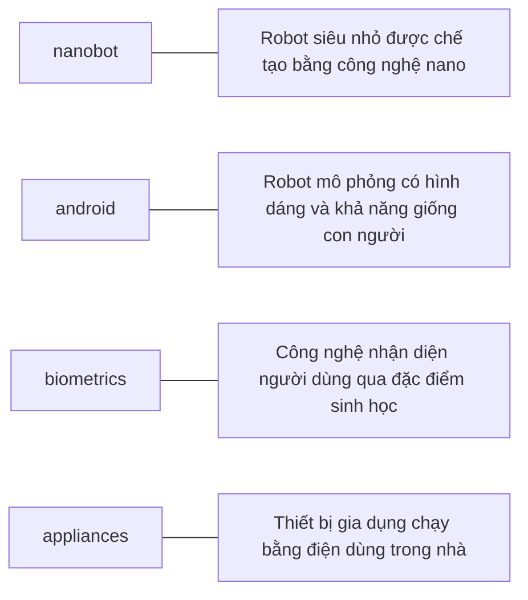

# UNIT 14 — New Technologies

## 1. TỪ VỰNG CHÍNH (Vocabulary)

| Thuật ngữ | Nghĩa | Gợi nhớ | Xuất hiện ở |
|---|---|---|---|
| **active tag** | thẻ RFID chủ động (có pin) | active = hoạt động | RFID section |
| **android** | robot hình người | robot mô phỏng người | AI section |
| **appliance** | thiết bị điện gia dụng | thiết bị trong nhà | Smart Home |
| **biometrics** | sinh trắc học | bio = sinh học | Biometrics |
| **data mining** | khai phá dữ liệu | mining = khai mỏ | Vocab list |
| **embedded** | được nhúng, tích hợp | embed = gắn vào | Ubiquitous Computing |
| **expert system** | hệ chuyên gia | expert = chuyên nghiệp | AI section |
| **facial recognition** | nhận diện khuôn mặt | facial = khuôn mặt | Biometrics |
| **humanoid** | dạng người, giống người | human + oid | AI section |
| **iris pattern** | mẫu mống mắt | iris = mống mắt | Biometrics |
| **nanobot** | robot siêu nhỏ (nano) | nano + bot | Nanotechnology |
| **nanometre** | na-nô-mét | nano + metre | Nanotechnology |
| **nanotechnology** | công nghệ nano | nano + technology | Nanotechnology |
| **nanotransistor** | bóng bán dẫn nano | nano + transistor | Nanotechnology |
| **nanotube** | ống nano carbon | nano + tube | Nanotechnology |
| **passive tag** | thẻ RFID thụ động | passive = thụ động | RFID section |
| **pervasive computing** | điện toán phổ biến, lan tỏa | pervasive = lan tỏa | Ubiquitous Computing |
| **radio tag** | thẻ vô tuyến | | RFID section |
| **retina pattern** | mẫu võng mạc | retina = võng mạc | Biometrics |
| **RFID** | nhận dạng qua tần số vô tuyến | Radio Frequency Identification | RFID section |
| **smart device** | thiết bị thông minh | smart = thông minh | Ubiquitous Computing |
| **ubiquitous computing** | điện toán hiện diện khắp nơi | ubiquitous = mọi nơi | Ubiquitous Computing |

---

### BẢNG TỔNG HỢP — CÔNG NGHỆ MỚI

⚠️ Bảng này là nguồn ôn chính cho dạng bài "điền tên công nghệ theo chức năng" hoặc "nối công nghệ với mô tả".

| Công nghệ | Mô tả / Ứng dụng chính | Đặc điểm nổi bật |
|---|---|---|
| **nanotechnology** | Chế tạo thiết bị từ nguyên tử và phân tử đơn lẻ | Đo bằng na-nô-mét (1/1 tỷ mét) |
| **Artificial Intelligence (AI)** | Chế tạo máy móc và chương trình thông minh (như ASIMO, android) | Bắt nguồn từ những năm 1940 (Alan Turing) |
| **biometrics** | Nhận dạng con người dựa trên đặc điểm sinh học (vân tay, mống mắt...) | Tự động xác thực bảo mật |
| **ubiquitous computing** | Tích hợp máy tính và cảm biến vô hình vào đời sống | Cho phép truy cập thông tin mọi lúc mọi nơi không dây |
| **smart home** | Đồng bộ hóa thiết bị điện gia dụng qua mạng gia đình | Nâng cao an ninh và tự động hóa sinh hoạt |
| **RFID** | Nhận dạng đối tượng tự động qua sóng vô tuyến bằng thẻ gắn chip | Gồm thẻ chủ động (active) và thụ động (passive) |

---

## 2. BÀI ĐỌC SONG NGỮ (Reading — EN | VI)

### Future trends — Nanotechnology

**English (Original)**
By all accounts, **nanotechnology** — the science of making devices from single atoms and molecules — is going to have a huge impact on both business and our daily lives. Nano devices are measured in **nanometres** (one billionth of a metre) and are expected to be used in the following areas.

> **[VI]** Theo tất cả các nguồn tin, công nghệ nano — ngành khoa học chế tạo các thiết bị từ các nguyên tử và phân tử đơn lẻ — sẽ có tác động to lớn đến cả doanh nghiệp và cuộc sống hàng ngày của chúng ta. Các thiết bị nano được đo bằng na-nô-mét (một phần tỷ mét) và dự kiến ​​sẽ được sử dụng trong các lĩnh vực sau.
>
> 📌 *Tóm tắt:* Công nghệ nano chế tạo thiết bị từ phân tử/nguyên tử đơn lẻ.

- **Nanocomputers**: Chip makers will make tiny microprocessors with **nanotransistors**, ranging from 60 to 5 nanometres in size.

> **[VI]** - **Máy tính nano**: Các nhà sản xuất chip sẽ chế tạo các bộ vi xử lý siêu nhỏ với các bóng bán dẫn nano (nanotransistors), kích thước từ 60 đến 5 na-nô-mét.
>
> 📌 *Tóm tắt:* Ứng dụng trong nanocomputers (chế tạo vi xử lý siêu nhỏ), nanomedicine (tiêm nanobots trị bệnh cấp tế bào) và nanomaterials (ống nanotubes siêu bền).

- **Nanomedicine**: By 2020, scientists believe that nano-sized robots, or **nanobots**, will be injected into the body's bloodstream to treat diseases at the cellular level.

> **[VI]** - **Y học nano**: Đến năm 2020, các nhà khoa học tin rằng các robot kích thước nano, hay nanobot, sẽ được tiêm vào dòng máu của cơ thể để điều trị bệnh ở cấp độ tế bào.
>
> 📌 *Tóm tắt:* 

- **Nanomaterials**: New materials will be made from carbon atoms in the form of **nanotubes**, which are more flexible, resistant and durable than steel or aluminium. They will be incorporated into all kinds of products, for example stain-resistant coatings for clothes and scratch-resistant paints for cars.

> **[VI]** - **Vật liệu nano**: Các vật liệu mới sẽ được tạo ra từ các nguyên tử carbon dưới dạng các ống nano (nanotubes), dẻo hơn, chống chịu tốt hơn và bền hơn thép hoặc nhôm. Chúng sẽ được tích hợp vào tất cả các loại sản phẩm, ví dụ như lớp phủ chống bám bẩn cho quần áo và sơn chống trầy xước cho ô tô.
>
> 📌 *Tóm tắt:*

### Future trends — Artificial Intelligence (AI)

**English (Original)**
**Artificial Intelligence (AI)** is the science of making intelligent machines and programs. The term originated in the 1940s, when *Alan Turing* said: “A machine has artificial intelligence when there is no discernible difference between the conversation generated by the machine and that of an intelligent person.” A typical AI application is **robotics**. One example is *ASIMO*, Honda's intelligent humanoid robot. Soon, engineers will have built different types of **android**, with the form and capabilities of humans.

> **[VI]** Trí tuệ nhân tạo (AI) là ngành khoa học chế tạo các máy móc và chương trình thông minh. Thuật ngữ này bắt nguồn từ những năm 1940, khi Alan Turing nói: "Một cỗ máy có trí tuệ nhân tạo khi không có sự khác biệt rõ rệt giữa cuộc hội thoại do máy tạo ra và cuộc hội thoại của một người thông minh." Một ứng dụng AI điển hình là robot học. Một ví dụ là ASIMO, robot hình người thông minh của Honda. Chẳng bao lâu nữa, các kỹ sư sẽ chế tạo được các loại robot hình người (android) khác nhau, với hình dáng và khả năng của con người.
>
> 📌 *Tóm tắt:* Trí tuệ nhân tạo (AI) là khoa học chế tạo máy móc thông minh.

Another AI application is **expert systems** — programs containing everything that an 'expert' knows about a subject. In a few years, doctors will be using expert systems to diagnose illnesses.

> **[VI]** Một ứng dụng AI khác là các hệ chuyên gia (expert systems) — các chương trình chứa đựng mọi thứ mà một "chuyên gia" biết về một chủ đề. Trong vài năm tới, các bác sĩ sẽ sử dụng các hệ chuyên gia để chẩn đoán bệnh tật.
>
> 📌 *Tóm tắt:* Điển hình là robotics (robot humanoid ASIMO, các loại robot android tương lai) và expert systems (hệ chuyên gia hỗ trợ bác sĩ chẩn đoán).

### Future trends — Biometrics & Ubiquitous computing

**English (Original)**
Imagine you are about to take a holiday in Europe. You walk out to the garage and talk to your car. Recognizing your voice, the car's doors unlock. On the way to the airport, you stop at an ATM. A camera mounted on the bank machine looks you in the eye, recognizes the pattern of your iris and allows you to withdraw cash from your account.

> **[VI]** Hãy tưởng tượng bạn chuẩn bị đi nghỉ mát ở Châu Âu. Bạn đi ra nhà để xe và nói chuyện với chiếc xe của bạn. Nhận diện được giọng nói của bạn, cửa xe tự động mở khóa. Trên đường đến sân bay, bạn dừng lại ở một cây ATM. Một chiếc camera gắn trên máy rút tiền nhìn vào mắt bạn, nhận dạng mẫu mống mắt của bạn và cho phép bạn rút tiền mặt từ tài khoản của mình.
>
> 📌 *Tóm tắt:* Sinh trắc học nhận dạng qua vân tay, mống mắt, khuôn mặt.

When you enter the airport, a hidden camera compares the digitized image of your face to that of suspected criminals. At the immigration checkpoint, you swipe a card and place your hand on a small metal surface. The geometry of your hand matches the code on the card, and the gate opens.

> **[VI]** Khi bạn vào sân bay, một camera ẩn so sánh hình ảnh kỹ thuật số khuôn mặt của bạn với hình ảnh của những tên tội phạm bị tình nghi. Tại cửa kiểm soát nhập cảnh, bạn quẹt thẻ và đặt tay lên một bề mặt kim loại nhỏ. Hình học bàn tay của bạn khớp với mã trên thẻ và cổng mở ra.
>
> 📌 *Tóm tắt:* Điện toán hiện diện khắp nơi (ubiquitous/pervasive computing) tích hợp các chức năng của máy tính vô hình vào đời sống, giao tiếp không dây.

Does it sound futuristic? Well, the future is here. **Biometrics** uses computer technology to identify people based on physical characteristics such as fingerprints, facial features, voice, iris and retina patterns.

> **[VI]** Nghe có vẻ giống như khoa học viễn tưởng đúng không? Thực ra, tương lai đã ở đây rồi. Sinh trắc học (Biometrics) sử dụng công nghệ máy tính để nhận dạng con người dựa trên các đặc điểm thể chất như dấu vân tay, đặc điểm khuôn mặt, giọng nói, mẫu mống mắt và võng mạc.
>
> 📌 *Tóm tắt:* 

**Ubiquitous computing**, also known as **pervasive computing**, is a new approach in which computer functions are integrated into everyday life, often in an invisible way. **Ubiquitous devices** can be anything from smartphones to tiny sensors in homes, offices and cars, connected to networks, which allow information to be accessed anytime and anywhere — in other words, ubiquitously. In the future people will interact naturally with hundreds of these **smart devices** (objects containing a microchip and memory) every day, each invisibly **embedded** in our environment and communicating with each other without cables.

> **[VI]** Điện toán hiện diện khắp nơi (Ubiquitous computing), còn được gọi là điện toán lan tỏa (pervasive computing), là một phương pháp tiếp cận mới trong đó các chức năng máy tính được tích hợp vào cuộc sống hàng ngày, thường là theo cách vô hình. Các thiết bị hiện diện khắp nơi có thể là bất cứ thứ gì, từ điện thoại thông minh đến các cảm biến nhỏ trong nhà, văn phòng và ô tô, được kết nối với mạng lưới, cho phép truy cập thông tin mọi lúc, mọi nơi - nói cách khác là ở khắp mọi nơi. Trong tương lai, mọi người sẽ tương tác tự nhiên với hàng trăm thiết bị thông minh này (những vật thể chứa vi chíp và bộ nhớ) mỗi ngày, mỗi thiết bị đều được nhúng vô hình trong môi trường của chúng ta và giao tiếp với nhau không cần cáp nối.
>
> 📌 *Tóm tắt:*

### Future trends — Smart Home

**English (Original)**
In the ideal **smart home**, **appliances** and electronic devices work in sync to keep the house secure. For example, when a regular alarm system senses that someone is breaking into the house, it usually alerts the alarm company and then the police. A smart home system would go further, turning on the lights in the home and then sending a text message to the owner's phone. *Motorola Home sight* even sends images captured by wireless cameras to phones and PCs.

> **[VI]** Trong một ngôi nhà thông minh lý tưởng, các thiết bị gia dụng và thiết bị điện tử hoạt động đồng bộ với nhau để giữ cho ngôi nhà được an toàn. Ví dụ, khi một hệ thống báo động thông thường phát hiện có người đột nhập vào nhà, nó thường cảnh báo cho công ty bảo mật và sau đó là cảnh sát. Hệ thống nhà thông minh sẽ tiến xa hơn, tự động bật đèn trong nhà và sau đó gửi tin nhắn văn bản đến điện thoại của chủ nhà. Hệ thống Motorola Home sight thậm chí còn gửi hình ảnh được ghi lại bởi camera không dây đến điện thoại và máy tính cá nhân.
>
> 📌 *Tóm tắt:* Smart home liên kết các thiết bị điện gia dụng đồng bộ qua mạng gia đình nhằm nâng cao an ninh và tự động hóa tiện nghi sinh hoạt của gia đình.

Smart homes can remember your living patterns, so if you like to listen to some classical music when you come home from work, your house can do that for you automatically. They will also know when the house is empty and make sure all appliances are turned off. All home devices will be interconnected over a **home area network** where phones, cable services, home cinemas, touch screens, smart mirrors and even the refrigerator will cooperate to make our lives more comfortable.

> **[VI]** Nhà thông minh có thể ghi nhớ thói quen sinh hoạt của bạn, vì vậy nếu bạn thích nghe nhạc cổ điển khi đi làm về, ngôi nhà của bạn có thể tự động làm điều đó cho bạn. Chúng cũng sẽ biết khi nào nhà trống và đảm bảo tất cả các thiết bị đã được tắt. Tất cả các thiết bị trong nhà sẽ được liên kết với nhau qua mạng gia đình (home area network), nơi điện thoại, dịch vụ truyền hình cáp, rạp chiếu phim tại gia, màn hình cảm ứng, gương thông minh và thậm chí cả tủ lạnh sẽ hợp tác để giúp cuộc sống của chúng ta thoải mái hơn.
>
> 📌 *Tóm tắt:*

### RFID (Radio Frequency Identification)

**English (Original)**
**RFID** stands for **Radio Frequency Identification**. It is a technology that uses radio waves and chip-equipped tags to automatically identify people or things. **Radio tags** can be attached to or embedded into products, animals and humans. There are two main types of tags: active and passive. **Active RFID tags** have a communication range of several hundred metres, whereas passive tags have a much shorter range.

> **[VI]** RFID là viết tắt của Nhận dạng qua tần số vô tuyến. Đây là công nghệ sử dụng sóng vô tuyến và các thẻ gắn chíp để tự động nhận dạng con người hoặc đồ vật. Các thẻ vô tuyến có thể được đính kèm hoặc nhúng vào sản phẩm, động vật và con người. Có hai loại thẻ chính: thẻ chủ động và thẻ thụ động. Các thẻ RFID chủ động có phạm vi liên lạc lên tới vài trăm mét, trong khi các thẻ thụ động có phạm vi ngắn hơn nhiều.
>
> 📌 *Tóm tắt:* RFID tự động nhận dạng bằng sóng vô tuyến qua các thẻ gắn chip. Thẻ gồm loại active (khoảng cách rộng) và passive (khoảng cách ngắn).

In the future, **RFID chips** will help us track ordinary objects like car keys or books. Additionally, radio tags may be implanted under the skin to give doctors instant access to a patient's medical history. However, according to consumer organizations, RFID tags could be used to track consumers or to **steal a person's identity**, raising privacy concerns.

> **[VI]** Trong tương lai, các chíp RFID sẽ giúp chúng ta theo dõi các vật dụng thông thường như chìa khóa xe hoặc sách vở. Ngoài ra, các thẻ vô tuyến có thể được cấy dưới da để giúp bác sĩ truy cập tức thì vào lịch sử y tế của bệnh nhân. Tuy nhiên, theo các tổ chức bảo vệ người tiêu dùng, thẻ RFID có thể bị lợi dụng để theo dõi người tiêu dùng hoặc đánh cắp danh tính của một người, làm dấy lên những lo ngại về quyền riêng tư.
>
> 📌 *Tóm tắt:* Ứng dụng định vị đồ vật, lưu trữ thông tin y tế nhưng gây lo ngại về an toàn thông tin cá nhân.

## KEY CONCEPTS

| Concept | Short Explanation | Giải thích tiếng Việt |
|---|---|---|
| **RFID** | Radio Frequency Identification, tracking objects using radio waves. | RFID: nhận dạng tần số vô tuyến, định vị vật dụng bằng sóng vô tuyến. |
| **nanotechnology** | building structures on the scale of atoms and molecules. | Công nghệ nano: chế tạo cấu trúc vi mô ở cấp độ nguyên tử/phân tử. |
| **biometrics** | identifying people using unique physical characteristics. | Sinh trắc học: nhận dạng con người bằng đặc điểm sinh lý tự nhiên. |
| **ubiquitous computing** | integrating computer functions into everyday objects. | Điện toán khắp nơi: nhúng máy tính vào mọi vật dụng trong đời sống. |

---

## POSSIBLE EXAM QUESTIONS

Q: What is RFID?
A: Radio Frequency Identification, tracking tags on objects via radio waves.
*(Dịch: RFID là gì? - Nhận dạng tần số vô tuyến, theo dõi thẻ vô tuyến gắn trên đồ vật.)*

Q: What is the difference between active and passive RFID tags?
A: Active tags have batteries and long range; passive tags use reader signals and are short-range.
*(Dịch: Khác biệt RFID chủ động và thụ động? - Thẻ chủ động có pin tầm xa; thẻ thụ động không pin lấy nguồn đầu đọc tầm ngắn.)*

Q: Explain ubiquitous computing.
A: Computers embedded in everyday devices, communicating wirelessly.
*(Dịch: Giải thích điện toán hiện diện khắp nơi. - Máy tính nhúng vào đồ vật hàng ngày kết nối không dây tự động.)*

Q: What biological features does biometrics use?
A: Fingerprints, facial features, voice, iris, and retina patterns.
*(Dịch: Sinh trắc học dùng các đặc tính sinh học nào? - Vân tay, khuôn mặt, giọng nói, mống mắt và võng mạc.)*

---

## ONE-LINE ANSWERS

- RFID uses radio frequencies to track physical goods. (RFID dùng tần số vô tuyến để theo dõi hàng hóa vật lý.)
- Nanotechnology creates microscopic materials atom by atom. (Công nghệ nano chế tạo vật liệu siêu nhỏ từ nguyên tử.)
- Biometrics identifies individuals using fingerprints or irises. (Sinh trắc học định danh người dùng bằng vân tay/mống mắt.)
- Ubiquitous computing embeds computer systems everywhere. (Điện toán hiện diện khắp nơi tích hợp máy tính vào mọi vật.)
- AI allows computer systems to show intelligence. (Trí tuệ nhân tạo giúp hệ thống máy tính thể hiện sự thông minh.)

---

## TEACHER TRAPS (DỄ NHẦM LẪN)

### ⚠️ Active vs Passive RFID
Active có nguồn pin riêng (tầm xa, đắt tiền). Passive lấy điện từ sóng đầu đọc phát ra (tầm ngắn, siêu rẻ).

### ⚠️ Ubiquitous vs Pervasive
Hai từ đồng nghĩa chỉ máy tính nhúng mọi nơi, nhưng Ubiquitous nhấn mạnh sự 'có mặt cùng lúc', Pervasive nhấn mạnh sự 'thấm sâu'.

---

## WEBSITE / SOFTWARE / APPLICATION IDENTIFICATION

| Name | Type | Main Function (EN) | Chức năng chính (VI) |
|---|---|---|---|
| **RFID Tag** | Hardware Tracking | Store identity data transmitted via radio waves | Thẻ lưu dữ liệu định danh truyền bằng sóng vô tuyến |
| **Android** | Robotics | Humanoid robot designed to act like human | Robot hình người mô phỏng hành vi của con người |

---

## 3. NGỮ PHÁP (Grammar)

### Thì tương lai (Future Tenses)

| Thì (Tense) | Công thức | Cách dùng chính | Ví dụ thực tế |
|---|---|---|---|
| **Future Simple** (Tương lai đơn) | **will + Verb** | - Dự đoán không có căn cứ hiện tại.   - Quyết định tức thì lúc nói.   - Lời hứa, hy vọng (expect, hope).   - Sự thật hiển nhiên. | Nanobots **will be** injected into the bloodstream.   Don't worry. I **will lend** you my laptop.   She **will be** 21 in May. |
| **Be going to** | **am/is/are + going to + V** | - Dự định, kế hoạch đã lên trước.   - Dự đoán dựa trên bằng chứng hiện tại. | She **is going to write** a book.   Look out! You **are going to spill** that coffee! |
| **Future Continuous** (Tương lai tiếp diễn) | **will be + V-ing** | - Hành động đang diễn ra tại một thời điểm cụ thể trong tương lai. | Doctors **will be using** expert systems to diagnose illnesses. |
| **Future Perfect** (Tương lai hoàn thành) | **will have + P2** | - Hành động sẽ hoàn thành trước một thời điểm cụ thể trong tương lai. | Soon, engineers **will have built** different types of android. |

### Ghi nhớ nhanh
- `will` dùng khi quyết định ngay lúc nói hoặc đoán mò.
- `be going to` dùng khi đã có ý định sẵn trước khi nói hoặc có dấu hiệu rõ ràng.
- `will be + V-ing` nhấn mạnh vào hành động đang tiếp diễn tại một mốc cụ thể trong tương lai.
- `will have + P2` nhấn mạnh hành động **đã kết thúc** tính đến một thời điểm tương lai (thường đi với **by + thời gian**).

⚠️ **Hay nhầm:**
- **Nhầm "will" và "be going to" trong dự đoán:** Căn cứ rõ ràng (như đám mây đen, ly nước sắp đổ) thì bắt buộc dùng `be going to`.
- **Nhầm tương lai tiếp diễn và hoàn thành:** 
  - *"By this time next month, I will have bought that phone"* (Đến lúc đó là đã mua xong - Tương lai hoàn thành).
  - *"In twenty years' time, people will be living in space"* (Nhấn mạnh hành động đang sống - Tương lai tiếp diễn).

---

## 4. BÀI TẬP & ĐÁP ÁN (Exercises & Answer Key)

### Exercise A — Reading Comprehension

Trả lời các câu hỏi dựa trên các đoạn văn Future Trends:
1. Which unit of measurement is used in nanotechnology?
2. What are the advantages of nanotubes over regular materials?
3. What will doctors use expert systems for?
4. What features are analysed by biometrics?
5. Which trend refers to computers embedded in everyday devices, communicating with each other over wireless networks?
6. What will the alarm system do if someone breaks into a smart home?
7. How will devices be interconnected inside the smart home?

<b>Xem đáp án chi tiết</b>

1. "Which unit of measurement is used in nanotechnology?" → **nanometres** — Đoạn 1 ghi: "measured in nanometres (one billionth of a metre)..."
2. "What are the advantages of nanotubes over regular materials?" → **more flexible, resistant and durable than steel or aluminium** — Đoạn 1 ghi: "...nanotubes, which are more flexible, resistant and durable than steel or aluminium."
3. "What will doctors use expert systems for?" → **to diagnose illnesses** — Đoạn 2 ghi: "...using expert systems to diagnose illnesses."
4. "What features are analysed by biometrics?" → **fingerprints, facial features, voice, iris and retina patterns** — Đoạn 3 ghi: "...based on physical characteristics such as fingerprints, facial features, voice, iris and retina patterns."
5. "Which trend refers to computers embedded in everyday devices..." → **ubiquitous (or pervasive) computing** — Đoạn 3 ghi: "Ubiquitous computing... is a new approach in which computer functions are integrated into everyday life..."
6. "What will the alarm system do if someone breaks into a smart home?" → **turn on the lights and send a text message to the owner's phone** — Đoạn 4 ghi: "...turning on the lights in the home and then sending a text message to the owner's phone."
7. "How will devices be interconnected inside the smart home?" → **over a home area network** — Đoạn 4 ghi: "...interconnected over a home area network..."

### Exercise B — Nối thuật ngữ công nghệ mới với định nghĩa bằng sơ đồ Mermaid

<b>Xem đáp án chi tiết</b>

*   **nanobot** --- **"Robot siêu nhỏ được chế tạo bằng công nghệ nano"** (suy luận) — dựa theo định nghĩa nanobot ở đoạn 1 (nano-sized robots).
*   **android** --- **"Robot mô phỏng có hình dáng và khả năng giống con người"** (suy luận) — dựa theo định nghĩa android ở đoạn 2 (form and capabilities of humans).
*   **biometrics** --- **"Công nghệ nhận diện người dùng qua đặc điểm sinh học"** (suy luận) — dựa theo định nghĩa biometrics ở đoạn 3 (identify people based on physical characteristics).
*   **appliances** --- **"Thiết bị gia dụng chạy bằng điện dùng trong nhà"** (suy luận) — dựa theo định nghĩa appliances ở đoạn 4 (electrical devices, or machines, used in the home).

### Exercise C — Which definition best describes RFID?

Choose the definition (a, b, or c) that best describes RFID:
- a. a smart technology worn on the user's body so that they can email and access the Web
- b. a technology that uses radio waves and chip-equipped tags to automatically identify people or things
- c. a technology that uses microchips and bar codes to track people or things at a distance

<b>Xem đáp án chi tiết</b>

*   **b. a technology that uses radio waves and chip-equipped tags to automatically identify people or things ✓** — Vì RFID sử dụng sóng vô tuyến (radio waves) và thẻ chứa chip (chip-equipped tags) để định danh đối tượng tự động.
    - - a. ✗ — Đây là định nghĩa của thiết bị máy tính đeo trên người (wearable computer).
    - - c. ✗ — Sai vì RFID không sử dụng mã vạch (bar codes).

### Exercise D — Multiple Choice: RFID

Chọn đáp án đúng (a, b hoặc c) [Lưu ý: bản gốc viết ký tự Kirin 'с' thay vì chữ 'c' Latin ở lựa chọn thứ ba]:
1. **RFID stands for**
   - a. Radio Frequency Identification.
   - b. Radio Frequency Identification Download.
2. **Radio tags**
   - a. can only be attached to or embedded into products.
   - b. can be attached to or embedded into products, animals and humans.
3. **Active RFID tags**
   - a. have a communication range of several hundred metres.
   - b. have a communication range of five metres.
4. **RFID chips**
   - a. will help us track ordinary objects like car keys or books.
   - b. won't be able to locate objects when they are lost or stolen.
5. **Radio tags may be implanted under the skin**
   - a. to confirm a patient's identity and cure illnesses.
   - b. to give doctors instant access to a patient's medical history.
6. **According to consumer organizations, RFID tags**
   - a. could be used to track consumers or to steal a person's identity.
   - b. are secure and private; there is no need for concern.

<b>Xem đáp án chi tiết</b>

1. "RFID stands for" → **a. Radio Frequency Identification. ✓** — dựa theo định nghĩa chính thức của từ viết tắt RFID.
   - - b. Radio Frequency Identification Download. ✗ — định nghĩa sai (thừa chữ Download).
2. "Radio tags" → **b. can be attached to or embedded into products, animals and humans. ✓** — đoạn RFID ghi: "Radio tags can be attached to or embedded into products, animals and humans."
   - - a. can only be attached to or embedded into products. ✗ — sai vì thiếu động vật và con người.
3. "Active RFID tags" → **a. have a communication range of several hundred metres. ✓** — đoạn RFID ghi: "Active RFID tags have a communication range of several hundred metres."
   - - b. have a communication range of five metres. ✗ — đây là khoảng cách của các loại thẻ thụ động tầm gần.
4. "RFID chips" → **a. will help us track ordinary objects like car keys or books. ✓** — đoạn RFID ghi: "RFID chips will help us track ordinary objects like car keys or books."
   - - b. won't be able to locate objects... ✗ — sai, chúng hoàn toàn có thể xác định vị trí đồ vật khi bị mất.
5. "Radio tags may be implanted under the skin" → **b. to give doctors instant access to a patient's medical history. ✓** — đoạn RFID ghi: "...give doctors instant access to a patient's medical history."
   - - a. to confirm a patient's identity and cure illnesses. ✗ — sai vì chíp RFID chỉ lưu hồ sơ, không tự chữa lành bệnh (cure illnesses).
6. "According to consumer organizations, RFID tags" → **a. could be used to track consumers or to steal a person's identity. ✓** — đoạn RFID ghi: "...could be used to track consumers or to steal a person's identity."
   - - b. are secure and private... ✗ — các tổ chức tiêu dùng rất lo ngại (privacy concerns), không đồng ý rằng chúng an toàn.

### Exercise E — Future Tenses Selection

Chọn từ thích hợp trong ngoặc để hoàn thành câu:
1. In the future, I hope we ( 'll have / 're going to have ) robots in the home to help us with the housework.
2. Hey, Nick, be careful, you ( 're going to spill / 'll spill ) that coffee on the computer!
3. It's John's birthday next week. We ( 'll give / 're going to give ) him a mobile phone [Lưu ý: bản gốc bị lỗi khoảng trắng thành 'r e going to give'].
4. - My laptop has crashed! 
   - Don't worry. I ( 'll lend / 'm going to lend ) you mine.
5. The Internet ( will probably change / is probably going to change ) the publishing industry in the way that TV changed the movie industry.
6. Futurists predict that smart technology ( will be / is going to be ) incorporated into fabrics.

<b>Xem đáp án chi tiết</b>

1. "In the future, I hope we ( 'll have / 're going to have )..." → **'ll have** (suy luận) — dùng `will` đi với động từ chỉ hy vọng "hope" (dự đoán chủ quan).
2. "Hey, Nick, be careful, you ( 're going to spill / 'll spill )..." → **'re going to spill** (suy luận) — dự đoán có bằng chứng cụ thể trước mắt (thấy Nick đang cầm cốc cà phê không cẩn thận).
3. "It's John's birthday next week. We ( 'll give / 're going to give )..." → **'re going to give** (suy luận) — diễn tả dự định/kế hoạch đã quyết định trước khi nói. [Lưu ý: bản gốc viết sai khoảng trắng 'r e going to give'].
4. "- My laptop has crashed! - Don't worry. I ( 'll lend / 'm going to lend )..." → **'ll lend** (suy luận) — diễn tả một quyết định tức thời hoặc lời đề nghị giúp đỡ tại thời điểm nói.
5. "The Internet ( will probably change / is probably going to change )..." → **will probably change** (suy luận) — dùng `will` đi kèm với trạng từ khả năng "probably".
6. "Futurists predict that smart technology ( will be / is going to be )..." → **will be** (suy luận) — dự đoán tương lai chung chung của các chuyên gia khi không có căn cứ thực tế trước mắt.

### Exercise F — Future Continuous vs Future Perfect

Chia động từ trong ngoặc ở thì tương lai tiếp diễn hoặc tương lai hoàn thành:
1. Thanks to ICT, by the year 2030 we (find) ________________ cures for the major diseases of our time.
2. In twenty years' time, some people (live) ________________ in space, perhaps inside a computerized colony.
3. By this time next week, I (work) ________________ for IBM [Lưu ý: các chỗ trống điền từ được gạch dưới ở bản gốc].
4. By this time next month, I (buy) ________________ that BlackBerry that I've been wanting to buy for months.
5. Scientists predict that in twenty years' time nearly everyone (live) ________________ in smart houses.

<b>Xem đáp án chi tiết</b>

1. "...by the year 2030 we (find) ________________ cures..." → **will have found** (suy luận) — dùng tương lai hoàn thành vì hành động đã hoàn tất trước mốc tương lai cụ thể "by the year 2030".
2. "In twenty years' time, some people (live) ________________..." → **will be living** (suy luận) — dùng tương lai tiếp diễn để nhấn mạnh hành động đang diễn ra tại mốc thời gian xác định "In twenty years' time".
3. "By this time next week, I (work) ________________..." → **will be working** (suy luận) — dùng tương lai tiếp diễn để chỉ hành động đang diễn ra tại mốc thời gian cụ thể "By this time next week".
4. "By this time next month, I (buy) ________________..." → **will have bought** (suy luận) — dùng tương lai hoàn thành vì hành động mua điện thoại sẽ hoàn tất trước thời điểm "By this time next month".
5. "Scientists predict that in twenty years' time nearly everyone (live) ________________..." → **will be living** (suy luận) — dùng tương lai tiếp diễn nhấn mạnh hành động đang tiếp diễn vào 20 năm nữa.

### Exercise G — Discussion: Predictions

Discuss these predictions. Do you agree or disagree? Give reasons for your answers:
1. Some day, we'll be talking to computers naturally, like friends.
2. Microchips implanted in our arms will serve as ID cards and contain our medical records.
3. Robots will learn to build themselves, without human help.
4. Smart homes will be voice-activated.
5. Computers will be ubiquitous and almost invisible, embedded into our homes and integrated into our lives.

---

<b>Xem đáp án chi tiết</b>

1. **Agree:** AI voice assistants are improving rapidly, and conversational AI (like LLMs) will make speaking with computers extremely natural. (suy luận)
2. **Disagree:** Many people have privacy and ethical concerns about implanting chips in their bodies, so it may not become a widespread standard. (suy luận)
3. **Agree:** Self-replicating and self-repairing robotics are currently researched in advanced labs, which can be useful in outer space exploration. (suy luận)
4. **Agree:** Most smart home devices already support voice controls via Google Assistant, Siri or Alexa, and this will become the default interface. (suy luận)
5. **Agree:** Pervasive computing will embed sensors into furniture, walls, and vehicles, making technology merge invisibly into our environment. (suy luận)

### 🧪 Mini Quiz

**Câu 1 (Trắc nghiệm):** Which unit of measurement is equivalent to one billionth of a metre?
- a. micrometre
- b. nanometre
- c. millimetre

<b>Xem đáp án chi tiết</b>

**Câu 1 (Trắc nghiệm):**
*   **b. nanometre ✓** — nanometre tương đương một phần tỷ mét (one billionth of a metre) được ghi ở đoạn 1.
*   - a. micrometre ✗ — micrometre tương đương một phần triệu mét.
*   - c. millimetre ✗ — millimetre tương đương một phần nghìn mét.

**Câu 2 (Trắc nghiệm):** Which computing style integrates computer functions into everyday objects, often invisibly?
- a. Ubiquitous computing
- b. Nanotechnology
- c. Expert systems

<b>Xem đáp án chi tiết</b>

**Câu 2 (Trắc nghiệm):**
*   **a. Ubiquitous computing ✓** — đoạn 3 định nghĩa Ubiquitous computing là phương pháp mà các chức năng máy tính tích hợp vô hình vào đời sống hàng ngày.
*   - b. Nanotechnology ✗ — đây là khoa học chế tạo thiết bị siêu nhỏ cấp độ nguyên tử.
*   - c. Expert systems ✗ — đây là hệ thống mô phỏng kiến thức chuyên gia.

**Câu 3 (Điền từ):** By this time tomorrow, I _____________ (complete) my nanotechnology project.

<b>Xem đáp án chi tiết</b>

**Câu 3 (Điền từ):**
*   **will have completed** (suy luận) — dùng tương lai hoàn thành vì có mốc giới hạn thời gian "By this time tomorrow".

**Câu 4 (Điền từ):** Active RFID tags have a communication range of several hundred _____________.

<b>Xem đáp án chi tiết</b>

**Câu 4 (Điền từ):**
*   **metres** (suy luận) — đoạn RFID ghi phạm vi giao tiếp của thẻ chủ động là "several hundred metres".

**Câu 5 (Điền từ):** Honda's intelligent humanoid robot is called _____________.

<b>Xem đáp án chi tiết</b>

**Câu 5 (Điền từ):**
*   **ASIMO** (suy luận) — đoạn 2 ghi ví dụ robot hình người của Honda là ASIMO.

**Câu 6 (Trắc nghiệm):** "He is probably going to call you." - What is the correct alternative with probably?
- a. He will probably call you.
- b. He probably will call you.
- c. He probably calling you.

<b>Xem đáp án chi tiết</b>

**Câu 6 (Trắc nghiệm):**
*   **a. He will probably call you. ✓** — vị trí đúng của trạng từ probably là đứng sau will trong câu khẳng định.
*   - b. He probably will call you. ✗ — sai vị trí của trạng từ trong văn phong chuẩn mực (phải đứng sau will).
*   - c. He probably calling you. ✗ — sai ngữ pháp thì tương lai (thiếu will/be going to).

**Câu 7 (Nối):** Nối công nghệ với mô tả tương ứng:
1. Nanotubes — A. Hệ thống chứa kiến thức chuyên gia chẩn đoán bệnh
2. Expert systems — B. Nhận diện mống mắt, vân tay để bảo mật
3. Biometrics — C. Vật liệu carbon dẻo và bền hơn cả thép

---

<b>Xem đáp án chi tiết</b>

**Câu 7 (Nối):**
*   **1-C** (Nanotubes — C. Vật liệu carbon dẻo và bền hơn cả thép) — dựa trên thông số kỹ thuật của nanotubes ở đoạn 1.
*   **2-A** (Expert systems — A. Hệ thống chứa kiến thức chuyên gia chẩn đoán bệnh) — dựa trên chức năng chẩn đoán bệnh ở đoạn 2.
*   **3-B** (Biometrics — B. Nhận diện mống mắt, vân tay để bảo mật) — dựa trên đặc điểm nhận dạng ở đoạn 3.

---

